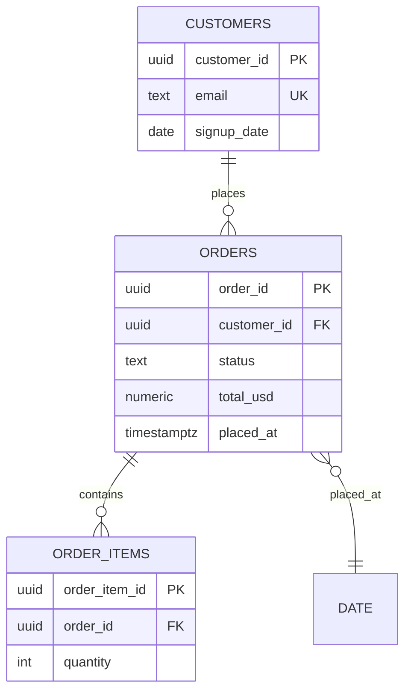

# OKF Wiki Examples

§1 is the flagship data/ERD bundle — copy its conventions for any database,
dataset, warehouse, or lakehouse. §2–§6 are five other domains. All examples
are conformant OKF v0.1 (with optional v0.2 trust fields where shown).

---

## §1 Data / ERD bundle (flagship)

```
shopdb-wiki/
├── index.md
├── log.md
├── datasets/
│   └── sales.md
├── tables/
│   ├── customers.md
│   ├── orders.md
│   └── order_items.md
├── metrics/
│   └── net_revenue.md
└── dimensions/
    └── date.md
```

The bundle documents a **database** (`resource` on the dataset concept), its
**datasets/schemas**, **tables** with full column + PK/FK detail, an implicit
**ERD** that emerges from the relationship links, **metrics** (aggregated
business measures), and **dimensions** (the axes you slice metrics by).

### shopdb-wiki/index.md

```markdown
# ShopDB Knowledge Wiki

Agent-readable documentation for the `shopdb` PostgreSQL database.
Start with the [sales dataset](/datasets/sales.md).

# Datasets

* [sales](datasets/sales.md) - Core transactional schema for the storefront.

# Tables

* [customers](tables/customers.md) - One row per registered customer account.
* [orders](tables/orders.md) - One row per completed customer order.
* [order_items](tables/order_items.md) - Line items belonging to an order.

# Metrics

* [net_revenue](metrics/net_revenue.md) - Revenue net of refunds, USD, daily grain.

# Dimensions

* [date](dimensions/date.md) - Calendar dimension for time slicing.
```

### datasets/sales.md — the database/schema concept

```markdown
---
type: Dataset
title: sales
description: Core transactional schema for the storefront (orders, customers, items).
resource: postgresql://prod-db/shopdb/sales
tags: [core, transactions]
timestamp: 2026-09-25T10:00:00Z
owner: data-eng@example.com
status: stable
---

The `sales` schema is the source of truth for order and revenue reporting.
Contains [orders](/tables/orders.md), [customers](/tables/customers.md), and
[order_items](/tables/order_items.md).

# Business Value

Answers "what did we sell, to whom, for how much" — feeds the
[net_revenue](/metrics/net_revenue.md) metric and finance reporting.

# Known Issues

- `orders.updated_at` is not backfilled before 2024-01 (migration 042);
  don't use it for historical incremental loads.
```

### tables/customers.md

```markdown
---
type: Table
title: customers
description: One row per registered customer account.
resource: postgresql://prod-db/shopdb/sales/customers
tags: [core, identity, pii]
timestamp: 2026-09-25T10:00:00Z
status: stable
---

# Schema

| Column | Type | Nullable | Default | Description |
|---|---|---|---|---|
| `customer_id` | UUID | no | `gen_random_uuid()` | **PK** |
| `email` | TEXT | no | — | Unique login email. **PII** — mask in non-prod. |
| `signup_date` | DATE | no | — | Day the account was created. FK to [date](/dimensions/date.md) grain. |
| `country` | TEXT | no | — | ISO 3166-1 alpha-2 country code. |
| `deleted_at` | TIMESTAMPTZ | yes | NULL | Soft-delete marker; NULL = active. |

Unique constraint: `email` (functional unique index).

# Relationships

- **Parent of** [orders](/tables/orders.md) — 1:N via
  `orders.customer_id` → `customer_id`.
- **Rolled up by** [date](/dimensions/date.md) on `signup_date` (day grain).

# Business Value

Customer master data. Every revenue metric joins through this table.
`deleted_at IS NOT NULL` rows must be excluded from "active customer" counts.

# Known Issues

- ~2% duplicate emails created before the unique index (2023); dedupe on
  `email, min(signup_date)` for identity resolution.
```

### tables/orders.md — the full ERD treatment

```markdown
---
type: Table
title: orders
description: One row per completed customer order across all channels.
resource: postgresql://prod-db/shopdb/sales/orders
tags: [core, revenue, sla]
timestamp: 2026-09-25T10:00:00Z
status: stable
sources:
  - id: migration-042
    resource: https://git.internal/db/migrations/042
    title: "Migration 042: orders refunds columns"
generated: { by: human:data-eng, at: 2026-09-25T10:00:00Z }
verified:
  - { by: process:schema-drift-ci, at: 2026-09-25T12:00:00Z }
---

Join root for all revenue queries. Aggregated by [net_revenue](/metrics/net_revenue.md).
Part of the [sales](/datasets/sales.md) dataset.

# Schema

| Column | Type | Nullable | Default | Description |
|---|---|---|---|---|
| `order_id` | UUID | no | `gen_random_uuid()` | **PK** |
| `customer_id` | UUID | no | — | **FK** → [customers](/tables/customers.md). |
| `status` | TEXT | no | `'pending'` | Enum: `pending` / `complete` / `refunded`. Do NOT filter `= 'complete'` unless excluding in-flight orders intentionally. |
| `total_usd` | NUMERIC(12,2) | no | — | Order total pre-refund, USD. |
| `refunded_usd` | NUMERIC(12,2) | no | `0` | Sum of refunded amounts, USD. |
| `placed_at` | TIMESTAMPTZ | no | `now()` | Submission time, UTC. FK grain to [date](/dimensions/date.md). |
| `updated_at` | TIMESTAMPTZ | no | `now()` | Last mutation. **Not backfilled before 2024-01.** |

# Relationships

- **Belongs to** [customers](/tables/customers.md) — N:1 via `customer_id`.
- **Parent of** [order_items](/tables/order_items.md) — 1:N via
  `order_items.order_id` → `order_id`.
- **Rolled up by** [net_revenue](/metrics/net_revenue.md) (SUM over this table).
- **Time grain** [date](/dimensions/date.md) on `placed_at`.

# ERD



# Joins

- [customers](/tables/customers.md) via `orders.customer_id = customers.customer_id` (N:1).
- [order_items](/tables/order_items.md) via `orders.order_id = order_items.order_id` (1:N).

# Examples

```sql
-- Daily net revenue (see metric definition: net_revenue)
SELECT d.day, SUM(o.total_usd - o.refunded_usd) AS net_revenue_usd
FROM sales.orders o
JOIN dimensions.date d ON d.day = o.placed_at::date
WHERE o.status <> 'pending'
GROUP BY d.day;
```

# Business Value

Primary revenue fact table. SLA: fresh within 15 min of order placement.
Powers finance reporting and the [net_revenue](/metrics/net_revenue.md) KPI.

# Citations

[1] [Migration 042](https://git.internal/db/migrations/042)
```

### metrics/net_revenue.md — a metric concept

```markdown
---
type: Metric
title: net_revenue
description: Revenue net of refunds, in USD, at daily grain.
tags: [finance, kpi, revenue]
timestamp: 2026-09-25T10:00:00Z
status: stable
---

# Definition

`SUM(total_usd - refunded_usd)` over [orders](/tables/orders.md), grouped by
the [date](/dimensions/date.md) dimension on `placed_at`, excluding
`status = 'pending'`.

# Reference SQL

```sql
SELECT d.day,
       SUM(o.total_usd - o.refunded_usd) AS net_revenue_usd
FROM sales.orders o
JOIN dimensions.date d ON d.day = o.placed_at::date
WHERE o.status <> 'pending'
GROUP BY d.day;
```

# Dimensions

Sliceable by: [date](/dimensions/date.md) (day), `customers.country`,
`orders.status`. NOT sliceable by product — that requires
[order_items](/tables/order_items.md).

# Business Value

The company headline KPI. Reported to the board monthly. A wrong number here
is a finance incident — always exclude `pending`, always net refunds.

# Caveats

- `refunded_usd` is 0 before 2024-02; net == gross for earlier dates.
- Does not include tax breakdown (tax is inside `total_usd`).
```

### dimensions/date.md — a dimension concept

```markdown
---
type: Dimension
title: date
description: Calendar dimension, day grain, 2015-2030.
resource: postgresql://prod-db/shopdb/dimensions/date
tags: [time, shared]
timestamp: 2026-09-25T10:00:00Z
---

# Schema

| Column | Type | Description |
|---|---|---|
| `day` | DATE | **PK**, day grain. |
| `week` | INT | ISO week number. |
| `month` | TEXT | `YYYY-MM`. |
| `quarter` | TEXT | `YYYY-Qn`. |
| `is_holiday` | BOOLEAN | US federal holidays. |

# Relationships

- **Slice of** [net_revenue](/metrics/net_revenue.md) and
  [orders](/tables/orders.md) via `placed_at::date`.
- **Slice of** [customers](/tables/customers.md) via `signup_date`.

# Business Value

Standard time axis for all metrics. Use `day` for joins, `month`/`quarter`
for rollups. Do not join on `week` — ISO weeks cross years.
```

### log.md

```markdown
# Update Log

## 2026-09-25
* **Create**: Documented [orders](/tables/orders.md) with ERD and FK links.
* **Create**: Added [net_revenue](/metrics/net_revenue.md) metric.

## 2026-09-20
* **Init**: Created bundle for shopdb.
```

**Data-doc conventions to reuse:** every FK is a markdown link to the parent
table; every table lists PK/FK/nullable/default/PII in `# Schema`;
`# Relationships` states cardinality and join keys in prose; `# ERD` carries
a mermaid diagram (ASCII works too); metrics declare their formula, source
table, sliceable dimensions, and caveats; every dataset/table/metric gets a
`# Business Value` section so an agent can reason about *why the data
matters*, not just what it contains.

---

## §2 API documentation bundle

```
payments-api-wiki/
├── index.md
└── apis/
    ├── payments.md
    └── schemas/
        └── charge.md
```

```markdown
---
type: API
title: Payments API
description: REST API for all payment processing operations.
resource: https://api.internal/payments/v2
tags: [payments, core, pci]
timestamp: 2026-09-25T10:00:00Z
---

# Auth

Bearer token from the auth service. Tokens expire after 1 hour.

# Key endpoints

- `POST /charges` — Create a charge. See [charge schema](/apis/schemas/charge.md).
- `GET /charges/{id}` — Retrieve charge status.
- `POST /refunds` — Issue a refund. Requires `refunds:write` scope.

# Rate limits

100 req/min per key; burst 200 for 10s; `429` on breach.

# PCI scope

Fields tagged `pci:true` must never be logged.
```

---

## §3 Runbook / on-call bundle

```markdown
---
type: Runbook
title: pipeline-failure
description: Triage steps when the orders ingestion pipeline fails.
tags: [oncall, critical]
timestamp: 2026-09-25T10:00:00Z
---

# Trigger

Freshness alert: [orders](/tables/orders.md) >30 min behind SLA.

# Steps

1. Check the ingestion job dashboard.
2. Verify the source system is responding.
3. Source failure → escalate to partner team, Slack #data-incidents.
4. Internal failure → page data-eng via PagerDuty.

# Post-incident

Record backfill window in [log](/log.md) and note data gaps in the table's
`# Known Issues`.
```

---

## §4 Codebase architecture wiki

```markdown
---
type: Service
title: checkout-service
description: Owns cart-to-order conversion; writes to the sales schema.
resource: https://git.internal/checkout-service
tags: [backend, critical]
timestamp: 2026-09-25T10:00:00Z
---

# Responsibility

Converts a cart into an [order](/tables/orders.md). Emits `order.completed`
events consumed by the email service.

# Dependencies

- PostgreSQL `sales` schema — inserts [orders](/tables/orders.md).
- Payments API — creates the charge. See [payments](/apis/payments.md).

# Failure modes

Double-charge risk if retried after `POST /charges` succeeded but the
response timed out; idempotency key = `order_id`.
```

---

## §5 ML models & feature store

```markdown
---
type: ML Model
title: churn-predictor
description: XGBoost classifier predicting 30-day churn probability per customer.
resource: s3://ml-prod/models/churn-predictor/v7
tags: [ml, retention]
timestamp: 2026-09-25T10:00:00Z
---

# Inputs (features)

- `ltv_90d` — from [net_revenue](/metrics/net_revenue.md) per customer.
- `days_since_last_order` — from [orders](/tables/orders.md).
- `signup_age_days` — from [customers](/tables/customers.md).signup_date.

# Training data

Snapshot of the tables above, label = no order within 30 days of prediction
date. Excludes soft-deleted customers (`deleted_at IS NOT NULL`).

# Caveats

Trained on pre-2025 data only; re-train before trusting seasonal patterns.
```

---

## §6 Compliance & policy bundle

```markdown
---
type: Policy
title: pii-handling
description: Rules for handling PII columns across all datasets.
tags: [compliance, gdpr, pii]
timestamp: 2026-09-25T10:00:00Z
status: stable
---

# Scope

Every column tagged PII in table docs, e.g.
[customers.email](/tables/customers.md).

# Rules

1. PII is masked in all non-prod environments.
2. Right-to-erasure: soft-delete via `deleted_at` within 30 days of request.
3. PII values must never appear in logs, dashboards, or LLM prompts.

# Citations

[1] [GDPR Art. 17](https://gdpr-info.eu/art-17-gdpr/)
```
