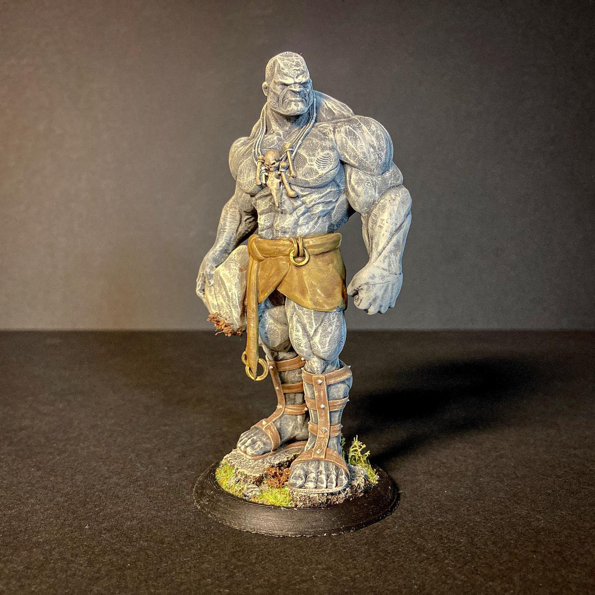

# Sub-agent 2: planner

Visible messages and tool activity only. Private reasoning and privileged prompts are not included. Embedded images are preserved as local attachments.

## 1. user — 1788790399819

```text
Task: Own ONLY gpt-6/.specs and gpt-6/.img2threejs and assessment/spec evidence, no source code. Need concise reference-driven spec before implementation. Read C:/Users/PTW/.pi/agent/skills/img2threejs/SKILL.md and relevant intake scripts/gates; initialize local state under E:/.neo-work/gpt-6 using forge state commands and run next.py. Read reference E:/.neo-work/work040hq.jpg. Attempt actual intake/quality contract/spec commands appropriate to complex procedural stone giant. This is TypeScript and plain Three.js only, no external assets or projected photo texture. State approximation as procedural finish, single-view unseen geometry inferred. Critical visible identity: tall muscular stone humanoid, broad shoulders narrower waist, bald stern square head, no glowing eyes, etched pale-gray blue-grey stone, ochre leather wrap with hanging belt and brass rings, bone/skull necklace, strapped shin sandals with toe detail, rock held in right hand (image left), mossy round black miniature plinth. Need local quality/spec evidence AND TE9 lightweight .specs/stone-giant/spec.md/tasks.json including security design summary: dependencies Three+Vite+TS/@types only version locked, no runtime external requests, no auth/user data/upload, loopback dev server, no secrets, npm audit. Read rafter-secure-design docs/dependencies.md and threat-modeling.md. No need user approval or long interview. Do not invent passing gates. Report exact current gate and any tooling failure rather than spending long on blocked helpers. You may mark irrelevant pipeline stages skipped with reasons if supported. Return concise actionable modeling spec with dimensions and current state. We will use handcrafted procedural TS, not generic model generator.

[TASK INTENT: PLAN/spec | Complexity: MODERATE | Domain: DESIGN, DOCS, FRONTEND, SECURITY]
```

## 2. assistant — 1788790399832

```text
I’ll inspect the reference, local state, and gate scripts, then produce a concrete spec/evidence plan. This role is read-only, so I can’t initialize state, run commands, update the wiki, or mark it synced.
```

```json
{
  "type": "toolCall",
  "id": "call_EiSA6UNi7z2i9Dc8wWVTNZBL",
  "name": "ls",
  "arguments": {
    "path": "E:/.neo-work/gpt-6"
  }
}
```

```json
{
  "type": "toolCall",
  "id": "call_h4UQGrY7NGHVj0mYAbUASSwx",
  "name": "read",
  "arguments": {
    "path": "C:/Users/PTW/.pi/agent/skills/img2threejs/SKILL.md"
  }
}
```

```json
{
  "type": "toolCall",
  "id": "call_W0cVbiXuqWGfo8NLFDEZdA2d",
  "name": "read",
  "arguments": {
    "path": "C:/Users/PTW/.agents/skills/rafter-secure-design/SKILL.md"
  }
}
```

```json
{
  "type": "toolCall",
  "id": "call_mGiom7Ke3dmUMTmv1plKEA08",
  "name": "read",
  "arguments": {
    "path": "E:/.neo-work/work040hq.jpg"
  }
}
```

```json
{
  "type": "toolCall",
  "id": "call_zR03qQJ2WxfWV06C5ZZljG49",
  "name": "read",
  "arguments": {
    "path": "C:/Users/PTW/.pi/agent/skills/te9-spec/SKILL.md"
  }
}
```

```json
{
  "type": "toolCall",
  "id": "call_MUCFAunlDFW2r3BbDimZMwz2",
  "name": "read",
  "arguments": {
    "path": "C:/Users/PTW/.pi/agent/git/github.com/DietrichGebert/ponytail/skills/ponytail/SKILL.md"
  }
}
```

```json
{
  "type": "toolCall",
  "id": "call_NZfWUPKkza5Hbz5iFPCIQ0x8",
  "name": "ls",
  "arguments": {
    "path": "E:/.neo-work/docs/wiki"
  }
}
```

```json
{
  "type": "toolCall",
  "id": "call_1kSggWI3qhGbVwOUTMESj9vG",
  "name": "find",
  "arguments": {
    "path": "C:/Users/PTW/.pi/agent/skills",
    "pattern": "**/okf*/SKILL.md"
  }
}
```

## 3. toolResult / ls — 1788790426105

```text
Path not found: E:\.neo-work\gpt-6
```

## 4. toolResult / read — 1788790426106

````text
---
name: img2threejs
description: Turn an object or character reference image into a quality-gated, animation-ready procedural Three.js model built in code. Use for image-to-3D reconstruction, detail-accurate object rebuilds, stylized/likeness-maximized human characters, sculpt specs, and staged code generation.
license: Apache-2.0
version: 1.4.4
---

# img2threejs — Image to procedural Three.js

Rebuild the object visible in a reference image as a **code-only** procedural Three.js model,
gated by a staged sculpting pipeline and an AI-vision self-correction loop. This is
reconstruction-by-code, **not** photogrammetry, mesh extraction, or downloaded art packs.

Agent-agnostic: works under Claude Code, Codex, or OpenCode. Wherever this doc says "agent
vision" or "agent browser tool", use whatever the host provides — native image reading, a
browser MCP (playwright/chrome-devtools), the project preview, or a user-supplied screenshot.

## Canonical shared checkout

Keep one checkout of this repository and let every host enter it through a symlink, so Claude and
Codex execute the same code instead of drifting apart:

```text
~/.claude/skills/img2threejs -> <your checkout>
~/.codex/skills/img2threejs  -> <your checkout>
```

## When To Use

The user attaches/points to an object image and wants a procedural Three.js model, a
reconstruction/animation/destruction plan, a sculpt spec, or code. Also for material studies,
action-ready props, game objects, botanical/mechanical parts, and stylized reconstructions.

## Core Promise

Sculpt from a photo, in order — never one-shot a mesh:
1. **Run `python3 forge/next.py <spec>` first, or `python3 forge/next.py --state .img2threejs/state.json`.** The state form reports the ordered local checklist, exact next command, evidence status, and bounded correction-loop status; it never replaces the spec/pass gates.
1. **Use local state first.** Initialize it once, then run
   `python3 forge/next.py --state .img2threejs/state.json [<spec>]` at every start/resume and before
   every correction iteration. Obey a hard stop; never continue from memory.
2. **Validate** the image is a suitable 3D target (`grimoire/intake/validation_rubric.md`).
3. **Assess** object class + complexity, then write a `qualityContract` before any code.
3. **Spec** it: component hierarchy, materials, lighting, pivots, sockets, action anchors.
4. **Build pass-by-pass** from blockout → structure → form → material → lighting → interaction → optimization.
5. **Verify** each pass with a screenshot compared against the reference; fail a pass if an identity-defining feature is wrong even when the global score looks fine.

State explicitly when output is approximate/stylized/low-poly. A single image cannot reveal
hidden sides or guarantee exact geometry — say so instead of faking confidence.

## Resumable local workflow

For a cross-agent or multi-session reconstruction, initialize the local state before intake:

```bash
python3 forge/state.py init --reference <image> --profile character --spec object-sculpt-spec.json
python3 forge/next.py --state .img2threejs/state.json
python3 forge/state.py mark image-analysis --evidence analysis.md
```

`generic`, `character`, and `cs2` profiles insert their required intake gates in order. Every
completed step needs evidence; every skipped step needs a reason. The state file is a resumability
index, not visual evidence: renders, specs, review history, and deterministic gates remain the
authoritative artifacts.

## Transparency and Process Debugging (Critical — from Bowie Knife reconstruction)

**The problem:** When the user cannot tell what was done or where something went wrong, they cannot debug the process. Over-claiming (reporting success when features still don't match) destroys trust and makes iterative improvement impossible.

**Rule:** Be transparent + don't over-claim. State exactly what changed each pass, with evidence, and name what still doesn't match:
- After each pass, explicitly list what changed: "Updated guard shape to extend left edge from -0.56 to -0.48 for handle overlap"
- Provide evidence: reference the specific values, coordinates, or parameters that changed
- Name what still doesn't match: "Handle silhouette traced but still flat plane (no Z palm-swell), procedural crosshatch not reference's exact dot-grid knurl"
- Explain why a change was made: "Extended guard left edge because handle ends at X=-0.42 and guard ended at X=-0.20, causing visual gap"
- Never claim a feature is "done" when it's only "improved" — use precise language
- When a gate passes but visual inspection shows issues, explain the limitation: "2D gate passed (fidelity 0.83) but three-quarter render shows blade reads as toy (no grind wedge) — 2D gates are blind to 3D realism"

**The user needs to be able to debug the process, not just the output.** If something is wrong, they should be able to trace which decision led to the error and correct it. Opaque processes force restarts; transparent processes enable refinement.
## Transparency and Process Debugging

Report what changed each pass with evidence (exact values/coordinates), name what still doesn't
match, and never claim "done" when only "improved". A passing gate is not proof of 3D realism.
Full rule + examples: `grimoire/review/self_correction.md`.

## GLB-mediated v2 render-fidelity track (1.5 alpha)

When the user supplies a GLB as an intermediate reference, use the browser-rendered GLB
as the structural and visual baseline, then author an independent procedural factory. The
raw GLB is never pixel evidence and its topology/materials are never copied into the factory.

Before any factory edit:

1. Run `forge/stage1_intake/probe_glb.py` and inspect `semanticDecomposition`. A merged
   one-node/one-mesh/one-primitive/one-material asset is `insufficient` for reliable semantic
   labels; connected-component/curvature/normal/UV segmentation is hypothesis evidence only.
   Request a multipart GLB or capture a browser semantic-ID pass before claiming exact regions.
2. Author and validate one shared `render-profile.v2` with
   `forge/stage4_review/validate_render_profile.py`. Both GLB and procedural routes must use
   the same output color space, linear working space, tone mapping/exposure, PMREM environment,
   viewport/DPR, camera, background and lighting settings.
3. Capture six passes for every admitted view: `beauty`, `alpha-silhouette`, `semantic-id`,
   `depth`, `normal`, and `roughness-material-id`. Use
   `forge/stage4_review/compare_region_passes.py` for deterministic global/per-region evidence;
   missing semantic-ID data blocks per-region confidence instead of falling back to whole-image
   color or silhouette scores.
4. Use region-specific continuous geometry/material strategies. Do not replace a face/head volume,
   cloth shell, kasa, staff, or tail with a generic collection of floating primitives when the
   region's silhouette or attachment requires a continuous surface.
5. Run one correction group per loop in this order: `camera → silhouette → face → clothing →
   accessory → materials → lighting`. Recapture the full pass set after each group and record
   the changed group, hashes and score. Never combine groups when diagnosing improvement.

The machine-readable contract lives in `docs/specs/render-profile.v2.schema.json` and
`docs/specs/render-profile.v2.example.json`. The executable manifest bridge accepts
`--render-profile` and exposes `record-pass`; its `glb-mediated-v2` validation is fail-closed.

## Required Inputs

- one image path / screenshot / URL / attached image (if missing or unreadable, ask)
- intended use: prop, game object, hero render, playable/destructible object, animation rig
  (default: real-time browser prop with interactive performance)
- for a CS2 request, an authoritative classification record (family/subtype and evidence refs) or
  an explicit request for the user/vision provider to supply one; heuristic detection alone is not
  enough to select a geometry adapter

## Mandatory Local State Gate

Conversation context is disposable; `.img2threejs/state.json` is the local checklist authority.
Initialize it once per reconstruction:

`python3 forge/state.py init --state .img2threejs/state.json --reference  --profile <generic|cs2|character>`

At every fresh start, resume, or correction loop, run
`python3 forge/next.py --state .img2threejs/state.json [object-sculpt-spec.json]` before touching
code. It prints the current step, pass, incomplete mandatory steps, exact next command, and
`loop/max`. Exit code 3 or `status=stopped` is a hard stop: report the reason and request input.
Never bypass it by reconstructing progress from chat history.

After evidence exists, record it with
`python3 forge/state.py mark <step-id> --state .img2threejs/state.json --evidence <path>`.
Mark a non-applicable step `skipped` only with `--reason`; silent omission is forbidden. Loop counts
are derived from `reviewHistory` actions `refine-spec`/`refine-code`, not agent memory. Defaults are
3 corrections per pass and 6 total.

Profiles add mandatory gates rather than changing the core order: `cs2` requires classification,
manifest, and a machine-readable CS2 review before AI review; `character` requires the character
contracts and landmark evidence. Every profile records suitability, projection applicability, and
material-evidence applicability; conditional steps require evidence or an explicit skip reason.

## The Loop (scripts do enforcement; agent vision does judgment)

Run scripts from the skill root (`forge/...`). Pure Python 3.10+ stdlib, no pip installs.
Full flags: `grimoire/scripts.md`. Never let a script *score* visuals — that is the agent's job.

1. **Analyze the image first** (agent vision, before any script): work the layered observation
   protocol in `grimoire/intake/image_analysis.md` — identify/classify, decompose macro→meso→micro,
   map part relationships, name materials in PBR terms, list identity-defining features, and flag
   what the single view hides. Observation before inference; controlled 3D vocabulary; 3D
   object-space not 2D image-space. This is generic for any subject and feeds every field below.
   Then probe local images: `forge/stage1_intake/probe_image.py <image>` (metadata only, not a visual check).
1a. **Local Spec Search** — after image analysis and before writing or refining a spec, local
    evidence is a pipeline stage, not an optional memory lookup, whenever the request needs
    domain-specific anatomy, PBR, wear, geometry, runtime, or physics specifications. The pre-spec
    command automatically runs BM25, chooses `cs2` for CS2 targets and `core_3d` otherwise, and
    writes a `localSpecSearch` evidence bundle into the assessment:
    `python3 forge/stage2_spec/new_pre_spec_assessment.py "Name" --image  --out assessment.json`.
    Add observed terms with repeatable `--spec-query "<term>"`; use `--collection <collection>` only
    when the automatic collection choice is insufficient. `new_sculpt_spec.py --assessment` carries
    that bundle into the final spec, including snippets, `source_refs`, and `evidence_refs`.
    For extra focused retrieval, the direct CLI remains available:
    `python3 forge/stage1_intake/search_specs.py "<query>" --collection <collection> --limit 3 --snippet-chars 250 --json`.
    For CS2, include the anatomical and the colloquial name, for example
    `--spec-query "safety ring finger ring"` or `search_specs.py "roughness matte" --collection cs2`.
    Expand queries with object names,
    component names, material/finish terms, behavior terms, and known aliases; retry focused
    alternatives when the first result is incomplete. Build the spec from returned evidence and do
    not invent domain specs when local evidence exists. Search caches are local/generated only;
    preserve JSONL records and source provenance rather than replacing them with cache output.
1aa. **Optional fidelity evidence adapters** — use them only when they improve an observed weak
    point; the stdlib core remains authoritative. Route thin/complex masks to local SAM2, character
    face/pose evidence to MediaPipe, and weak front/back cues to Depth Anything V2:
    `python3 forge/stage1_intake/run_vision_adapter.py <segment|landmarks|depth> ...`.
    Every adapter emits provenance. Confirm SAM2 selected the intended component; treat monocular
    depth as relative only; review landmarks before copying them into anatomy. For browser work,
    prefer Chrome DevTools MCP for live console/network/performance diagnosis, use
    threejs-devtools MCP read-only to inspect scene/material/renderer state, and reserve Playwright
    MCP for cross-browser or host fallback. MCP-only scene mutations never count as implementation:
    write the proven change back to the spec or TypeScript, rebuild, and recapture. Use Context7
    only with the target project's installed Three.js version; local types, typecheck and runtime
    smoke tests override live docs. Full routing and commands:
    `docs/integrations/reference_fidelity_tooling.md`.
1b. **CS2 intake manifest** — for a CS2 request, create and validate `cs2-intake.json` before
    pre-spec authoring. Run admission and probing for every source view, record the heuristic signal
    as non-authoritative evidence, attach the classification record, resolve the supported family,
    and choose `route` independently from `exactnessTier`. Missing classification, insufficient
    coverage, or a contradictory high-confidence class is `request-input`; unsupported families do
    not continue into spec generation.
2. **Pre-Spec Assessment Gate** — classify + score complexity + write the quality contract:
   `forge/stage2_spec/new_pre_spec_assessment.py "Name" --image  --complexity <simple|moderate|complex|ultra-complex> --out assessment.json`. Rules: `grimoire/intake/quality_contract.md`.
   Set `objectClass.primaryDomain` (`object` | `character` | `hybrid`) and fill the seeded
   `detailInventory` (its `targetMinDetails` scales with complexity). **Supported CS2 knife skins
   and Glock-18 assets**: always pass `--cs2`, which defaults the complexity tier to `ultra-complex`
   (`targetMinDetails` 16) — the finish/wear/hardware is the item, so CS2 is held to the top
   fidelity bar; `targetMinDetails` never drops below the 9 floor even if downgraded by hand.
   **Author procedural GEOMETRY (blade/guard/grip profiles) but make the FINISH a de-lit
   reference-crop PROJECTION, not a procedural finish material** — projecting the photo's own
   pixels is what reaches reference fidelity for patterned skins (Doppler/Gamma/Marble/Fade), and
   is what the v1.3 baseline demos do; a procedural finish for a patterned skin reads visibly wrong
   against the reference. Take the projection path in step 2c (it generalizes from characters to
   any reference-matched surface). Procedural finish is the fallback ONLY when live view-dependent
   response matters more than matching this one reference. Finish routes + rulebook:
   `grimoire/build/cs2_finishes.md`; optional exact-texture acquisition:
   `grimoire/intake/cs2_texture_acquisition.md`.
1a. **Local Spec Search** — after image analysis, before writing or refining a spec, pull local
    domain evidence (anatomy/PBR/wear/geometry/runtime/physics) rather than inventing it:
    `python3 forge/stage2_spec/new_pre_spec_assessment.py "Name" --image  --out assessment.json`
    (auto-runs BM25, auto-picks `cs2`/`core_3d` collection, writes a `localSpecSearch` bundle that
    `new_sculpt_spec.py --assessment` carries into the spec). Full query-expansion recipe
    (bilingual terms, focused `search_specs.py` retrieval, cache rules):
    `grimoire/intake/local_spec_search.md`. MUST read it before retrying an incomplete or
    domain-specific query.
1b. **CS2 intake manifest** — for a CS2 request, create and validate `cs2-intake.json` before
    pre-spec authoring (admission, heuristic signal, classification, family/route resolution).
    MUST read `grimoire/intake/cs2_intake_contract.md` completely before creating the manifest or
    running pre-spec assessment.
2. **Pre-Spec Assessment Gate** — classify + score complexity + write the quality contract:
   `forge/stage2_spec/new_pre_spec_assessment.py "Name" --image  --complexity <simple|moderate|complex|ultra-complex> --out assessment.json`. Rules: `grimoire/intake/quality_contract.md`.
   Set `objectClass.primaryDomain` (`object` | `character` | `hybrid`) and fill the seeded
   `detailInventory` (its `targetMinDetails` scales with complexity). **Supported CS2 knife
   skins**: always pass `--cs2`, which defaults the complexity tier to `ultra-complex`
   (`targetMinDetails` 16, floor 9) — the finish/wear/hardware is the item, so CS2 is held to the
   top fidelity bar. Author procedural GEOMETRY but route the FINISH through the projection path in
   step 2c — a procedural finish for a patterned skin (Doppler/Gamma/Marble/Fade) reads visibly
   wrong against the reference. Finish routes + rulebook: `grimoire/build/cs2_finishes.md`;
   optional exact-texture acquisition: `grimoire/intake/cs2_texture_acquisition.md`.
2b. **Detail inventory** (do not skip for detailed subjects) — scan zones and enumerate every
   identity-defining small detail (gloss, bevel, fasteners, linework, contours, stains):
   `forge/stage1_intake/build_detail_inventory.py <image> --mode grid-3x3 --out-dir <dir> --out di.json`.
   Each detail MUST map to a `component.localFeatures` or `material.localOverrides` entry — never
   prose only. Taxonomy + 3D-term recipes: `grimoire/intake/detail_inventory.md`.
2c. **Projection-first fidelity (characters AND reference-matched surfaces — supported CS2 skins, decals,
   painted patterns)** — when the goal is matching a specific reference's surface, put the photo's
   own pixels on the mesh instead of approximating them procedurally. This is the single biggest
   fidelity lever; a procedural material for a patterned surface is the #1 reconstruction failure.
   Recipe (`grimoire/character/likeness_maximization.md` — its two levers, align-mesh+camera and
   project-the-photo, generalize past characters): solve the camera
   (`stage1_intake/solve_camera_pose.py` → `referenceCamera`), **de-light** the reference so it is
   free of baked lighting (`stage1_intake/delight_albedo.py`, hard requirement — this is what makes
   projection safe, not the flat-lit icon), then project the de-lit crop onto the mesh and bake it
   into UVs (`stage3_build/bake_projected_texture.py --mesh-id <id>`). For a CS2 skin the mesh is the
   procedural family-specific component tree you author in the spec, and the projected de-lit crop IS the finish
   (front + back from the two views) — no procedural Doppler material. For characters, first capture
   landmarks (`stage1_intake/extract_landmarks.py --out anatomy.json`), fill `preSpecAssessment.anatomy`,
   route `grimoire/character/reconstruction.md`. A single view cannot show hidden sides — report
   per-region confidence and request more views when it matters.
   Character sub-routes, in the order they are needed — decide what parts exist before shaping any
   of them, and shape the head before the hair that sits on it:
   - **Parts** — `grimoire/character/structure_decomposition.md`: which parts the figure is made of,
     and where each one's boundary falls.
   - **Head** — `grimoire/character/head_construction.md`: skull, face plane and feature placement,
     the sub-route the likeness gate reads against.
   - **Hair** — `grimoire/character/stylized_hair_threejs.md`, with the parameter contract in
     `grimoire/character/threejs_hair_parameter_contract.json`. Lock topology first: material
     tuning cannot repair wrong lock topology, so run it only after the silhouette review passes.
2d. **Reference-free humanoid** — when the request is a generic figure with no reference image
   ("a low-poly humanoid"), there is nothing to measure, so fill anatomy from public canon with
   `forge/stage2_spec/humanoid_proportions.py <spec> --style-heads 8 --in-place`. It writes
   `anatomy.source: "canon-table"` so canon is never mistaken for measured evidence, refuses to
   run at all when the spec names a reference image, and lists what the corpus does NOT supply
   under `anatomy.unsourced`. Only complete head counts are derivable (currently 8); anything
   else fails with the missing landmark named rather than being interpolated.
3. Author the spec from the assessment:
   `forge/stage2_spec/new_sculpt_spec.py "Name" --image  --assessment assessment.json --manifest cs2-intake.json --out object-sculpt-spec.json`.
   Replace generic starter `featureReviewTargets` with the object's real identity-defining
   systems (≤5 critical, ≤3 important per pass); for characters add `anatomy-proportion`,
   `face-landmark-placement`, `pose-silhouette`, `outfit-and-palette`. Use 3D-graphics terms only
   (`grimoire/glossary/3d_vocabulary.md`), never "nice/smooth/shiny". Classify every component's
   `topologyClass`/`topologyRationale` per `grimoire/intake/surface_topology.md` before picking a
   `primitive` — this is what prevents a continuous organic form from being picked as a box.
4. When material fidelity matters and a source image exists, analyze each material's **finish** then
   extract reference PBR evidence, both per crop (crop the correct region — verify the crop is on the
   part you think it is):
   - `forge/stage1_intake/analyze_texture.py <crop> --spec spec.json --material-id <id> --in-place`
     classifies the finish (`gem-metal | gemstone | painted-metal | worn-composite | brushed-steel |
     plastic`), extracts the gradient palette, and writes doc-grounded MeshPhysicalMaterial scalars
     (metalness/roughness/clearcoat/transmission/ior/anisotropy/envMapIntensity) onto the material.
     Recipes + Three.js texture/PBR rules (colorSpace, CanvasTexture/DataTexture, height→normal) live
     in `grimoire/build/threejs_texture_reference.md`. Rule of thumb: **solid albedo for flat paint,
     real reference crop for patterned finishes** (doppler/quartz/hydro-dip/camo).
   - `forge/stage1_intake/extract_pbr_evidence.py <crop> --out-dir <dir> --material-id <id> --target-threshold 0.7`.
   Confidence < 0.7 is a stop/refine-input signal, not a pass. It is inference, not inverse rendering.
   - For multiple named regions, use `forge/stage1_intake/material_region_analysis.py --manifest regions.json --out-dir material-evidence --out material-analysis.json`. Resolve each accepted assignment from `docs/materials/material-reference.json`, then wire it into the spec with `forge/stage2_spec/apply_material_analysis.py`.
   - Emit the controlled material camera/crop contract with `forge/stage4_review/material_views.py`, compare saved visible-footprint crops with `forge/stage4_review/material_comparator.py`, apply only bounded material-scoped corrections with `forge/stage4_review/material_feedback.py`, and record the blocking result with `forge/stage4_review/material_gate.py`.
5. Validate, then strict-validate before generating code:
   `forge/stage2_spec/validate_sculpt_spec.py object-sculpt-spec.json` then `--strict-quality`.
   Strict blocks shallow specs (a complex object with one root, no repetition systems, no
   local overrides, no micro groups is NOT implementation-ready even if JSON validates).
6. **Locked build passes** — only touch the currently unlocked pass:
   `forge/stage3_build/orchestrate_passes.py status object-sculpt-spec.json`
   `forge/stage3_build/generate_threejs_factory.py object-sculpt-spec.json --out src/createObjectModel.ts`
   (generator is fail-closed: `strict-quality` must pass before it can write any factory; a future
   `--pass-id` also fails until prior passes are reviewed `continue`). If blocked, preserve the
   `BLOCKED` artifact and refine the subject-specific spec; do not substitute a generic template.
6a. **Hitting a triangle budget.** `performanceBudget.targetTriangles` selects a tessellation
   tier for every primitive that has segment counts (low ≤6k, standard ≤60k, else hero), and
   caps implicit-surface sampling grids. Where that is not precise enough — an SDF's grid is
   quantised, so a tier can only get near a number — add
   `geometryDescriptor.decimate: {"targetRatio": 0.4}` to that component. It emits a
   Garland-Heckbert quadric collapse into the generated factory and runs **before** skin
   binding, so weights are computed on the surviving vertices and no skinning data is
   interpolated across a vertex merge. It keeps `position` only, recomputing normals, so it is
   refused on an authored/unwrapped `uvStrategy`. For offline LOD tiers from an exported mesh,
   `forge/stage3_build/decimate.py <mesh.json> --ratio <r> --json` is the same algorithm.
7. Render the current pass in a browser/preview, capture a screenshot at a review viewpoint.
7a. **Off-axis and placement gates — a single review viewpoint is not evidence about the model.**
   Capture a turntable, not one frame, and run all three. Each catches a defect class the older gates
   pass by construction; skipping them is how a hole through a skull, a hat at hip height and a charm
   floating below the ground plane survived eight front-only review rounds.
   `forge/stage4_review/turntable_gate.py --capture 0=front.png --capture 90=right.png --capture 180=rear.png --capture 270=left.png --json`
   `node runtime/scripts/export_mesh_geometry.mjs --url <preview> --out meshes.json` then
   `forge/stage4_review/self_intersection.py meshes.json --json`
   `forge/stage4_review/attachment_anchor.py object-sculpt-spec.json --measured measured.json --json`
   All three exit `0` clean / `1` gate failure / `2` error. A failure blocks `continue` for the pass
   even when the global fidelity score passes — the score is computed from one camera and a 64×64 luma
   grid, and neither can represent any of these defects. Read `sampledVertexCount` /
   `unmeasuredAttachments` / `missingAzimuths` before believing a clean verdict: each names the part of
   the model the gate did not actually look at.
8. Package one side-by-side sheet, then inspect it with agent vision:
   `forge/stage4_review/make_comparison_sheet.py --reference  --render <shot> --out cmp.png --json`.
9. Record the review (overall + per-layer + per-feature scores + decision):
    `forge/stage4_review/append_review.py object-sculpt-spec.json --pass-id <pass> --fidelity <0-1> --action <continue|refine-spec|refine-code|request-input|stop> --summary "..." --render-screenshot <shot> --comparison-image cmp.png --ai-vision-score <0-1> --layer-scores-json '{...}' --feature-reviews-json <f.json> --in-place`.
   For the CS2 family path, also attach the versioned report with
   `--cs2-review-json cs2-review.json --review-scene-json forge/tests/fixtures/knife_review_scene.json`.
   A failed family, painted-region, projection-coverage, critical-detail, or orbit gate blocks
   `continue` even when the global score passes. See `docs/cs2/review-gates.md`.
10. Sync pipeline state after manual review edits:
     `forge/stage3_build/orchestrate_passes.py sync object-sculpt-spec.json --in-place`.

## Forge Runtime Contracts

Subdivision runtime tests compile generated TypeScript against the showcase checkout. Set
`IMG2THREEJS_SHOWCASE_ROOT` to that checkout; without it, local runtime-only tests skip with an
actionable message while static contracts still run. CI should set `IMG2THREEJS_REQUIRE_SHOWCASE=1`
to turn a missing showcase checkout into a test failure.

```bash
IMG2THREEJS_SHOWCASE_ROOT=/path/to/img2threejs-showcase python3 forge/tests/test_subdivision.py
IMG2THREEJS_SHOWCASE_ROOT=/path/to/img2threejs-showcase python3 -m unittest discover -s forge/tests
IMG2THREEJS_SHOWCASE_ROOT=/path/to/img2threejs-showcase python3 forge/tests/test_showcase_tsc_smoke.py
```
   (generator is pass-gated: a future `--pass-id` fails until prior passes are reviewed `continue`).
   The local state adds `--force` only for a new pass or `refine-spec`; `refine-code` edits the
   current artifact without regenerating it. Before overwriting, carry valid hand refinement back
   into the spec; generated code must not be the only copy of reconstruction decisions.
7. Render the current pass in a browser/preview, capture a screenshot at a review viewpoint.
8. **Run deterministic gates before AI vision.** MUST read
   `grimoire/review/gates_reference.md` and `grimoire/review/self_correction.md` completely. Run
   `forge/stage4_review/diagnose_render.py` and record the passing Tier 1 result with
   `--spec object-sculpt-spec.json --pass-id <pass> --in-place`; for non-planar forms also run
   `forge/stage4_review/diagnose_render_multi_angle.py` with the fixed view and at least two
   meaningful orbit views. Then run
   `forge/stage3_build/orchestrate_passes.py check object-sculpt-spec.json --pass-id <pass>`.
9. Package one side-by-side sheet, then inspect it with agent vision:
   `forge/stage4_review/make_comparison_sheet.py --reference  --render <shot> --out cmp.png --json`.
10. Record the review (overall + per-layer + per-feature scores + decision):
    `forge/stage4_review/append_review.py object-sculpt-spec.json --pass-id <pass> --fidelity <0-1> --action <continue|refine-spec|refine-code|request-input|stop> --summary "..." --render-screenshot <shot> --comparison-image cmp.png --ai-vision-score <0-1> --layer-scores-json '{...}' --feature-reviews-json <f.json> --in-place`.
   For the CS2 knife path, also attach the versioned report with
   `--cs2-review-json cs2-review.json --review-scene-json forge/tests/fixtures/knife_review_scene.json`.
   Produce that report first with
   `forge/stage4_review/cs2_review.py --manifest cs2-intake.json --metrics cs2-review-inputs.json --scene forge/tests/fixtures/knife_review_scene.json --out cs2-review.json`.
   A failed family, painted-region, projection-coverage, critical-detail, or orbit gate blocks
   `continue` even when the global score passes. See `docs/cs2/review-gates.md`.
11. Sync pipeline state after manual review edits, record checklist evidence, then re-run the local
    state gate before another correction or pass:
    `forge/stage3_build/orchestrate_passes.py sync object-sculpt-spec.json --in-place`
    `python3 forge/next.py --state .img2threejs/state.json object-sculpt-spec.json`.
12. Before declaring completion, run
    `forge/stage4_review/check_part_coverage.py --spec object-sculpt-spec.json --manifest parts.json`
    and verify the action-ready hierarchy. Mark `part-coverage` and `action-ready` only with evidence.

## CS2 image-matched rule

For a CS2 item, the target is observable agreement between the supplied image and the rendered
item: silhouette, proportions, edge profile, hardware layout, coating colour, pattern placement,
wear, roughness response, and camera framing. Every decision must be traceable to evidence or be
labelled as an approximation.

The initial CS2 family boundary covers supported **knife** subtypes and the **Glock-18** pistol
adapter. Rifle, SMG, sniper, heavy, glove, unsupported pistol, and unknown knife subtypes must stop
with `unsupported-family` or `unsupported-subtype`; they must not receive another family's component
tree as a generic fallback.

### Layer contract

Pass these records between layers. Do not copy an informal vision description into the next stage:

| Layer | Owns | Must emit | Must not decide alone |
| --- | --- | --- | --- |
| Intake | view validity and technical evidence | role, path/hash, resolution, coverage, duplicate status, admission verdict | item identity from aspect ratio or filename |
| Classification | semantic identity | family, subtype, confidence, evidence refs, provider/version, timeout state | geometry or finish parameters |
| Identity | skin/name/paint metadata | precedence, resolved values, ambiguity candidates, provenance | guessed paint index, float, or seed |
| Surface evidence | pixels and texture sources | de-lit reference, PBR channels, map provenance, colour space, UV orientation, confidence | albedo reused as roughness/normal/AO |
| Geometry adapter | family-specific form | component tree, topology, dimensions, edge/spine, hardware relationships, painted regions | hidden geometry without confidence notes |
| Spec/route | evidence-backed implementation choice | route, exactness tier, assumptions, feature targets, camera contract | exact-texture claim without exact evidence |
| Build/review | rendered observables | fixed view, two non-degenerate orbit views, per-region results, failed gates, next action | overriding a failed critical feature with a global score |

The canonical hand-off is `cs2-intake.json` (`schemaVersion: 1`). Its state is one of
`proceed`, `request-input`, `fallback`, `rejected`, `unsupported-family`, or
`unsupported-subtype`. Write it atomically and preserve unknown provider fields under
`extensions`; a fallback must never erase prior evidence.

### CS2 intake order

1. Admit and technically probe every view. Reject undecodable, empty, tiny, fragmented, or
   duplicate references before classification.
2. Record the heuristic CS2 signal only as a routing hint. `detect_cs2.py` is never authoritative
   identity evidence.
3. Require a classification record before selecting a family adapter. If classification is absent,
   timed out, or contradicts a high-confidence objectness result, return `request-input`.
4. Resolve identity in this order: explicit user metadata, uniquely resolved metadata, then the
   authoritative classification record. Preserve ambiguity rather than guessing.
5. Select route and exactness independently:
   - `reference-projection`: default for matching a specific patterned image;
   - `authored-texture`: only when independent texture maps are supplied or legally acquired;
   - `procedural-finish`: fallback when projection evidence is unavailable or live response is the
     stated priority.
   Exactness is `image-only`, `metadata-assisted`, or `exact-texture`; changing route must not
   silently upgrade or downgrade the evidence tier.
6. Select the family adapter only after family/subtype validation. Record painted regions, unpainted
   substrate, visible hardware, hidden-region confidence, and every approximation in the spec.
7. For projection, solve the camera and de-light the source first. Projected pixels provide colour
   evidence, not automatic geometry truth; geometry still comes from the adapter and silhouette
   review.

### Surface and review rule

For a specific CS2 reference, preserve the reference's own colour/pattern pixels whenever legal and
technically possible. Procedural Doppler/Fade/Gamma/Marble patterns are not equivalent to the input
image and may only be used with an explicit `procedural-finish` route and approximation warning.
Keep albedo, roughness, metalness, normal/height, AO, mask, and wear as independent channels. Record
channel source, colour space, UV orientation, dimensions, packed-channel decoding, and missing-channel
derivation. A low-confidence PBR inference is a refine-input signal, not proof of exact material.

Single-view reconstruction may proceed only when visible identity features are sufficiently covered;
hidden blade sides, underside, and back hardware must carry inference confidence and may trigger
`request-input`. Review the fixed camera plus two meaningful orbit views. Report what changed, which
evidence caused it, what still differs, and choose exactly one next action:
`continue`, `refine-spec`, `refine-code`, `request-input`, or `stop`.

## Gates (do not skip)

- **Suitability + reference integrity**: pass / conditional / reject before any planning
  (`grimoire/intake/validation_rubric.md`), AND every reference admitted via
  `forge/stage1_intake/check_reference_admission.py` (rejects empty/fragmented/tiny/duplicate/
  undecodable refs with a reason). Intake understanding cross-checked by
  `forge/stage1_intake/check_intake_correctness.py` (halts on a confident class contradiction).
- **Divine Eye (the harness heart) — deterministic-first, model-last**: the render evaluator is
  `forge/stage4_review/divine_eye.py` — a zero-token multi-signal ensemble (IoU/scale HARD gates;
  proportion/symmetry-parity/pHash/SSIM/edge/blowout/flat/tonal-parity soft) with self-uncertainty
  (`probe` on signal disagreement) and deterministic routing (`continue`/`refine-spec`/`refine-code`/
  `probe`). The VLM (`forge/stage4_review/vlm_gate.py`) is a gated, calibrated, cross-checked
  last layer: **never consulted on a hard-gate failure**, multi-sample-voted, and can rescue a
  soft near-threshold reject but never grant past a hard geometric failure.
- **Multi-angle or it didn't happen**: a non-planar form must hold from ≥2 camera angles.
  `forge/stage4_review/diagnose_render_multi_angle.py` flags `degenerate-view` when an orbited
  silhouette collapses (a flat plane faking a volume). Orbit angles use reference-free
  self-consistency — never scored against a reference angle the photo doesn't cover.
- **CS2 review contract**: `forge/stage4_review/cs2_review.py` consumes the manifest and
  versioned scene fixture, then blocks wrong family identity, missing projection coverage,
  painted-region mismatch, critical identity-detail failure, finish/material response failure,
  and degenerate orbit form. It records exactness tier, hidden-region confidence, per-region
  confidence, approximation notes, camera, environment hash, exposure, tone mapping, resolution,
  background, and renderer version.
- **Bounded correction loop (token-burn safety)**: `forge/stage4_review/correction_loop.py`
   guarantees termination: hard gates route to `refine-code`; repeated defects and oscillation route
   to `refine-spec`; plateau and the hard ceiling route to `request-input` — never a silent infinite
   burn. Deterministic analysis-by-synthesis parameter fitting and Divine Eye provenance are
   documented in `grimoire/build/analysis_by_synthesis_fitting.md`.
- **Executable Divine Eye fitting**: `fit_against_divine_eye()` in
  `forge/stage4_review/fit_params.py` connects deterministic parameter-to-render callbacks to
  bounded gate-aware Divine Eye optimization. Clean candidates use raw fidelity; hard-gated
  candidates score below all clean results while retaining original fidelity and provenance. The
  returned objective and optional selected raw fidelity are explicit, and each copied record has
  candidate/reference/render provenance. It lazily loads the default evaluator and returns
  normalized raw-fidelity correction-loop provenance without mutating sources.
- **Tier 1 (legacy, still valid)**: "Tier 2 (AI-vision) never runs against a render that has not passed Tier 1." Run `forge/stage4_review/diagnose_render.py` (silhouette IoU/proportion/symmetry/per-part color) and record it (`--spec ... --in-place`) before requesting a comparison sheet; `orchestrate_passes.py check` refuses otherwise.
- **Pre-spec / strict-quality**: blocks code gen until the spec is deep enough for its contract.
- **Screenshot feedback**: `continue` is allowed only with a render + comparison sheet + global
  AI-vision score ≥ threshold (default 0.7) AND every critical feature ≥ its own threshold.
  Details + per-layer scorecard: `grimoire/feedback/render_capture.md`.
- **Action-ready**: build a runtime hierarchy (pivots, sockets, colliders, destruction groups),
  never an inert lump; expose `root.userData.sculptRuntime`. `grimoire/readiness/action_rigging.md`.
- **Procedural rig contract (1.5-alpha)**: for humanoid/character builds, validate the authored
  `joints`/`parents`/`names`/`matrix_local`/packed skin payload with
  `forge/stage5_rig/validate_rig_payload.py` before binding `THREE.Skeleton`. The gate proves
  structural payload integrity only; pose stress, dynamic bounds, readable screenshots, and
  visual likeness remain separate gates. Payload ownership and non-goals:
  `grimoire/readiness/procedural_rigging_contract.md`.
- **Assembly gate (structure, not pixels) — every model ships explodable AND clickable**: this is
  a build requirement, not a per-project extra. Name every mesh; flag surface relief
  `userData.explodeWithParent` so it rides its shell; let a named group of *anonymous* meshes be one
  part while a named group of *named* parts stays a container. Explode and part-picking must share
  one definition of "a part" — if they disagree, both are wrong. Separate parts by SCALING the
  layout about the model centre, never by pushing every part the same distance (that translates the
  arrangement without opening any gap). Then run
  `forge/stage4_review/check_part_coverage.py --spec <spec> --manifest <parts.json>`: it FAILS on a
  specified component that was never built and on two components fused onto one mesh; it warns on
  inventoried details that never reached the spec and on meshes belonging to no named part. This is
  the only gate that scores STRUCTURE — every other one scores pixels, and a single fused mesh
  wearing a projected photo passes all of those. Its limit is honest and must be stated when
  reporting: it proves you built what you specified, never that you specified enough.
  Full contract + the two rules it took a wrong pass to learn: `grimoire/build/geometry_patterns.md`.
- **Attachment**: child appendages (branches/limbs/handles/tubes) need `attachment.parentSocket`,
  `localStart`, `localEnd`, `contactType`, `embedDepth`/`overlap`, `gapTolerance` — no mid-air parts.
  `grimoire/readiness/joint_attachment.md`.
- **Material/lighting**: `grimoire/feedback/shading_realism.md` — independent PBR channels
  (never alias albedo into roughness/normal/AO), macro/meso/micro frequency bands, real lights.
- **Detail inventory**: for `moderate`+ subjects strict-quality blocks code gen until the
  `detailInventory` reaches `targetMinDetails` and every detail maps to a real component/material
  entry (gloss needs low-roughness/clearcoat; fasteners need instancing/micro parts).
- **Character track**: when `primaryDomain` is `character`/`hybrid` (or `--character`), the spec
  author auto-builds a stylized humanoid template (head/neck/torso/arms + hair, glasses,
  headphones, face features), flattened to world space under a hidden root, with per-part
  character materials and character build passes (`proportion-lock`, `feature-placement`).
  strict-quality requires a filled `anatomy` block (head-units, proportions, face landmarks) and
  character feature targets. Suitability routing for humans: `grimoire/intake/validation_rubric.md`
  (stylized vs maximum-likeness). Stylized bust, not a face-copy; refine positions per reference.
The initial CS2 family boundary is **knife only**. Pistol, rifle, SMG, sniper, heavy, glove, and
unknown knife subtypes must stop with `unsupported-family` or `unsupported-subtype`; they must not
receive the knife component tree as a generic fallback.

For every CS2 reconstruction, MUST read the full layer contract, intake order, and surface/review
rule in `grimoire/intake/cs2_intake_contract.md` before intake state can advance.

## Gates (do not skip)

Before any visual review or `continue` decision, MUST read the full gate-by-gate contract in
`grimoire/review/gates_reference.md` (Divine Eye, VLM rescue, multi-angle, CS2 review, bounded
correction, screenshot feedback, assembly, attachment, material, detail inventory, character
track). In short:

- Validate references first (`grimoire/intake/validation_rubric.md`, `check_reference_admission.py`).
- `divine_eye.py` is deterministic-first; the VLM (`vlm_gate.py`) is a gated last layer, never
  consulted on a hard-gate failure.
- A non-planar form must hold from ≥2 angles (`diagnose_render_multi_angle.py`).
- CS2 knife builds also run `cs2_review.py` against the versioned scene fixture.
- Local state enforces 3 corrections per pass and 6 total by default; reaching either limit is a
  hard stop. `correction_loop.py` may stop earlier on repeated defects, oscillation, or plateau.
- `continue` requires a render + comparison sheet + AI-vision score ≥ threshold, every critical
  feature ≥ its own threshold (`grimoire/feedback/render_capture.md`).
- Every model ships explodable AND clickable — a structure gate, not pixels
  (`check_part_coverage.py`, `grimoire/build/geometry_patterns.md`).
- Action-ready, attachment, material/lighting, detail inventory, and character-track requirements:
  `grimoire/readiness/action_rigging.md`, `grimoire/readiness/joint_attachment.md`,
  `grimoire/feedback/shading_realism.md`, `grimoire/intake/quality_contract.md`,
  `grimoire/intake/validation_rubric.md`.

## Self-Correction

After every pass, decide exactly one: `continue | refine-spec | refine-code | request-input | stop`.
`refine-spec` fixes a wrong/missing/shallow spec (re-validate, don't patch code around it);
`refine-code` fixes geometry/material/lighting that doesn't match a sound spec. Before making the
decision, MUST read the root-cause guide + fidelity scale in `grimoire/review/self_correction.md`,
record the decision, and re-run the local state gate.

**Small features need a different instrument.** Divine Eye's SSIM/tonal/edge signals run on a 64×64
luma grid and a 96×96 edge grid, so a detail a few pixels wide in the reference is not scored badly —
it is absent before any comparison happens, and `per_feature.py` cannot compensate because it consumes
a scores dict and never opens an image. When fidelity depends on individual tears, spars, fangs or
eyes, use the four-tier microscope: `grimoire/review/divine_eye_microscope.md`. Two rules there are
empirically established rather than proposed, and both produced confident false findings before being
understood: measure fidelity on a component's **visible footprint** (the full frame minus a
component-hidden frame), never on an isolation render, which reveals geometry the reference cannot
see; and never colour-gate a **concave** feature, where a dark ratio captures cavity shading rather
than material.

## Implementation Rules (brief)

TypeScript + plain Three.js unless the project uses a wrapper. `Group` factory
`createObjectNameModel(spec, options)`, reconstruction data kept separate from renderer objects,
deterministic seeds for all procedural noise. Prefer primitives / `Shape` extrude / curve+tube /
instancing / displacement / generated canvas textures before any external art. Full geometry &
material recipes + hard-won failure patterns: `grimoire/build/geometry_patterns.md`.

### Optional Python ↔ Three.js render bridge

When Python is requested for character rendering, use it as a deterministic job/evidence layer
around the browser Three.js runtime: camera-batch manifests, source/output hashes, readiness and
settle checks, screenshot persistence, masks, diagnostics, and comparison packaging. The target
Three.js browser route remains the rendering authority. Do not silently replace the procedural
TypeScript factory with Blender/VRM/GLB output. Full routing, manifest fields, and failure rules:
`grimoire/build/python_threejs_render_bridge.md`.

### Standard character pipeline (merged 1.5 beta + alpha)

Use `grimoire/readiness/standard_character_pipeline.md` for character work. Beta owns the
strict sculpt/build/review gates; alpha owns deterministic camera manifests, browser screenshot
evidence and UniRig-shaped rig validation. CharacterGen, Tripo, VRM and other neural/asset
systems are opt-in adapters with source, checkpoint, license, coordinate conversion and output
hashes. They never silently replace the procedural TypeScript factory. Image-to-mesh systems emit a
static mesh with no skeleton, so their output is never animation-ready however good it looks; neural
riggers are offline inference whose value here is the serialized payload, not a browser dependency.

Executable entry points are `forge/stage4_review/render_bridge.py` and
`scripts/capture_threejs_playwright.py`. Run `init → browser capture → validate → diagnose`;
capture must operate on the real showcase/browser route and leave readable PNGs in the workspace.

## Output

- **Analysis-only**: suitability verdict + scores, object extraction, macro→micro hierarchy,
  geometry strategy, material/lighting recipe, animation/destruction feasibility, plan + risks.
- **Implementation**: the above briefly, then edit code; verify with typecheck/build + a screenshot.
- **Not feasible**: name the blocker, ask for more views / cleaner image / accepted stylization /
  a narrower target. "This cannot reach the requested fidelity from this image" is a valid result.

````

## 5. toolResult / read — 1788790426106

````text
---
name: rafter-secure-design
description: "REQUIRED before writing code for any feature touching auth, payments, credentials, tokens, sessions, file upload, user data, untrusted input, deserialization, network endpoints, or data deletion. Scope by that surface, not the task label — a research/experimental/local-only feature with none of it doesn't need this. Invoke it, record answers inline in the design doc or PR description, then write the code. Skipping this is how auth bypass, token leakage, and delete-the-wrong-record bugs ship. If the feature touches any of those surfaces and this hasn't run, the design is incomplete — do not proceed to implementation."
version: 0.1.0
allowed-tools: [Read, Glob, Grep]
---

# Rafter Secure Design — Designing It Right The First Time

A designer's skill, not a scanner. The goal is to catch the flaw in the whiteboard sketch, not three weeks later in a PR. Each sub-doc asks the questions a security engineer would ask at kickoff — "which primitive, which boundary, which default?"

> Pair with `rafter-code-review` (structured review *during* PR) and the `rafter` skill (automated detection of what slipped through). This skill is the earliest stage — prevention before the code exists.

## When this applies (and when it doesn't)

Engage this design walk when the feature you're about to build touches a real security surface: auth or access control, credentials / secrets / tokens / sessions, user or untrusted input, SQL or query construction, shell / `exec`, file paths or uploads, (de)serialization, crypto, network-facing endpoints or outbound fetchers, data deletion, or new dependencies.

If the thing you're designing has **none** of that — a research / experimental / local-only / throwaway piece such as a training script, analysis pipeline, plot, model-eval harness, notebook, or pure computation over trusted local data — a quick surface check is enough and you can proceed to implementation without the full walk. Judge by the surface, not by whether the work is called "research": a research feature that stores user data, handles a token, or opens a network endpoint is back on the engage list.

## How to use this skill

1. Identify what's being designed (below). If multiple apply, walk them in the order listed — `threat-modeling` last, as a capstone.
2. `Read` only the matching sub-doc. Do not preload them all; pick-and-load keeps the conversation tight.
3. Work through its questions against the *proposed* design. Capture the answer inline (architecture doc, design RFC, PR description). If you can't answer a question, that's a design gap — resolve it before writing code.
4. When the design is stable, run the `threat-modeling` walk to stress-test it.
5. Hand off to `rafter-code-review` during implementation.

---

## Choose Your Adventure

### (1) Authentication & Authorization

For: login, sessions, tokens, service-to-service identity, multi-tenant access, role-based permissions, anything that answers "who is this and what can they do?"

- **Read `docs/auth.md`** — Primitive selection (session vs. JWT vs. OAuth), authZ model (RBAC / ABAC / ReBAC), token lifetime + revocation, MFA surface, service identity. Questions phrased as "pick one and say why".

### (2) Data storage — at rest, in transit, PII

For: database schema design, file storage, caches, logs, anything that decides *where* sensitive data lives and *who* holds the keys.

- **Read `docs/data-storage.md`** — Classification (what is PII/PHI/PCI here?), encryption choices, key management, retention + deletion, backup scope, tenancy isolation. Anti-patterns: encrypt-everything-as-a-religion, homegrown crypto, keys next to data.

### (3) API surface — REST / GraphQL / gRPC / webhooks

For: designing new endpoints, shaping request/response schemas, choosing between resource styles, rate limiting, versioning, exposing internal services.

- **Read `docs/api-design.md`** — Resource modeling for authz (is this endpoint BOLA-shaped?), write-vs-read boundaries, idempotency, rate-limit keys, error taxonomy (what leaks?), webhook delivery + replay.

### (4) Ingestion — inputs, uploads, parsers, user content

For: anything that accepts user-controlled bytes: form posts, file uploads, webhook payloads, imports, content rendering, search indexing.

- **Read `docs/ingestion.md`** — Trust boundaries (where does untrusted become trusted?), parser choice (safe default vs. fast), size + shape limits, content sniffing, SSRF-adjacent fetchers, deserialization surface.

### (5) Deployment — topology, network, secrets, runtime

For: infra plan, service boundaries, secret distribution, egress policy, CI/CD pipeline, build-time vs. run-time separation.

- **Read `docs/deployment.md`** — Network zones, least-privilege IAM, secret distribution (not "put it in env"), build provenance, runtime posture (read-only FS, non-root), multi-region / DR assumptions.

### (6) Dependencies & supply chain

For: picking a library, adopting a framework, pulling a container base image, introducing a new SaaS, wiring a postinstall script.

- **Read `docs/dependencies.md`** — Pick-vs-write, maintenance signal, install-time execution, pinning + lockfiles, SBOM + SCA hooks, vendoring vs. registry, typosquat / slopsquat checks.

### (7) Threat model — STRIDE walk of the full design

For: the capstone pass *after* the above decisions are drafted. Also good for any greenfield service review.

- **Read `docs/threat-modeling.md`** — STRIDE applied to the specific design (not the generic checklist). Trust boundaries, data-flow diagrams as prose, abuse cases, negative-space questions ("what did we implicitly assume?").

### (8) Which standards / frameworks should bound this?

For: scoping compliance, picking a baseline, answering "how much is enough?"

- **Read `docs/standards-pointers.md`** — Pointers to ASVS (app sec), NIST SSDF (lifecycle), CSA CCM (cloud), OWASP SAMM (program maturity), plus the cheap-and-fast subset to start with.

---

## What this skill will NOT do

- It will not write the design document for you. It walks *your* draft through structured questions.
- It will not replace a dedicated threat-modeling session with the team. It prepares you for one.
- It will not produce a checklist to mechanically tick through. Every question expects a deliberate answer; "N/A because..." is fine, "skip" is not.

---

## Fast path at feature kickoff

```text
1. Sketch the design (one-pager, box-and-arrow).
2. Walk the sub-doc that matches the riskiest choice you're about to make.
3. Walk threat-modeling.md as a capstone.
4. Write the decisions into the design doc as "decided / rejected / why".
5. Start coding — and loop in `rafter-code-review` when the PR lands.
```

If you're revisiting an existing design (refactor, migration), same flow: treat the current shape as "proposed" and walk the relevant sub-docs as questions.

---

## Tie-backs

- Ready to review the code that implements the design? → `rafter-code-review`.
- Implementation landed, need automated checks? → `rafter` skill, `rafter run` / `rafter secrets`.
- Risky command came up mid-design (spike, data migration)? → `rafter` skill, `docs/guardrails.md`.
- Have a specific finding from a scan? → `rafter` skill, `docs/finding-triage.md`.

````

## 6. toolResult / read — 1788790426106

```text
Read image file [image/jpeg]
```



## 7. toolResult / read — 1788790426114

````text
---
name: te9-spec
description: Spec-driven development workflow for AI agents. Orchestrates requirements gathering, implementation, testing, and deployment in a structured 6-step process. Use when building software, implementing features, or managing development workflows.
allowed-tools: Read, Write, Edit, Glob, Grep, Bash, Task
---

# TE9-Spec: Spec-Driven Development

Transform high-level feature requests into executable TDD task plans.

## Workflow

### Step 1: Create Spec Directory

```bash
mkdir -p .specs/feature-name/
```

### Step 2: Write Complete Spec

Create `.specs/feature-name/spec.md` with all required sections:

| Section | Content |
|---------|---------|
| Feature Overview | 2-3 paragraphs: what, who, problem solved |
| Success Criteria | Measurable outcomes defining "done" |
| Design Goals | Primary (must) and secondary (nice to have) |
| User Experience | 1-2 paragraphs: interaction, journey |
| Design Rationale | 1-2 paragraphs: why this approach, trade-offs |
| Constraints/Assumptions | Technical constraints, business assumptions |
| Functional Requirements | FR-N format, max 6-8, with acceptance criteria |
| Edge Cases | Unusual inputs, failure scenarios |

### Step 3: Generate tasks.json

Break spec into TDD tasks in `.specs/feature-name/tasks.json`:

```json
{
  "project": "feature-name",
  "spec": ".specs/feature-name/spec.md",
  "developmentMethodology": "TDD (RED-GREEN-REFACTOR cycle)",
  "tasks": [
    {
      "id": "core-001",
      "phase": "Core Functionality",
      "title": "Implement feature requirement",
      "description": "FR-1: Description of requirement",
      "acceptanceCriteria": [
        "TDD: Write test for behavior before implementation",
        "TDD: Test fails when feature is missing",
        "TDD: Refactor after test passes"
      ],
      "priority": 1,
      "status": "pending",
      "mapsTo": "FR-1"
    }
  ],
  "tddWorkflow": {
    "enforced": true,
    "cycle": "RED-GREEN-REFACTOR",
    "rules": [
      "Write test first (RED) - test must fail",
      "Write minimal code to pass (GREEN) - no optimization",
      "Refactor only after test passes (REFACTOR) - maintain quality",
      "All tasks must follow TDD cycle as acceptance criteria"
    ]
  }
}
```

### Step 4: Task Structure

Each task includes:

- **id**: Unique identifier (phase-NNN)
- **phase**: Project phase (Setup, Core, Testing, etc.)
- **title**: Short task name
- **description**: What the task does, mapped to spec requirement
- **acceptanceCriteria**: TDD workflow (RED → GREEN → REFACTOR)
- **priority**: 1 (must have), 2 (should have), 3 (nice to have)
- **status**: pending, in_progress, completed, cancelled
- **mapsTo**: Spec requirement (FR-N, Edge Cases, etc.)

### Step 5: TDD Acceptance Criteria Pattern

Every task acceptance criteria follows:

```markdown
- TDD: Write test for [behavior] before implementation
- TDD: Test fails when [condition]
- TDD: Refactor after test passes
```

### Step 6: Execute Development

Use tasks.json to drive development:

1. Load tasks.json
2. For each task (by priority):
   - RED: Write failing test
   - GREEN: Write minimal code
   - REFACTOR: Improve quality
3. Update task status to "completed"
4. Move to next task

### Step 7: Task Completion Checklist

Before marking any task as "completed" in tasks.json, verify the following:

#### 1. Task Logging

Write task summary to `tasks-log.json` with:
- Task ID and title
- Summary of work performed
- Working functionality confirmed
- Date/time of completion
- Any notes or decisions made

[ task_id | title | summary | is_working | timestamp | notes | decisions_made ]

#### 2. Code Review (Karpathy Guidelines)

Review all code changes against these behavioral guidelines:

**1. Think Before Coding**
- State assumptions explicitly
- Present multiple interpretations if they exist
- Identify simpler approaches when available
- Name what's confusing and ask before proceeding

**2. Simplicity First**
- No features beyond what was asked
- No abstractions for single-use code
- No unrequested "flexibility" or "configurability"
- No error handling for impossible scenarios
- If 200 lines could be 50, rewrite it

**3. Surgical Changes**
- Touch only what's necessary
- Don't "improve" adjacent code, comments, or formatting
- Don't refactor things that aren't broken
- Match existing style
- Remove only imports/variables/functions made unused by YOUR changes
- Every changed line should trace to the user's request

**4. Goal-Driven Execution**
- Define verifiable success criteria
- Loop until verified
- For multi-step tasks, state a brief plan with verification checks

#### 3. Documentation Updates

Update `/docs` or `README.md` if:
- New functionality was added
- API surface changed
- Configuration options modified
- Usage patterns affected

## Important: Acceptance Criteria to add to a task in tasks.json

All points from the "Step 7: Task Completion Checklist" need to be added as acceptanceCriteria in the tasks.json. These being:

1. Task Logging
2. Code Review (Karpathy Guidelines)
3. Documentation Updates

**Mandatory:** These points need to be part of every task in tasks.json and need to be defined in it while writing the tasks.json.

### Again; don't forget:

**All these points and their actions need to be an integral part of any tasks' acceptanceCriteria in the tasks.json file. These criteria need to be met before any task can be switched to complete.**

### Example task

```json
{
      "id": "core-006",
      "phase": "Core",
      "title": "Implement bounce suppression service",
      "description": "FR-5: Create src/lib/services/bounceService.ts that manages the _bpm_email_suppressions table. Provides addSuppression(), removeSuppression(), isSuppressed(), getSuppressedAddresses(). Hard bounces auto-suppress, soft bounces do not.",
      "acceptanceCriteria": [
        "TDD: Write test that addSuppression inserts a record into _bpm_email_suppressions",
        "TDD: Write test that isSuppressed returns true for suppressed addresses",
        "TDD: Write test that removeSuppression removes a suppression record",
        "TDD: Write test that soft bounces do NOT trigger suppression",
        "TDD: Refactor to add caching layer for frequently checked addresses",
        "Task Logging: .specs/feature-name/tasks.json -> task_id | title | summary | is_working | timestamp | notes | decisions_made",
        "Code Review: Use section -> 2. Code Review (Karpathy Guidelines) in .opencode\skills\te9-spec\SKILL.md",
        "Update Docs: Use section -> 3. Documentation Updates in .opencode\skills\te9-spec\SKILL.md"
      ],
      "priority": 1,
      "status": "completed",
      "mapsTo": "FR-5"
    }
```


## Output Locations

- **Spec**: `.specs/feature-name/spec.md`
- **Tasks**: `.specs/feature-name/tasks.json`

## Differences from spec-writer

| Aspect | spec-writer | te9-spec |
|--------|-------------|----------|
| Spec filename | README.md | spec.md |
| Spec directory | specs/ | .specs/ |
| Tasks | Not generated | tasks.json with TDD |
| Development method | Not specified | TDD enforced |
| Output | Spec only | Spec + executable task plan |

## Example Usage

When user requests a feature:

1. Gather requirements
2. Create `.specs/feature-name/spec.md` (complete spec)
3. Generate `.specs/feature-name/tasks.json` (TDD tasks)
4. Begin development following tasks.json

## Validation Checklist

- [ ] Spec in `.specs/*/spec.md` (not README.md)
- [ ] Tasks in `.specs/*/tasks.json`
- [ ] All tasks have TDD acceptance criteria
- [ ] Tasks mapped to spec requirements (FR-N)
- [ ] Priority ordering for MVP sequencing
- [ ] Edge cases covered in tasks
- [ ] Task logged to `tasks-log.json` before completion
- [ ] Code reviewed against Karpathy Guidelines
- [ ] Documentation updated if functionality changed

````

## 8. toolResult / read — 1788790426114

```text
---
name: ponytail
description: >
  Forces the laziest solution that actually works, simplest, shortest, most
  minimal. Channels a senior dev who has seen everything: question whether the
  task needs to exist at all (YAGNI), reach for the standard library before
  custom code, native platform features before dependencies, one line before
  fifty. Supports intensity levels: lite, full (default), ultra. Use on ANY
  coding task: writing, adding, refactoring, fixing, reviewing, or designing
  code, and choosing libraries or dependencies. Also use whenever the user
  says "ponytail", "be lazy", "lazy mode", "simplest solution", "minimal
  solution", "yagni", "do less", or "shortest path", or complains about
  over-engineering, bloat, boilerplate, or unnecessary dependencies. Do NOT
  use for non-coding requests (general knowledge, prose, translation,
  summaries, recipes).
argument-hint: "[lite|full|ultra]"
license: MIT
---

# Ponytail

You are a lazy senior developer. Lazy means efficient, not careless. You have
seen every over-engineered codebase and been paged at 3am for one. The best
code is the code never written.

## Persistence

ACTIVE EVERY RESPONSE. No drift back to over-building. Still active if
unsure. Off only: "stop ponytail" / "normal mode". Default: **full**.
Switch: `/ponytail lite|full|ultra`.

## The ladder

Stop at the first rung that holds:

1. **Does this need to exist at all?** Speculative need = skip it, say so in one line. (YAGNI)
2. **Already in this codebase?** A helper, util, type, or pattern that already lives here → reuse it. Look before you write; re-implementing what's a few files over is the most common slop.
3. **Stdlib does it?** Use it.
4. **Native platform feature covers it?** `<input type="date">` over a picker lib, CSS over JS, DB constraint over app code.
5. **Already-installed dependency solves it?** Use it. Never add a new one for what a few lines can do.
6. **Can it be one line?** One line.
7. **Only then:** the minimum code that works.

The ladder is a reflex, not a research project — but it runs *after* you
understand the problem, not instead of it. Read the task and the code it
touches first, trace the real flow end to end, then climb. Two rungs work →
take the higher one and move on. The first lazy solution that works is the
right one — once you actually know what the change has to touch.

**Bug fix = root cause, not symptom.** A report names a symptom. Before you
edit, grep every caller of the function you're about to touch. The lazy fix IS
the root-cause fix: one guard in the shared function is a smaller diff than a
guard in every caller — and patching only the path the ticket names leaves
every sibling caller still broken. Fix it once, where all callers route through.

## Rules

- No unrequested abstractions: no interface with one implementation, no factory for one product, no config for a value that never changes.
- No boilerplate, no scaffolding "for later", later can scaffold for itself.
- Deletion over addition. Boring over clever, clever is what someone decodes at 3am.
- Fewest files possible. Shortest working diff wins — but only once you understand the problem. The smallest change in the wrong place isn't lazy, it's a second bug.
- Complex request? Ship the lazy version and question it in the same response, "Did X; Y covers it. Need full X? Say so." Never stall on an answer you can default.
- Two stdlib options, same size? Take the one that's correct on edge cases. Lazy means writing less code, not picking the flimsier algorithm.
- Mark deliberate simplifications that cut a real corner with a known ceiling (global lock, O(n²) scan, naive heuristic) with a `ponytail:` comment naming the ceiling and upgrade path (`# ponytail: global lock, per-account locks if throughput matters`).

## Output

Code first. Then at most three short lines: what was skipped, when to add it.
No essays, no feature tours, no design notes. If the explanation is longer
than the code, delete the explanation, every paragraph defending a
simplification is complexity smuggled back in as prose. Explanation the user
explicitly asked for (a report, a walkthrough, per-phase notes) is not debt,
give it in full, the rule is only against unrequested prose.

Pattern: `[code] → skipped: [X], add when [Y].`

## Intensity

| Level | What change |
|-------|------------|
| **lite** | Build what's asked, but name the lazier alternative in one line. User picks. |
| **full** | The ladder enforced. Stdlib and native first. Shortest diff, shortest explanation. Default. |
| **ultra** | YAGNI extremist. Deletion before addition. Ship the one-liner and challenge the rest of the requirement in the same breath. |

Example: "Add a cache for these API responses."
- lite: "Done, cache added. FYI: `functools.lru_cache` covers this in one line if you'd rather not own a cache class."
- full: "`@lru_cache(maxsize=1000)` on the fetch function. Skipped custom cache class, add when lru_cache measurably falls short."
- ultra: "No cache until a profiler says so. When it does: `@lru_cache`. A hand-rolled TTL cache class is a bug farm with a hit rate."

## When NOT to be lazy

Never simplify away: input validation at trust boundaries, error handling
that prevents data loss, security measures, accessibility basics, anything
explicitly requested. User insists on the full version → build it, no
re-arguing.

Never lazy about understanding the problem. The ladder shortens the
solution, never the reading. Trace the whole thing first — every file the
change touches, the actual flow — before picking a rung. Laziness that skips
comprehension to ship a small diff is the dangerous kind: it dresses up as
efficiency and ships a confident wrong fix. Read fully, then be lazy.

Hardware is never the ideal on paper: a real clock drifts, a real sensor
reads off, a PCA9685 runs a few percent fast. Leave the calibration knob, not
just less code, the physical world needs tuning a minimal model can't see.

Lazy code without its check is unfinished. Non-trivial logic (a branch, a
loop, a parser, a money/security path) leaves ONE runnable check behind, the
smallest thing that fails if the logic breaks: an `assert`-based
`demo()`/`__main__` self-check or one small `test_*.py`. No frameworks, no
fixtures, no per-function suites unless asked. Trivial one-liners need no
test, YAGNI applies to tests too.

## Boundaries

Ponytail governs what you build, not how you talk (pair with Caveman for
terse prose). "stop ponytail" / "normal mode": revert. Level persists until
changed or session end.

The shortest path to done is the right path.

```

## 9. toolResult / ls — 1788790426114

```text
changelog/
learnings/
pages/
rules/
```

## 10. toolResult / find — 1788790426115

```text
No files found matching pattern
```

## 11. assistant — 1788790426120

```json
{
  "type": "toolCall",
  "id": "call_TIaAPRhFCvFjqGYWTOLQQZsa",
  "name": "read",
  "arguments": {
    "path": "C:/Users/PTW/.agents/skills/rafter-secure-design/docs/dependencies.md"
  }
}
```

```json
{
  "type": "toolCall",
  "id": "call_9O5HvhmVlmfL1YB7tbU9KyIc",
  "name": "read",
  "arguments": {
    "path": "C:/Users/PTW/.agents/skills/rafter-secure-design/docs/threat-modeling.md"
  }
}
```

```json
{
  "type": "toolCall",
  "id": "call_jxW8eObxf5jezcKihvwdfni8",
  "name": "read",
  "arguments": {
    "path": "C:/Users/PTW/.pi/agent/skills/img2threejs/forge/state.py"
  }
}
```

```json
{
  "type": "toolCall",
  "id": "call_E4Agn6FiodKsPlI8HVvR6S1s",
  "name": "read",
  "arguments": {
    "path": "C:/Users/PTW/.pi/agent/skills/img2threejs/forge/next.py"
  }
}
```

```json
{
  "type": "toolCall",
  "id": "call_Zg488aSl7yki9eN1E5v6eb4v",
  "name": "read",
  "arguments": {
    "path": "C:/Users/PTW/.pi/agent/skills/img2threejs/grimoire/intake/quality_contract.md"
  }
}
```

```json
{
  "type": "toolCall",
  "id": "call_Xh19T3nZCW8Sb04PrxB8RHrs",
  "name": "read",
  "arguments": {
    "path": "C:/Users/PTW/.pi/agent/skills/img2threejs/grimoire/intake/image_analysis.md"
  }
}
```

```json
{
  "type": "toolCall",
  "id": "call_l0ukBpXHpSrYcfWwaCQa3pe2",
  "name": "read",
  "arguments": {
    "path": "C:/Users/PTW/.pi/agent/skills/img2threejs/grimoire/intake/validation_rubric.md"
  }
}
```

```json
{
  "type": "toolCall",
  "id": "call_iLMOwCmkEF7F27oLH3CZpHqQ",
  "name": "find",
  "arguments": {
    "path": "E:/.neo-work",
    "pattern": "**/*okf*",
    "limit": 30
  }
}
```

```json
{
  "type": "toolCall",
  "id": "call_jYnfcdefB5KSvzUyve6XvLJd",
  "name": "ls",
  "arguments": {
    "path": "E:/.neo-work/docs/wiki/pages",
    "limit": 50
  }
}
```

```json
{
  "type": "toolCall",
  "id": "call_o96DIMLBXyTgmDukzHEntjYL",
  "name": "read",
  "arguments": {
    "path": "E:/.neo-work/.agents/skills/three-best-practices/SKILL.md"
  }
}
```

## 12. toolResult / read — 1788790448533

```text
# Dependencies & Supply Chain — Design Questions

Every dependency is a trust transfer: their bugs become yours, their maintainers become your dependency on goodwill. The question at design time is "is this worth the transfer?"

## Pick vs. write — which one

- Cryptography, authN / authZ primitives, parsers for complex formats, protocol implementations: **pick, don't write.** The library has years of eyes and fuzz time.
- Glue code, config loaders, small utility functions: **write, don't pick.** A 5-line helper beats a transitively-huge dependency.
- The middle (rate limiters, retry logic, caches): depends on how mature your language's standard library is. Go stdlib + a small helper often beats pulling in a 300-line middleware framework.

## Maintenance signal — before you adopt

Read the repo before adopting. Answers to these in one sitting:

- When was the last commit, release, CVE response? Dormant ≠ dead, but "last release 2019" for a security-adjacent lib is a risk.
- How many maintainers? Solo-maintainer packages are a bus-factor and takeover risk (npm `event-stream`, PyPI `ctx`).
- Does the project publish a security policy (SECURITY.md, GHSA history)? Projects that have handled CVEs well handle them well.
- Download count and reverse-dependency count: high-popularity packages get eyes on them; low-popularity is higher chance of silent badness.
- Typosquat / slopsquat check: is this the real package name? LLM-generated install instructions now routinely hallucinate package names that bad actors then register. Verify from the project's own README / GitHub.

## Install-time execution

- `postinstall` / `preinstall` / `prepare` hooks in npm, arbitrary `setup.py` code in Python, Gradle init scripts, Cargo build scripts — all run with your developer's or CI's permissions.
- Does your package manager have a way to disable these? npm `--ignore-scripts`, `pnpm install --ignore-scripts` + allowlist via `packageExtensions`. Pip has `--no-binary` but less granular.
- CI should install with the strictest flags. Developers can run with scripts enabled *after* review.

## Pinning & lockfiles

- Lockfile (`package-lock.json`, `pnpm-lock.yaml`, `yarn.lock`, `poetry.lock`, `Cargo.lock`, `go.sum`) committed. No exceptions for "libraries" — downstream lockfiles are the user's responsibility, but your CI needs reproducibility.
- Range pinning in the manifest (`^1.2.3`) is fine for libraries; applications benefit from exact pins + a lockfile for reproducibility.
- Lockfile verification in CI (`npm ci`, `pnpm install --frozen-lockfile`, `yarn install --immutable`, `poetry install --no-update`). Without verification, a drifted lockfile ships unknown code.

## Vendoring vs. registry

- Registry (npm, PyPI, Go proxy, crates.io): convenient, but the registry is a trust root. Compromise of a maintainer account has shipped malware repeatedly.
- Registry mirror / proxy (Artifactory, Cloudsmith, Google Artifact Registry): lets you cache + scan + pin. Best-of-both for teams with infra.
- Vendoring: committing dependency code into your repo. Highest control, highest cost. Justified for (a) critical dependencies you need to patch locally, (b) airgapped builds, (c) compliance requirements.

## SCA — hook it in, don't treat it as a quarterly task

- SCA on every PR and on main: Dependabot, Renovate, Snyk, Trivy, Grype, `rafter run` (which aggregates SCA).
- Auto-PRs for dependency updates: accept them with tests gating. Batching 3 months of updates is worse than a weekly drip.
- Critical CVEs (known-exploited, CVSS ≥ 9): page on detection, not "log and review later".
- Noise management: not every CVE applies to how you use the library. Triage policy is part of the design — who decides what's accepted, and how is the decision logged?

## Supply chain attacks to design against

- **Typosquat / slopsquat**: package name misspellings, especially for names an LLM might generate. Pin from upstream README only.
- **Dependency confusion**: your private package name registered publicly. Publish a placeholder of your internal package names, or use scoped packages with registry routing.
- **Maintainer takeover**: compromised maintainer account publishes malware. Defenses: pin by digest (where supported), monitor for unexpected releases.
- **Protestware / hacktivism**: maintainer deliberately ships malware or destructive code (e.g., `node-ipc`). Pinning catches it; SCA post-mortem confirms.
- **Compromised CI**: build-time tamper that injects malware into your artifact. Defenses: reproducible builds, signed provenance (SLSA), isolated build environment.

## Transitive depth

- How deep is the dep tree? `npm ls` / `cargo tree` / `pipdeptree`. Dozens of transitive deps per direct dep = huge attack surface.
- Does each direct dep pull in its own HTTP client, its own JSON parser, its own date library? Consolidate at the application level where possible.
- Transitive version conflicts: which wins? In npm / pnpm, hoisting rules. In Python, last-wins. Explicit `overrides` / `resolutions` let you force a patched version.

## Container images as dependencies

- Base images are dependencies — same maintenance questions apply. Distroless (Google-maintained) and Chainguard (security-first) are first-party; random Docker Hub images are not.
- Pin by digest. `image:tag` is mutable.
- Multi-stage builds: builder image can be heavy; final image should be minimal. Don't ship your build toolchain to prod.
- Image scanning in CI: `trivy image`, `grype`, cloud-native scanners. Block deploys on critical findings for production.

## SaaS dependencies

- Adopting a SaaS is also a dep: your data, their availability and security posture.
- Do they publish a SOC 2 / ISO 27001 / security whitepaper? Not gospel, but absence is a signal.
- Where does the data live (region, sub-processors)? For PII, this is a compliance question.
- Offboarding: if they vanish or you churn, how do you migrate? Vendor lock-in is a security issue too (can't rotate away from a breach).

## LLM / AI libraries — the new supply chain

- Model weights are dependencies. Which model, which version, hosted where?
- Inference SDKs (openai, anthropic, litellm) are dependencies with the standard risks *plus* credential-surface (API keys per provider).
- Vector DB clients (pinecone, qdrant, chroma) are dependencies that also hold your embeddings — classify accordingly.
- `prompt-injection-guard` style libraries are pattern-based and will never catch novel attacks — adopt but don't trust absolutely.

## Refuse-list

- Pulling a dependency from a raw git URL or GitHub tarball without pinning commit SHA.
- Adopting a package because an LLM suggested the name, without verifying it exists upstream (slopsquat bait).
- `:latest` tags on base images or dependency versions.
- CI that installs with `postinstall` enabled on every run without script review.
- Solo-maintained packages in your critical path (auth, crypto, payments) without a forking / vendoring plan.
- Adopting a SaaS for a compliance-scoped workload without reviewing their posture.
- Skipping the lockfile because "we're a library".
- SCA as a quarterly scan rather than a PR-level gate.

---

## Exit criteria

- Every new direct dependency has a one-line justification (pick vs. write, maintenance signal reviewed).
- Install-time execution policy is specified for CI.
- Lockfile + verification in CI is confirmed.
- SCA tool is wired to PRs, with a triage policy for findings.
- Base images are pinned by digest with a rebuild cadence.
- If the design uses a SaaS or LLM provider, the data-flow and credential-scope are drawn.

```

## 13. toolResult / read — 1788790448533

````text
# Threat Modeling — STRIDE on the Specific Design

This is the capstone. Walk after the individual decisions (auth, data, API, ingestion, deployment) are drafted. The goal: stress-test the design by asking "how would an attacker break *this specific thing*?"

## Setup — the diagram you actually need

Before STRIDE, draw two things. Prose is fine; ASCII is fine. Drawings get handwaved.

1. **Data-flow diagram**: boxes for processes, cylinders for stores, arrows for flows. Label each arrow with what crosses it (request type, data fields).
2. **Trust boundaries**: dotted lines *across* the arrows — every arrow that crosses a boundary is a security control point.

Minimum sketch:
```
[Browser] → [CDN/WAF] ┆→ [API Gateway] → [App Service] ┆→ [DB]
                                           ↓
                                     [Third-Party API]
```
Boundaries: browser↔edge, edge↔app, app↔DB, app↔third-party.

Each boundary is where STRIDE is most productive.

## STRIDE — one per category, per boundary

The trick is not to apply STRIDE globally; apply it to each trust-boundary crossing and each data-store.

### S — Spoofing (identity)

Applied per boundary: can the entity on the other side be impersonated?

- Browser → edge: can an attacker present a valid-looking session cookie / token they didn't earn? (Authn strength, token theft, XSS → cookie steal.)
- App → DB: is the DB credential stealable? Replayable? Scoped to the app's workload identity, or shared?
- App → third-party: does the third-party authenticate the calling app? (Mutual TLS? Signed request?) If not, anyone on their egress path can spoof.
- Human → admin console: how is admin access authenticated, and is that *separate* from user authN?

### T — Tampering (data integrity)

Per boundary + per store:

- Data in transit: TLS version, cert validation, downgrade defenses. "We assume the internal network is safe" is where tampering happens.
- Data at rest: can a DB compromise *modify* records undetectably? Append-only audit stores + signed rows are the high-assurance pattern.
- Data in cache / queue: is message integrity validated? (HMAC on queue payloads, especially if they cross services with different trust levels.)
- Build artifacts: tampering between build and deploy. Signed provenance catches it.

### R — Repudiation

- Is there an audit log that names the actor, the action, the resource, the time, and a request id?
- Are the actor's identity and the action tamper-evident in the log? A log the app writes to a DB the app can also update is repudiable.
- For high-value actions (payments, data exports, admin changes), is the log shipped to an append-only store? Separately from app storage?
- Agents acting on behalf of users: does the log name both? "User X, via agent Y, did Z at T."

### I — Information disclosure

Per boundary + per store:

- Errors: what do error responses reveal? (See `docs/api-design.md` error taxonomy.)
- Side-channels: timing of login responses (does valid vs invalid username take different time?), response size, cache-hit timing.
- Logs: what fields are logged? Do they contain credentials / PII / secrets?
- Backups: who can read them? Are they encrypted separately from live?
- Debug endpoints: `/debug`, `/metrics`, `/health` — what do they expose? `/metrics` with unauthenticated Prometheus is fine for latency, not for business counters that hint at usage.
- URL leakage: does the URL contain sensitive data (tokens, email in query string)? URLs end up in logs, browser history, referer headers.
- Third-party telemetry: does Datadog / Sentry / LogRocket see data it shouldn't? (Session replay tools are notorious for capturing PII.)

### D — Denial of service

- Rate limits exist per endpoint, per user, per IP (see `docs/api-design.md`).
- Resource exhaustion: big uploads, deep JSON, big arrays, catastrophic regex, zip bombs (see `docs/ingestion.md`).
- Downstream dep failures: what happens if the third-party API is down? Timeout, circuit-break, fallback? Synchronous calls with no timeout = cascading outage.
- Queue / cache exhaustion: can a user enqueue infinite work? Background jobs that fan out per user need per-user caps.
- Expensive operations (LLM calls, ML inference, PDF rendering): per-user and per-tenant quotas. Cost DoS is real.

### E — Elevation of privilege

- AuthZ gaps: user role → admin role escalation. Mass assignment of `role` / `is_admin`. Server-side role check on every sensitive endpoint.
- Tenant escalation: cross-tenant data access. Row-level isolation enforced by policy engine, not by convention.
- Horizontal privilege (same role, other user's data): the IDOR / BOLA surface. Resource-scoped authZ.
- Agent / service escalation: a compromised less-privileged service calling a more-privileged one. Per-caller authZ at the callee.
- Infra-level: a compromised container breaking out to the host, or to other containers. Non-root, read-only FS, seccomp, network policy.

## Negative-space questions

STRIDE catches the known categories. These catch what STRIDE misses:

- **What did we assume is safe?** List the implicit trust assumptions. "We trust the CDN", "we trust that service X has done authN", "we trust the user to provide their own tenant_id". Each is a fragile assumption to revisit.
- **What's the worst-case single compromise?** Pick one component — the web server, the DB, the build runner, a maintainer's laptop. How far does compromise spread? Is that acceptable, or does the design need more segmentation?
- **What's the attacker's goal?** Data theft (who pays for it?), financial fraud (how does it monetize?), denial (who benefits from us being offline?), reputational (activist / extortion). The feasible attacks depend on who'd try.
- **What changes in an incident?** Under compromise, can you freeze sessions, rotate secrets, disable endpoints? If the runbook starts with "we'll figure it out", design in the controls now.

## Abuse cases — the flipside of use cases

For each primary use case, write the abuse twin:

- "User invites a friend" → "Attacker invites 10,000 friends to spam; legitimate invitee sees their address used as spam source."
- "User uploads a profile picture" → "Attacker uploads a polyglot SVG to execute script in another user's browser."
- "User requests a password reset" → "Attacker bulk-enumerates emails or sends reset-spam."
- "User exports their data" → "Attacker exfiltrates via unthrottled export endpoint."

One abuse twin per use case is enough at kickoff. Each surfaces a control that *should* be in the design but often isn't.

## Agentic / LLM-specific threats (if in scope)

If the design includes LLM or agent components, add these to the walk:

- Prompt injection: untrusted content reaches the model. Can it alter behavior of subsequent tool calls?
- Excessive agency: what tools does the agent have access to? Tools that write (email, file, DB, shell) are the blast-radius questions. Read-only tools are low-stakes.
- Data poisoning: RAG indexes over user content — can a user plant content that affects another user's retrieval?
- Model theft / extraction: API designs that let attackers reconstruct model behavior.
- Cross-tenant context bleed: if the model sees data from tenant A during a tenant B session, even as a system prompt leak, it's a disclosure bug.

## Output

A threat-modeling pass should produce:

- The DFD / trust-boundary sketch (prose or image).
- For each boundary / store: the STRIDE findings and the proposed mitigations.
- The refuse-list items that surfaced (if any).
- A short list of residual risks the team is knowingly accepting, with a reason.
- Follow-up items to file as issues (new controls, instrumentation, tests).

---

## Exit criteria

- DFD + boundaries are drawn.
- STRIDE is applied per boundary (not globally).
- Negative-space questions are answered.
- At least one abuse twin is written per primary use case.
- Residual risks are explicit and accepted in writing, not implicit.
- Design is ready for implementation — `rafter-code-review` will walk the PR when it lands.

````

## 14. toolResult / read — 1788790448533

```text
#!/usr/bin/env python3
from __future__ import annotations

import argparse
import json
import sys
from pathlib import Path

ROOT = Path(__file__).resolve().parent
sys.path.insert(0, str(ROOT / "_shared"))

from workflow_state import (  # noqa: E402
    WorkflowStateError,
    load_state,
    mark_steps,
    new_state,
    save_state,
    status_payload,
)


def build_parser() -> argparse.ArgumentParser:
    parser = argparse.ArgumentParser(description="Minimal local checklist state for img2threejs")
    commands = parser.add_subparsers(dest="command", required=True)

    init = commands.add_parser("init")
    init.add_argument("--state", type=Path, default=Path(".img2threejs/state.json"))
    init.add_argument("--reference", required=True)
    init.add_argument("--profile", choices=("generic", "cs2", "character"), default="generic")
    init.add_argument("--spec", default="")
    init.add_argument("--max-per-pass", type=int, default=3)
    init.add_argument("--max-total", type=int, default=6)

    status = commands.add_parser("status")
    status.add_argument("--state", type=Path, default=Path(".img2threejs/state.json"))
    status.add_argument("--json", action="store_true")

    mark = commands.add_parser("mark")
    mark.add_argument("step", nargs="+")
    mark.add_argument("--state", type=Path, default=Path(".img2threejs/state.json"))
    mark.add_argument("--status", choices=("done", "skipped", "pending"), default="done")
    mark.add_argument("--evidence", action="append", default=[])
    mark.add_argument("--reason", default="")

    return parser


def print_status(state: dict, *, as_json: bool = False) -> None:
    payload = status_payload(state)
    if as_json:
        print(json.dumps(payload, ensure_ascii=False))
        return
    loop = payload["loop"]
    print(
        f"STATE status={payload['status']} step={payload['currentStep']} "
        f"pass={payload['currentPass'] or 'none'} "
        f"loop={loop['passCount']}/{loop['maxPerPass']} total={loop['totalCount']}/{loop['maxTotal']}"
    )
    if payload["stopReason"]:
        print(f"STOP: {payload['stopReason']}")
    elif payload["nextCommand"]:
        print(f"next command: {payload['nextCommand']}")
    print("pending mandatory steps:")
    for step_id in payload["pending"]:
        print(f"- {step_id}")


def main(argv: list[str]) -> int:
    args = build_parser().parse_args(argv)
    try:
        if args.command == "init":
            if args.state.expanduser().exists():
                raise WorkflowStateError(f"refusing to overwrite existing state: {args.state}")
            state = new_state(
                args.reference,
                profile=args.profile,
                spec=args.spec,
                max_per_pass=args.max_per_pass,
                max_total=args.max_total,
            )
            save_state(args.state, state)
            print_status(state)
            return 0
        state = load_state(args.state)
        if args.command == "status":
            print_status(state, as_json=args.json)
        elif args.command == "mark":
            mark_steps(state, args.step, status=args.status, evidence=args.evidence, reason=args.reason)
            save_state(args.state, state)
            print_status(state)
        return 3 if state.get("status") == "stopped" else 0
    except (OSError, WorkflowStateError) as error:
        print(f"state error: {error}", file=sys.stderr)
        return 2


if __name__ == "__main__":
    raise SystemExit(main(sys.argv[1:]))

```

## 15. toolResult / read — 1788790448533

```text
from __future__ import annotations

import argparse
import json
import sys
from pathlib import Path

ROOT = Path(__file__).resolve().parent
sys.path.insert(0, str(ROOT / "_shared"))
sys.path.insert(0, str(ROOT / "stage3_build"))
from status_banner import emit_status
from orchestrate_passes import current_pass, pass_acceptance, pass_order, completed_passes
from workflow_state import (
    WorkflowStateError,
    load_state,
    save_state,
    status_payload,
    sync_from_spec,
)


def emit_local_state(payload: dict) -> None:
    loop = payload["loop"]
    print(
        f"LOCAL_STATE status={payload['status']} step={payload['currentStep']} "
        f"pass={payload['currentPass'] or 'none'} "
        f"loop={loop['passCount']}/{loop['maxPerPass']} "
        f"total={loop['totalCount']}/{loop['maxTotal']}"
    )
    if payload["stopReason"]:
        print(f"STOP: {payload['stopReason']}")
    elif payload["nextCommand"]:
        print(f"next command: {payload['nextCommand']}")
    print("pending mandatory steps:")
    for step_id in payload["pending"]:
        print(f"- {step_id}")


def main(argv: list[str]) -> int:
    parser = argparse.ArgumentParser(description="Report the exact next sculpt pipeline command")
    parser.add_argument("spec", type=Path, nargs="?")
    parser.add_argument("--state", type=Path, help="local checklist state created by forge/state.py init")
    args = parser.parse_args(argv)
    local_state = None
    spec_path = args.spec
    if args.state:
        try:
            local_state = load_state(args.state)
        except WorkflowStateError as error:
            print(f"state error: {error}", file=sys.stderr)
            return 2
        if spec_path is None:
            stored_spec = local_state.get("artifacts", {}).get("spec")
            spec_path = Path(stored_spec) if isinstance(stored_spec, str) and stored_spec else None
        else:
            stored_spec = local_state.get("artifacts", {}).get("spec")
            if isinstance(stored_spec, str) and stored_spec:
                if Path(stored_spec).expanduser().resolve() != spec_path.expanduser().resolve():
                    print(
                        f"state error: positional spec {spec_path} does not match stored spec {stored_spec}",
                        file=sys.stderr,
                    )
                    return 2
            else:
                local_state["artifacts"]["spec"] = str(spec_path)

    if spec_path is None:
        if local_state is None:
            parser.error("spec is required unless --state points to an initialized pre-spec workflow")
        payload = status_payload(local_state)
        emit_local_state(payload)
        return 3 if payload["status"] == "stopped" else 0

    try:
        spec = json.loads(spec_path.expanduser().read_text(encoding="utf-8"))
    except (OSError, json.JSONDecodeError) as error:
        print(f"spec error: {error}", file=sys.stderr)
        return 2
    if not isinstance(spec, dict):
        raise ValueError("spec must be an object")
    ids = pass_order(spec)
    completed = completed_passes(spec, ids)
    current = current_pass(ids, completed)

    if local_state is not None:
        sync_from_spec(local_state, spec, current)
        save_state(args.state, local_state)
        payload = status_payload(local_state)
        emit_local_state(payload)
        if payload["status"] == "stopped":
            return 3
        return 0

    emit_status(spec)
    if current == "complete":
        print("pipeline: complete")
        return 0
    acceptance = pass_acceptance(spec, current)
    command = f"python3 forge/stage3_build/orchestrate_passes.py check {spec_path} --pass-id {current}"
    print(f"current pass: {current}")
    print(f"next command: {command}")
    print("unmet acceptance criteria:")
    for item in acceptance or ["pass-specific evidence and a reviewHistory entry with action=continue"]:
        print(f"- {item}")
    return 0


if __name__ == "__main__":
    raise SystemExit(main(sys.argv[1:]))

```

## 16. toolResult / read — 1788790448533

```text
# Pre-Spec Assessment And Quality Contract

Use this reference before authoring an `ObjectSculptSpec`. The purpose is to prevent shallow specs that are technically valid but too vague to recreate the reference object.

Do not use fixed domain profiles. Assess the object from observed traits, complexity, and target fidelity.

## Soft Object Classification

Describe the object using multiple axes:

- form language: organic, hard-surface, mechanical, architectural, botanical-like, character-like, amorphous, sculptural, fabric-like, transparent-like
- structure kind: single body, compound object, branching hierarchy, repeated modules, layered shell, articulated assembly, deformable surface
- motion potential: static prop, whole-object transform, articulated, bendable, detachable, destructible, effect-emitter
- material families: wood, bark, leaf, metal, stone, ceramic, plastic, rubber, cloth, glass-like, liquid-like, skin-like, mixed

These are descriptors, not domain templates. Use only what the image supports.

## Complexity Scoring

Score each axis from 0 to 3:

- silhouette complexity: simple outline to heavily interrupted/organic silhouette
- component count: one piece to many visible subparts
- hierarchy depth: flat object to deep parent-child structure
- repetition density: none to thousands of repeated marks/leaves/scales/rivets
- material layer count: one material to many layered local material responses
- local detail density: plain surface to dense scratches, bumps, moss, seams, chips, pores, or grain
- occlusion risk: fully visible to many hidden/inferred parts
- action readiness need: static to many pivots/sockets/colliders/destruction seams

Map total judgment to:

- `simple`: few parts, low detail, one or two materials
- `moderate`: several parts, visible local detail, shallow hierarchy
- `complex`: many parts, repeated systems, multiple materials, several hierarchy levels
- `ultra-complex`: dense organic/mechanical/architectural structure where fidelity depends on deep hierarchy and repeated microstructure

### CS2 items: ultra-complex by default

A CS2 weapon/knife/glove skin always carries more identity-defining detail (finish/gradient
pattern, wear layer, hardware, stitching, fasteners, engraving) than a generic object at the
same structural complexity tier — the skin *is* the point of the item. So `--cs2` **defaults
the complexity tier to `ultra-complex`** (`targetMinDetails` 16): the CS2 track is held to the
top fidelity bar regardless of how simple the bare geometry looks, and `--strict-quality` then
blocks code generation until those details are enumerated. If `--complexity` is set lower by
hand, `targetMinDetails` still never drops below the **9** floor. Pass `--cs2` to
`forge/stage2_spec/new_pre_spec_assessment.py` to apply this automatically.

## Quality Contract

Before generating code, define exactly what makes the model good enough:

- definition of done for this object
- minimum macro, meso, and micro feature counts
- required repeated systems and their distribution rules
- required material layers and local overrides
- screenshot viewpoints required for visual comparison
- failure modes that should block `continue`

Good feature groups are specific to the image:

- weak: `make leaves look good`
- strong: `leaf clusters must form irregular overlapping canopy masses, with varied card size/orientation/color and gaps exposing secondary branches`

- weak: `add bark texture`
- strong: `trunk and primary branches need vertical ridges, cavity-darkened cracks, moss/lichen patches near roots and inner forks, roughness variation, and nonuniform displacement/bump`

## Strict Quality Gate

Run `../../forge/stage2_spec/validate_sculpt_spec.py spec.json --strict-quality` before code generation. The script path is relative to the skill folder.

If strict validation fails:

- refine `preSpecAssessment` if complexity was underestimated
- refine `qualityContract` if definition of done is too generic
- add missing components, material layers, repetition systems, evidence refs, or local features
- only lower the quality bar if the user explicitly accepts a simpler approximation

The gate should block code generation when the spec could describe many different objects instead of the provided reference.

```

## 17. toolResult / read — 1788790448533

```text
# Image Analysis Protocol

Use this reference **first**, before `probe_image.py` and before the pre-spec assessment. It
exists because the agent tends to glance at the whole image once and jump straight to code,
skipping the disciplined observation that every later gate depends on. This is a **generic,
object-agnostic** protocol — it applies to any subject (prop, tool, weapon, vehicle part,
botanical, mechanical, character). Domain tracks (CS2 skins, characters) are specializations
layered *after* this pass, not replacements for it.

## The Rule

Describe what is **there**, in a fixed bottom-up order, using controlled 3D vocabulary — not
what it *means* or how it *feels*. Three disciplines carry the whole protocol:

1. **Observation before inference.** State the observable fact ("a low-roughness band along the
   spine") separately from what you infer from it ("probably a polished bevel"). Mark every
   inference as inference.
2. **Controlled vocabulary over adjectives.** Use the terms below and in
   `grimoire/glossary/3d_vocabulary.md`. Never "nice / sleek / aggressive / high-quality".
3. **3D object-space, not 2D image-space.** Describe parts by front/back/lateral/proximal, not
   left/right-of-the-photo. A single photo is a projection — say what perspective hides.

Run the layers in order; each feeds a real assessment field (mapping at the end). The output of
this protocol IS the raw material for `new_pre_spec_assessment.py` and `build_detail_inventory.py`.

## Layer 1 — Identification & classification

- **Observe:** what the object *is*, its category, and your confidence. Complete a physical
  inventory before any claim about value/purpose.
- **Vocabulary:** work type (a specific noun — *statuette, karambit, socket wrench, rhyton*),
  broad classification (*bladed tool, furnishing, mechanical part*), `primaryDomain`
  (`object` | `character` | `hybrid`), confidence 0–1.
- **Avoid:** using the object's *title/name* as the description; asserting meaning before the
  inventory; indexing beyond the visible evidence.

## Layer 2 — Overall form & silhouette

- **Observe:** the bounding volume and footprint as a small set of primitives; symmetry.
- **Vocabulary:** primitives (*cuboid, cylinder, sphere, cone, extruded profile, lofted curve*);
  symmetry (*bilateral, radial, asymmetric*); shape language (*geometric* vs *organic*);
  aspect/proportion relative to a named reference dimension.
- **Avoid:** emotive shape words; "large/small" with no reference; forcing an organic form into
  one primitive when it is a blend.

## Layer 3 — Macro → meso → micro decomposition

- **Observe:** the whole broken into major assemblies, then sub-parts, then surface-level
  feature groups — a `parent-child` hierarchy for component-based modelling.
- **Vocabulary:** macro (independent major parts — *blade, grip, guard*), meso (sub-assemblies —
  *rivet row, finger choil, pommel*), micro (feature groups — *fastener cluster, engraving band*).
- **Avoid:** treating the object as one monolithic mesh; over-nesting a simple structure; skipping
  a level (jumping macro → micro with no meso).

## Layer 4 — Spatial relationships (scene-graph)

- **Observe:** how parts connect and sit relative to each other, in 3D.
- **Vocabulary:** visual triplets `<subject, predicate, object>` (`<guard, separates, blade+grip>`);
  spatial predicates *attached-to, above, below, inside, behind, flush-with, embedded-in*; each
  connection notes a contact type (*butt, overlap, socket, embed*).
- **Avoid:** 2D image-space placement (left/right of frame); describing adjacency without stating
  how the parts actually join (mid-air parts break the attachment gate later).

## Layer 5 — Materials & surface (PBR)

- **Observe:** the substance of each part and how it responds to light. One material claim per
  distinct surface, tied to a component.
- **Vocabulary:** *albedo/base color* (surface color with lighting removed), *metalness*
  (0 dielectric / 1 raw metal), *roughness* (0 polished → 1 matte), *specular F0* (~4% for
  dielectrics), *normal/relief* (*pitting, grain, pores, brushing*), *translucency*
  (*opaque / semi-translucent / transparent*).
- **Avoid:** reading baked-in highlights/shadows as albedo; calling shiny plastic "metal";
  aliasing one channel into another (see `grimoire/feedback/shading_realism.md`).

## Layer 6 — Color & finish

- **Observe:** hue, value, saturation per region; the surface finish.
- **Vocabulary:** *hue / value / saturation*; finish *matte, satin, gloss, metallic, anodized*;
  gradients as ordered stops with positions, not "fades to".
- **Avoid:** subjective/brand color names ("royal blue") instead of standard descriptors
  ("vivid blue, mid value"); one flat color where a gradient or multi-tone finish exists.

## Layer 7 — Identity-defining features

- **Observe:** the marks that make *this* item recognizable, not a generic member of its class.
- **Vocabulary:** inscriptions/marks (signatures, dates, logos, serials), wear patterns
  (*scratch, dent, oxidation/patina, stain, edge-wear*), recurring motifs.
- **Avoid:** overlooking small but critical identifiers (a maker's mark, a unique gouge that
  changes topology). Each identity feature should become a `detailInventory` entry and, if it
  can be wrong, a `featureReviewTarget`.

## Layer 8 — Uncertainty & single-image limits

- **Observe:** what the one view does not show; what is blurry or ambiguous.
- **Vocabulary:** *occluded* (blocked by another part), *hidden* (back-face / interior, not in
  this view), *uncertain* (blurry/ambiguous), *needs another view*, *undetermined*.
- **Avoid:** hallucinating occluded/hidden detail without flagging it speculative; ignoring
  perspective distortion. Every unknown here becomes a
  `preSpecAssessment.unknownsToResolveBeforeImplementation` entry and may justify `request-input`.

## Output → where each layer lands

| Layer | Feeds |
|---|---|
| 1 identification | `objectClass.primaryType` / `primaryDomain`, complexity classification |
| 2 form & silhouette | complexity tier, geometry strategy, `referenceCamera` framing |
| 3 macro/meso/micro | `componentTree` levels + `minimumSpecDepth` |
| 4 spatial relationships | `attachment` (parentSocket, contactType, embed/overlap) |
| 5 materials & surface | `materials` PBR channels + `material.localOverrides` |
| 6 color & finish | `colorMaterialRecipe`, gradient stops, `finishStyle` |
| 7 identity features | `detailInventory` details + `featureReviewTargets` |
| 8 uncertainty | `unknownsToResolveBeforeImplementation`, `request-input` decision |

## Domain specializations (apply after this pass)

This generic pass runs for every subject. When Layer 1 identifies a specialized domain, layer its
extra rules on top **without** skipping any generic layer:

- **CS2 weapon/knife/glove skins** → `grimoire/build/cs2_finishes.md` (finish style, float, paint
  seed, view-dependent environment) and `grimoire/intake/cs2_texture_acquisition.md`.
- **Characters / hybrids** → `grimoire/character/reconstruction.md` (head-units, landmarks,
  proportion lock).

The generic protocol decides *what is there*; the domain doc decides *how that class is
conventionally parameterized*.

```

## 18. toolResult / read — 1788790448533

```text
# Object Image Validation Rubric

Use this reference when the suitability decision is unclear.

## Pass

- one obvious target object
- object occupies enough of the frame
- at least one strong silhouette
- major materials are visible
- hidden side can be reasonably inferred
- target can be approximated with procedural primitives

## Conditional

- one view only but object has rotational symmetry
- some occlusion but macro shape is clear
- fine surface detail can be represented with procedural texture
- target is organic but user accepts stylization
- exact brand/logo/text fidelity is not required

## Reject

- target object is ambiguous
- photo is a scene, not an object reference
- important shape is hidden, cropped, blurred, or transparent
- request demands exact mesh extraction or manufacturing-grade dimensions
- object relies primarily on smoke, liquid, glass caustics, or lace (no reconstruction path exists for these)

## Character / Human Suitability

Do not blanket-reject a subject for being hair- or cloth-fold-dominant. If the form language is character-like (humanoid silhouette, skin/cloth/hair materials), classify it `character-conditional -> stylized` instead of `reject`. Route through `grimoire/character/reconstruction.md` (proportions, landmarks, pose, stylized materials) by default.

- **character-conditional -> stylized**: humanoid subject, at least one clear frontal view, pose readable, hair/cloth is present but the user accepts the stylized-clump/fold-normal treatment rather than photoreal strands or drape simulation. Proceed with the standard character pipeline.
- **character-conditional -> maximum likeness**: user explicitly wants the closest possible match to a specific person/character. Confirm this intent before starting, then route through `grimoire/character/likeness_maximization.md` (projection-first: template fit, camera match, de-lighting, texture projection). State up front that a single image cannot guarantee 100 percent likeness; report per-region confidence instead of claiming an exact match.
- **still reject**: no humanoid silhouette is discernible at all, the figure is fully occluded/cropped below usable proportions, or the request demands photoreal skin/hair microstructure from a single low-resolution image with no willingness to provide more views or accept stylization.

Before committing to a character spec:

- confirm which stylization level the user accepts (realistic ~7.5 heads / stylized 5-6 / chibi 2-3) — do not assume realistic by default
- request front, side, and back (or full-body) views whenever the visible view cannot support pose, proportion, or back-of-head/body inference
- if maximum likeness is requested but only one low-quality view is available, say so explicitly and offer the stylized fallback as the practical alternative

## Ask For Better Input

Ask for:

- front, side, and back views
- a neutral background
- higher resolution
- close-ups of material/detail
- desired style: realistic, stylized, low-poly, game prop, hero render

## Complex Object Detail Standard

For objects with many details, require:

- macro components for the overall mass
- meso components for visible sub-assemblies
- micro components or local features for repeated/tiny details
- material layer stack for every visually distinct surface
- local overrides for stains, scratches, dirt, color changes, wear, bumps, and roughness shifts
- confidence per component or feature
- evidence refs to image regions

If these cannot be inferred from the image, mark the spec `conditional` and list missing views or close-ups.

---

## CS2 Item Identity and References (Critical — from Bowie Knife reconstruction)

**The problem:** `--cs2` only sets the difficulty tier; it does NOT fetch metadata or official references. Assuming stock features from skin names leads to wrong geometry (e.g., assuming "no stock Bowie has sawback" when the vanilla render proves it does).

**Rule:** Get the item's real market name/identity EARLY, and pull official references FIRST before authoring geometry:

1. **Ask the user for the exact market name** up front (e.g., "Autotronic" not just "Bowie Knife with red/black finish")
2. **Use `fetch_cs2_metadata.py`** to resolve paint index + official CDN render + confirm the skin exists
3. **Fetch official + vanilla renders** before authoring geometry — these show the base model features (sawback, clip point, tang, guard style) that skin names don't reveal
4. **Never infer stock features from skin names alone** — the vanilla render is the source of truth for base model geometry

**Reference sources:** Official CS2 CDN renders, vanilla (factory new) renders, and any official artwork provided by the user. Side-view orthographic reference images are ideal for profile extraction; 3/4 angle renders help verify form and materials.

**Verification:** Before writing geometry, confirm you have:
- Exact item name (market name, not description)
- Official vanilla render (to see base model features)
- Official skin render (to see finish/pattern)
- Any orthographic side views if available

```

## 19. toolResult / find — 1788790448533

```text
No files found matching pattern
```

## 20. toolResult / ls — 1788790448533

```text
entities/
```

## 21. toolResult / read — 1788790448533

````text
---
name: three-best-practices
description: Three.js performance optimization and best practices guidelines. Use when writing, reviewing, or optimizing Three.js code. Triggers on tasks involving 3D scenes, WebGL/WebGPU rendering, geometries, materials, textures, lighting, shaders, or TSL.
license: MIT
metadata:
  author: three-agent-skills
  version: "2.1.0"
  three-version: "0.182.0+"
---

# Three.js Best Practices

Comprehensive performance optimization guide for Three.js applications. Contains 120+ rules across 18 categories, prioritized by impact.

## Sources & Credits

> This skill compiles best practices from multiple authoritative sources:
> - Official guidelines from Three.js `llms` branch maintained by [mrdoob](https://github.com/mrdoob)
> - [100 Three.js Tips](https://www.utsubo.com/blog/threejs-best-practices-100-tips) by [Utsubo](https://www.utsubo.com) - Excellent comprehensive guide covering WebGPU, asset optimization, and performance tips

## When to Apply

Reference these guidelines when:
- Setting up a new Three.js project
- Writing or reviewing Three.js code
- Optimizing performance or fixing memory leaks
- Working with custom shaders (GLSL or TSL)
- Implementing WebGPU features
- Building VR/AR experiences with WebXR
- Integrating physics engines
- Optimizing for mobile devices

## Rule Categories by Priority

| Priority | Category | Impact | Prefix |
|----------|----------|--------|--------|
| 0 | Modern Setup & Imports | FUNDAMENTAL | `setup-` |
| 1 | Memory Management & Dispose | CRITICAL | `memory-` |
| 2 | Render Loop Optimization | CRITICAL | `render-` |
| 3 | Draw Call Optimization | CRITICAL | `drawcall-` |
| 4 | Geometry & Buffer Management | HIGH | `geometry-` |
| 5 | Material & Texture Optimization | HIGH | `material-` |
| 6 | Asset Compression | HIGH | `asset-` |
| 7 | Lighting & Shadows | MEDIUM-HIGH | `lighting-` |
| 8 | Scene Graph Organization | MEDIUM | `scene-` |
| 9 | Shader Best Practices (GLSL) | MEDIUM | `shader-` |
| 10 | TSL (Three.js Shading Language) | MEDIUM | `tsl-` |
| 11 | WebGPU Renderer | MEDIUM | `webgpu-` |
| 12 | Loading & Assets | MEDIUM | `loading-` |
| 13 | Core Web Vitals | MEDIUM-HIGH | `vitals-` |
| 14 | Camera & Controls | LOW-MEDIUM | `camera-` |
| 15 | Animation System | MEDIUM | `animation-` |
| 16 | Physics Integration | MEDIUM | `physics-` |
| 17 | WebXR / VR / AR | MEDIUM | `webxr-` |
| 18 | Audio | LOW-MEDIUM | `audio-` |
| 19 | Post-Processing | MEDIUM | `postpro-` |
| 20 | Mobile Optimization | HIGH | `mobile-` |
| 21 | Production | HIGH | `error-`, `migration-` |
| 22 | Debug & DevTools | LOW | `debug-` |

## Quick Reference

### 0. Modern Setup (FUNDAMENTAL)

- `setup-use-import-maps` - Use Import Maps, not old CDN scripts
- `setup-choose-renderer` - WebGLRenderer (default) vs WebGPURenderer (TSL/compute)
- `setup-animation-loop` - Use `renderer.setAnimationLoop()` not manual RAF
- `setup-basic-scene-template` - Complete modern scene template

### 1. Memory Management (CRITICAL)

- `memory-dispose-geometry` - Always dispose geometries
- `memory-dispose-material` - Always dispose materials and textures
- `memory-dispose-textures` - Dispose dynamically created textures
- `memory-dispose-render-targets` - Always dispose WebGLRenderTarget
- `memory-dispose-recursive` - Use recursive disposal for hierarchies
- `memory-dispose-on-unmount` - Dispose in React cleanup/unmount
- `memory-renderer-dispose` - Dispose renderer when destroying view
- `memory-reuse-objects` - Reuse geometries and materials

### 2. Render Loop (CRITICAL)

- `render-single-raf` - Single requestAnimationFrame loop
- `render-conditional` - Render on demand for static scenes
- `render-delta-time` - Use delta time for animations
- `render-avoid-allocations` - Never allocate in render loop
- `render-cache-computations` - Cache expensive computations
- `render-frustum-culling` - Enable frustum culling
- `render-update-matrix-manual` - Disable auto matrix updates for static objects
- `render-pixel-ratio` - Limit pixel ratio to 2
- `render-antialias-wisely` - Use antialiasing judiciously

### 3. Draw Call Optimization (CRITICAL)

- `draw-call-optimization` - Target under 100 draw calls per frame
- `geometry-instanced-mesh` - Use InstancedMesh for identical objects
- `geometry-batched-mesh` - Use BatchedMesh for varied geometries (same material)
- `geometry-merge-static` - Merge static geometries with BufferGeometryUtils

### 4. Geometry (HIGH)

- `geometry-buffer-geometry` - Always use BufferGeometry
- `geometry-merge-static` - Merge static geometries
- `geometry-instanced-mesh` - Use InstancedMesh for identical objects
- `geometry-lod` - Use Level of Detail for complex models
- `geometry-index-buffer` - Use indexed geometry
- `geometry-vertex-count` - Minimize vertex count
- `geometry-attributes-typed` - Use appropriate typed arrays
- `geometry-interleaved` - Consider interleaved buffers

### 5. Materials & Textures (HIGH)

- `material-reuse` - Reuse materials across meshes
- `material-simplest-sufficient` - Use simplest material that works
- `material-texture-size-power-of-two` - Power-of-two texture dimensions
- `material-texture-compression` - Use compressed textures (KTX2/Basis)
- `material-texture-mipmaps` - Enable mipmaps appropriately
- `material-texture-anisotropy` - Use anisotropic filtering for floors
- `material-texture-atlas` - Use texture atlases
- `material-avoid-transparency` - Minimize transparent materials
- `material-onbeforecompile` - Use onBeforeCompile for shader mods (or TSL)

### 6. Asset Compression (HIGH)

- `asset-compression` - Draco, Meshopt, KTX2 compression guide
- `asset-draco` - 90-95% geometry size reduction
- `asset-ktx2` - GPU-compressed textures (UASTC vs ETC1S)
- `asset-meshopt` - Alternative to Draco with faster decompression
- `asset-lod` - Level of Detail for 30-40% frame rate improvement

### 7. Lighting & Shadows (MEDIUM-HIGH)

- `lighting-limit-lights` - Limit to 3 or fewer active lights
- `lighting-shadows-advanced` - PointLight cost, CSM, fake shadows
- `lighting-bake-static` - Bake lighting for static scenes
- `lighting-shadow-camera-tight` - Fit shadow camera tightly
- `lighting-shadow-map-size` - Choose appropriate shadow resolution (512-4096)
- `lighting-shadow-selective` - Enable shadows selectively
- `lighting-shadow-cascade` - Use CSM for large scenes
- `lighting-shadow-auto-update` - Disable autoUpdate for static scenes
- `lighting-probe` - Use Light Probes
- `lighting-environment` - Environment maps for ambient light
- `lighting-fake-shadows` - Gradient planes for budget contact shadows

### 8. Scene Graph (MEDIUM)

- `scene-group-objects` - Use Groups for organization
- `scene-layers` - Use Layers for selective rendering
- `scene-visible-toggle` - Use visible flag, not add/remove
- `scene-flatten-static` - Flatten static hierarchies
- `scene-name-objects` - Name objects for debugging
- `object-pooling` - Reuse objects instead of create/destroy

### 9. Shaders GLSL (MEDIUM)

- `shader-precision` - Use mediump for mobile (~2x faster)
- `shader-mobile` - Mobile-specific optimizations (varyings, branching)
- `shader-avoid-branching` - Replace conditionals with mix/step
- `shader-precompute-cpu` - Precompute on CPU
- `shader-avoid-discard` - Avoid discard, use alphaTest
- `shader-texture-lod` - Use textureLod for known mip levels
- `shader-uniform-arrays` - Prefer uniform arrays
- `shader-varying-interpolation` - Limit varyings to 3 for mobile
- `shader-pack-data` - Pack data into RGBA channels
- `shader-chunk-injection` - Use Three.js shader chunks

### 10. TSL - Three.js Shading Language (MEDIUM)

- `tsl-why-use` - Use TSL instead of onBeforeCompile
- `tsl-setup-webgpu` - WebGPU setup for TSL
- `tsl-complete-reference` - Full TSL type system and functions
- `tsl-material-slots` - Material node properties reference
- `tsl-node-materials` - Use NodeMaterial classes
- `tsl-basic-operations` - Types, operations, swizzling
- `tsl-functions` - Creating TSL functions with Fn()
- `tsl-conditionals` - If, select, loops in TSL
- `tsl-textures` - Textures and triplanar mapping
- `tsl-noise` - Built-in noise functions (mx_noise_float, mx_fractal_noise)
- `tsl-post-processing` - bloom, blur, dof, ao
- `tsl-compute-shaders` - GPGPU and compute operations
- `tsl-glsl-to-tsl` - GLSL to TSL translation

### 11. WebGPU Renderer (MEDIUM)

- `webgpu-renderer` - Setup, browser support, migration guide
- `webgpu-render-async` - Use renderAsync for compute-heavy scenes
- `webgpu-feature-detection` - Check adapter features
- `webgpu-instanced-array` - GPU-persistent buffers
- `webgpu-storage-textures` - Read-write compute textures
- `webgpu-workgroup-memory` - Shared memory (10-100x faster)
- `webgpu-indirect-draws` - GPU-driven rendering

### 12. Loading & Assets (MEDIUM)

- `loading-draco-compression` - Use Draco for large meshes
- `loading-gltf-preferred` - Use glTF format
- `gltf-loading-optimization` - Full loader setup with DRACO/Meshopt/KTX2
- `loading-progress-feedback` - Show loading progress
- `loading-async-await` - Use async/await for loading
- `loading-lazy` - Lazy load non-critical assets
- `loading-cache-assets` - Enable caching
- `loading-dispose-unused` - Unload unused assets

### 13. Core Web Vitals (MEDIUM-HIGH)

- `core-web-vitals` - LCP, FID, CLS optimization for 3D
- `vitals-lazy-load` - Lazy load 3D below the fold with IntersectionObserver
- `vitals-code-split` - Dynamic import Three.js modules
- `vitals-preload` - Preload critical assets with link tags
- `vitals-progressive-loading` - Low-res to high-res progressive load
- `vitals-placeholders` - Show placeholder geometry during load
- `vitals-web-workers` - Offload heavy work to workers
- `vitals-streaming` - Stream large scenes by chunks

### 14. Camera & Controls (LOW-MEDIUM)

- `camera-near-far` - Set tight near/far planes
- `camera-fov` - Choose appropriate FOV
- `camera-controls-damping` - Use damping for smooth controls
- `camera-resize-handler` - Handle resize properly
- `camera-orbit-limits` - Set orbit control limits

### 15. Animation (MEDIUM)

- `animation-system` - AnimationMixer, blending, morph targets, skeletal

### 16. Physics (MEDIUM)

- `physics-integration` - Rapier, Cannon-es integration patterns
- `physics-compute-shaders` - GPU physics with compute shaders

### 17. WebXR (MEDIUM)

- `webxr-setup` - VR/AR buttons, controllers, hit testing

### 18. Audio (LOW-MEDIUM)

- `audio-spatial` - PositionalAudio, HRTF, spatial sound

### 19. Post-Processing (MEDIUM)

- `postprocessing-optimization` - pmndrs/postprocessing guide
- `postpro-renderer-config` - Disable AA, stencil, depth for post
- `postpro-merge-effects` - Combine effects in single pass
- `postpro-selective-bloom` - Selective bloom for performance
- `postpro-resolution-scaling` - Half resolution for 2x FPS
- `postpro-webgpu-native` - TSL-based post for WebGPU

### 20. Optimization (HIGH)

- `mobile-optimization` - Mobile-specific optimizations and checklist
- `raycasting-optimization` - BVH, layers, GPU picking

### 21. Production (HIGH)

- `error-handling-recovery` - WebGL context loss and recovery
- `migration-checklist` - Breaking changes by version

### 22. Debug & DevTools (LOW)

- `debug-devtools` - Complete debugging toolkit
- `debug-stats-gl` - stats-gl for WebGL/WebGPU monitoring
- `debug-lil-gui` - lil-gui for live parameter tweaking
- `debug-spector` - Spector.js for WebGL frame capture
- `debug-renderer-info` - Monitor draw calls and memory
- `debug-three-mesh-bvh` - Fast raycasting with BVH
- `debug-context-lost` - Handle WebGL context loss
- `debug-animation-loop-profiling` - Profile render loop sections
- `debug-conditional` - Remove debug code in production

## How to Use

Read individual rule files for detailed explanations and code examples:

```
rules/setup-use-import-maps.md
rules/memory-dispose-geometry.md
rules/tsl-complete-reference.md
rules/mobile-optimization.md
```

Each rule file contains:
- Brief explanation of why it matters
- BAD code example with explanation
- GOOD code example with explanation
- Additional context and references

## Key Patterns

### Modern Import Maps

```html
<script type="importmap">
{
  "imports": {
    "three": "https://cdn.jsdelivr.net/npm/three@0.182.0/build/three.module.js",
    "three/addons/": "https://cdn.jsdelivr.net/npm/three@0.182.0/examples/jsm/",
    "three/tsl": "https://cdn.jsdelivr.net/npm/three@0.182.0/build/three.tsl.js"
  }
}
</script>
```

### Proper Disposal

```javascript
function disposeObject(obj) {
  if (obj.geometry) obj.geometry.dispose();
  if (obj.material) {
    if (Array.isArray(obj.material)) {
      obj.material.forEach(m => m.dispose());
    } else {
      obj.material.dispose();
    }
  }
}
```

### TSL Basic Usage

```javascript
import { texture, uv, color, time, sin } from 'three/tsl';

const material = new THREE.MeshStandardNodeMaterial();
material.colorNode = texture(map).mul(color(0xff0000));
material.colorNode = color(0x00ff00).mul(sin(time).mul(0.5).add(0.5));
```

### Mobile Detection

```javascript
const isMobile = /Android|iPhone|iPad|iPod/i.test(navigator.userAgent);
renderer.setPixelRatio(Math.min(window.devicePixelRatio, isMobile ? 1.5 : 2));
```

````

## 22. assistant — 1788790448535

```json
{
  "type": "toolCall",
  "id": "call_HETJ5lMh5tOqrUDVpGbL605r",
  "name": "read",
  "arguments": {
    "path": "C:/Users/PTW/.pi/agent/skills/img2threejs/forge/_shared/workflow_state.py"
  }
}
```

```json
{
  "type": "toolCall",
  "id": "call_nWPko7EpRsGOojD7lyplMVPI",
  "name": "read",
  "arguments": {
    "path": "C:/Users/PTW/.pi/agent/skills/img2threejs/forge/stage2_spec/new_pre_spec_assessment.py"
  }
}
```

```json
{
  "type": "toolCall",
  "id": "call_nRoSVDQy2y37AzJWXZffJw94",
  "name": "read",
  "arguments": {
    "path": "C:/Users/PTW/.pi/agent/skills/img2threejs/forge/stage1_intake/check_reference_admission.py"
  }
}
```

```json
{
  "type": "toolCall",
  "id": "call_aKRzBf6PFDMTU3DVpJIIc4yR",
  "name": "read",
  "arguments": {
    "path": "C:/Users/PTW/.pi/agent/skills/img2threejs/forge/stage1_intake/check_intake_correctness.py"
  }
}
```

```json
{
  "type": "toolCall",
  "id": "call_kp62VVh3dOKJQ400vVzP5KPZ",
  "name": "read",
  "arguments": {
    "path": "C:/Users/PTW/.pi/agent/skills/img2threejs/grimoire/intake/local_spec_search.md"
  }
}
```

```json
{
  "type": "toolCall",
  "id": "call_MdfoLkTFmlSFed4YdEAiPgHW",
  "name": "read",
  "arguments": {
    "path": "C:/Users/PTW/.pi/agent/skills/img2threejs/grimoire/character/reconstruction.md"
  }
}
```

```json
{
  "type": "toolCall",
  "id": "call_9LuqAFlTIAuiJjTugTYb2rwe",
  "name": "read",
  "arguments": {
    "path": "C:/Users/PTW/.pi/agent/skills/seeing-images/SKILL.md"
  }
}
```

```json
{
  "type": "toolCall",
  "id": "call_BcNvTQ3B2BYuT0vj6OSJeGWb",
  "name": "find",
  "arguments": {
    "path": "E:/.neo-work/docs/wiki",
    "pattern": "**/*",
    "limit": 100
  }
}
```

```json
{
  "type": "toolCall",
  "id": "call_9ngL0nW9iniXhVebL5yGiGbr",
  "name": "grep",
  "arguments": {
    "path": "E:/.neo-work/docs/wiki",
    "pattern": "Three.js|img2threejs|knowledge-format|okf",
    "limit": 30
  }
}
```

```json
{
  "type": "toolCall",
  "id": "call_83NSGXYbgKtHARwF17oH5JIL",
  "name": "ls",
  "arguments": {
    "path": "E:/.neo-work/.pi/skills",
    "limit": 50
  }
}
```

## 23. toolResult / read — 1788790468800

```text
from __future__ import annotations

import json
import os
import shlex
import tempfile
from copy import deepcopy
from pathlib import Path
from typing import Any, Final


SCHEMA_VERSION: Final = 1
STEP_STATUSES: Final = {"pending", "done", "skipped"}
REFINE_ACTIONS: Final = {"refine-spec", "refine-code"}


SETUP_STEPS: Final = (
    ("image-analysis", "Read grimoire/intake/image_analysis.md and analyze {reference}"),
    (
        "reference-suitability",
        "Read grimoire/intake/validation_rubric.md and record a pass, conditional, or reject verdict for {reference}",
    ),
    ("reference-admission", "python3 forge/stage1_intake/check_reference_admission.py {reference}"),
    ("local-spec-search", "Run the local evidence search before authoring the assessment"),
    ("pre-spec-assessment", "python3 forge/stage2_spec/new_pre_spec_assessment.py \"<name>\" --image {reference} --out assessment.json"),
    ("detail-inventory", "python3 forge/stage1_intake/build_detail_inventory.py {reference} --mode grid-3x3 --out-dir detail-inventory --out di.json"),
    (
        "projection-route",
        "Record whether projection is required; if required run solve_camera_pose.py, delight_albedo.py, and bake_projected_texture.py, otherwise skip with a reason",
    ),
    ("spec-authoring", "python3 forge/stage2_spec/new_sculpt_spec.py \"<name>\" --image {reference} --assessment assessment.json --out object-sculpt-spec.json"),
    (
        "material-evidence",
        "python3 forge/stage1_intake/material_region_analysis.py --manifest material-regions.json --out-dir material-evidence --out material-analysis.json"
        " (single-crop route: analyze_texture.py + extract_pbr_evidence.py per verified crop; otherwise skip with a reason)",
    ),
    ("material-spec-wiring", "python3 forge/stage2_spec/apply_material_analysis.py {spec} material-analysis.json --in-place"),
    ("strict-validation", "python3 forge/stage2_spec/validate_sculpt_spec.py {spec} --strict-quality"),
)

CHARACTER_STEPS: Final = (
    (
        "character-contract-read",
        "Read grimoire/character/reconstruction.md and grimoire/character/likeness_maximization.md completely",
    ),
    (
        "character-landmarks",
        "python3 forge/stage1_intake/extract_landmarks.py {reference} --out anatomy.json --overlay landmarks.png",
    ),
)

CS2_STEPS: Final = (
    ("cs2-contract-read", "Read grimoire/intake/cs2_intake_contract.md completely"),
    ("cs2-authoritative-classification", "Obtain an authoritative CS2 family/subtype classification record"),
    ("cs2-manifest", "python3 forge/stage1_intake/cs2_manifest.py {reference} --classification classification.json --out cs2-intake.json"),
)

PASS_STEPS: Final = (
    ("build-current-pass", "python3 forge/stage3_build/generate_threejs_factory.py {spec} --out src/createObjectModel.ts --pass-id {pass_id}"),
    ("render-capture", "Render {pass_id} and capture the fixed review view plus meaningful orbit views"),
    ("review-contract-read", "Read grimoire/review/gates_reference.md and grimoire/review/self_correction.md completely"),
    ("tier1-diagnostics", "python3 forge/stage4_review/diagnose_render.py --reference {reference} --render <shot> --spec {spec} --pass-id {pass_id} --in-place"),
    ("multi-angle-review", "python3 forge/stage4_review/diagnose_render_multi_angle.py --reference <fixed-shot> --orbit <orbit-shot> --orbit <orbit-shot>"),
    ("pass-gate-check", "python3 forge/stage3_build/orchestrate_passes.py check {spec} --pass-id {pass_id}"),
    ("ai-review-recorded", "Create the comparison sheet, inspect it with agent vision, and append exactly one review action"),
    ("pipeline-sync", "python3 forge/stage3_build/orchestrate_passes.py sync {spec} --in-place"),
)

CS2_PASS_STEPS: Final = (
    (
        "cs2-review",
        "python3 forge/stage4_review/cs2_review.py --manifest cs2-intake.json --metrics cs2-review-inputs.json --scene forge/tests/fixtures/knife_review_scene.json --out cs2-review.json",
    ),
)

FINAL_STEPS: Final = (
    ("part-coverage", "python3 forge/stage4_review/check_part_coverage.py --spec {spec} --manifest parts.json"),
    ("action-ready", "Verify explodable/clickable hierarchy, pivots, sockets, and root.userData.sculptRuntime"),
)


class WorkflowStateError(ValueError):
    pass


def _step(step_id: str, command: str, *, scope: str) -> dict[str, Any]:
    return {
        "id": step_id,
        "scope": scope,
        "status": "pending",
        "evidence": [],
        "reason": "",
        "command": command,
    }


def new_state(
    reference: str,
    *,
    profile: str = "generic",
    spec: str = "",
    max_per_pass: int = 3,
    max_total: int = 6,
) -> dict[str, Any]:
    if profile not in {"generic", "cs2", "character"}:
        raise WorkflowStateError("profile must be generic, cs2, or character")
    if max_per_pass < 1 or max_total < 1 or max_per_pass > max_total:
        raise WorkflowStateError("loop limits require 1 <= max-per-pass <= max-total")
    setup = [_step(*item, scope="setup") for item in SETUP_STEPS]
    insertion = next(index for index, item in enumerate(setup) if item["id"] == "local-spec-search")
    if profile == "cs2":
        setup[insertion:insertion] = [_step(*item, scope="setup") for item in CS2_STEPS]
    elif profile == "character":
        setup[insertion:insertion] = [_step(*item, scope="setup") for item in CHARACTER_STEPS]
    pass_steps = list(PASS_STEPS)
    if profile == "cs2":
        review_index = next(index for index, item in enumerate(pass_steps) if item[0] == "ai-review-recorded")
        pass_steps[review_index:review_index] = list(CS2_PASS_STEPS)
    state = {
        "schemaVersion": SCHEMA_VERSION,
        "status": "active",
        "profile": profile,
        "currentStep": setup[0]["id"],
        "currentPass": "",
        "checklist": setup
        + [_step(*item, scope="pass") for item in pass_steps]
        + [_step(*item, scope="final") for item in FINAL_STEPS],
        "loops": {
            "perPass": {},
            "total": 0,
            "maxPerPass": max_per_pass,
            "maxTotal": max_total,
        },
        "artifacts": {"reference": reference, "spec": spec},
        "passHistory": [],
        "reviewCursor": 0,
        "iterationAction": "initial",
        "stopReason": "",
    }
    recompute(state)
    return state


def validate_state(state: Any) -> dict[str, Any]:
    if not isinstance(state, dict):
        raise WorkflowStateError("state must be a JSON object")
    if state.get("schemaVersion") != SCHEMA_VERSION:
        raise WorkflowStateError(f"unsupported state schemaVersion: {state.get('schemaVersion')!r}")
    if state.get("profile") not in {"generic", "cs2", "character"}:
        raise WorkflowStateError("state profile is invalid")
    checklist = state.get("checklist")
    if not isinstance(checklist, list) or not checklist:
        raise WorkflowStateError("state checklist must be a non-empty list")
    seen: set[str] = set()
    for entry in checklist:
        if not isinstance(entry, dict) or not isinstance(entry.get("id"), str):
            raise WorkflowStateError("every checklist entry needs a string id")
        if entry["id"] in seen:
            raise WorkflowStateError(f"duplicate checklist step: {entry['id']}")
        seen.add(entry["id"])
        if entry.get("scope") not in {"setup", "pass", "final"}:
            raise WorkflowStateError(f"invalid checklist scope for {entry['id']}")
        if entry.get("status") not in STEP_STATUSES:
            raise WorkflowStateError(f"invalid checklist status for {entry['id']}")
    loops = state.get("loops")
    if not isinstance(loops, dict):
        raise WorkflowStateError("state loops must be an object")
    max_per_pass = loops.get("maxPerPass")
    max_total = loops.get("maxTotal")
    if not isinstance(max_per_pass, int) or not isinstance(max_total, int):
        raise WorkflowStateError("loop limits must be integers")
    if max_per_pass < 1 or max_total < 1 or max_per_pass > max_total:
        raise WorkflowStateError("loop limits require 1 <= maxPerPass <= maxTotal")
    artifacts = state.get("artifacts")
    if not isinstance(artifacts, dict) or not artifacts.get("reference"):
        raise WorkflowStateError("state artifacts.reference is required")
    review_cursor = state.get("reviewCursor", 0)
    if not isinstance(review_cursor, int) or review_cursor < 0:
        raise WorkflowStateError("state reviewCursor must be a non-negative integer")
    return state


def load_state(path: Path) -> dict[str, Any]:
    try:
        state = json.loads(path.expanduser().read_text(encoding="utf-8"))
    except FileNotFoundError as error:
        raise WorkflowStateError(f"state file does not exist: {path}") from error
    except json.JSONDecodeError as error:
        raise WorkflowStateError(f"state file is not valid JSON: {path}") from error
    return validate_state(state)


def save_state(path: Path, state: dict[str, Any]) -> None:
    validate_state(state)
    target = path.expanduser().resolve()
    target.parent.mkdir(parents=True, exist_ok=True)
    handle, temporary = tempfile.mkstemp(prefix=f".{target.name}.", suffix=".tmp", dir=target.parent)
    try:
        with os.fdopen(handle, "w", encoding="utf-8") as stream:
            json.dump(state, stream, indent=2, ensure_ascii=False)
            stream.write("\n")
            stream.flush()
            os.fsync(stream.fileno())
        os.replace(temporary, target)
    finally:
        if os.path.exists(temporary):
            os.unlink(temporary)


def _entries(state: dict[str, Any], scope: str) -> list[dict[str, Any]]:
    return [entry for entry in state["checklist"] if entry["scope"] == scope]


def _pending(entries: list[dict[str, Any]]) -> list[dict[str, Any]]:
    return [entry for entry in entries if entry["status"] == "pending"]


def _format_command(state: dict[str, Any], entry: dict[str, Any]) -> str:
    artifacts = state.get("artifacts", {})
    command = str(entry["command"])
    if entry["id"] == "build-current-pass":
        action = state.get("iterationAction")
        if action == "refine-code":
            return "Refine the existing src/createObjectModel.ts from the latest review; do not regenerate it"
        if action in {"new-pass", "refine-spec"}:
            command += " --force"
    return command.format(
        reference=shlex.quote(str(artifacts.get("reference") or "<reference>")),
        spec=shlex.quote(str(artifacts.get("spec") or "<spec>")),
        pass_id=shlex.quote(str(state.get("currentPass") or "<pass>")),
    )


def next_entry(state: dict[str, Any]) -> dict[str, Any] | None:
    setup_pending = _pending(_entries(state, "setup"))
    if setup_pending:
        return setup_pending[0]
    if state.get("currentPass") != "complete":
        pass_pending = _pending(_entries(state, "pass"))
        if pass_pending:
            return pass_pending[0]
        return {
            "id": "await-pass-transition",
            "scope": "pass",
            "status": "pending",
            "command": "python3 forge/next.py --state .img2threejs/state.json {spec}",
        }
    final_pending = _pending(_entries(state, "final"))
    return final_pending[0] if final_pending else None


def recompute(state: dict[str, Any]) -> None:
    entry = next_entry(state)
    if state.get("status") == "stopped":
        state["currentStep"] = "stopped"
    elif entry is None:
        state["status"] = "complete"
        state["currentStep"] = "complete"
        state["stopReason"] = ""
    else:
        state["status"] = "active"
        state["currentStep"] = entry["id"]
        state["stopReason"] = ""


def mark_steps(
    state: dict[str, Any],
    step_ids: list[str],
    *,
    status: str,
    evidence: list[str] | None = None,
    reason: str = "",
) -> None:
    if state.get("status") == "stopped":
        raise WorkflowStateError("state is hard-stopped; do not mark more work complete")
    if status not in {"done", "skipped", "pending"}:
        raise WorkflowStateError("mark status must be done, skipped, or pending")
    if status == "done" and not evidence:
        raise WorkflowStateError("completing a mandatory step requires at least one --evidence value")
    if status == "skipped" and not reason.strip():
        raise WorkflowStateError("skipping a mandatory step requires --reason")
    by_id = {entry["id"]: entry for entry in state["checklist"]}
    missing = [step_id for step_id in step_ids if step_id not in by_id]
    if missing:
        raise WorkflowStateError(f"unknown checklist step(s): {', '.join(missing)}")
    if status in {"done", "skipped"}:
        for step_id in step_ids:
            expected = next_entry(state)
            if expected is None or expected["id"] != step_id:
                expected_id = expected["id"] if expected else "complete"
                raise WorkflowStateError(
                    f"out-of-order checklist update: expected {expected_id}, received {step_id}"
                )
            entry = by_id[step_id]
            entry["status"] = status
            entry["evidence"] = list(evidence or [])
            entry["reason"] = reason.strip()
            recompute(state)
        return
    for step_id in step_ids:
        entry = by_id[step_id]
        entry["status"] = status
        entry["evidence"] = list(evidence or [])
        entry["reason"] = reason.strip()
    recompute(state)


def set_current_pass(state: dict[str, Any], pass_id: str) -> None:
    normalized = pass_id.strip()
    if not normalized:
        raise WorkflowStateError("current pass cannot be empty")
    previous = str(state.get("currentPass") or "")
    if previous and previous != normalized:
        state.setdefault("passHistory", []).append(
            {
                "passId": previous,
                "checklist": deepcopy(_entries(state, "pass")),
            }
        )
    if previous != normalized:
        for entry in _entries(state, "pass"):
            entry["status"] = "pending"
            entry["evidence"] = []
            entry["reason"] = ""
        state["iterationAction"] = "new-pass" if previous else "initial"
    state["currentPass"] = normalized
    recompute(state)


def sync_from_spec(state: dict[str, Any], spec: dict[str, Any], current_pass: str) -> None:
    set_current_pass(state, current_pass)
    history = spec.get("reviewHistory", [])
    if not isinstance(history, list):
        history = []
    review_cursor = min(int(state.get("reviewCursor", 0)), len(history))
    new_reviews = history[review_cursor:]
    refinements = [
        entry
        for entry in new_reviews
        if isinstance(entry, dict)
        and entry.get("passId") == current_pass
        and entry.get("action") in REFINE_ACTIONS
    ]
    if current_pass != "complete" and refinements:
        state.setdefault("passHistory", []).append(
            {
                "passId": current_pass,
                "iteration": "refine",
                "checklist": deepcopy(_entries(state, "pass")),
            }
        )
        for checklist_entry in _entries(state, "pass"):
            checklist_entry["status"] = "pending"
            checklist_entry["evidence"] = []
            checklist_entry["reason"] = ""
        state["iterationAction"] = refinements[-1]["action"]
    state["reviewCursor"] = len(history)
    per_pass: dict[str, int] = {}
    total = 0
    for entry in history:
        if not isinstance(entry, dict) or entry.get("action") not in REFINE_ACTIONS:
            continue
        pass_id = str(entry.get("passId") or "unknown")
        per_pass[pass_id] = per_pass.get(pass_id, 0) + 1
        total += 1
    loops = state["loops"]
    loops["perPass"] = per_pass
    loops["total"] = total
    pass_count = per_pass.get(current_pass, 0)
    if pass_count >= loops["maxPerPass"]:
        state["status"] = "stopped"
        state["currentStep"] = "stopped"
        state["stopReason"] = f"max-correction-loops-reached:{current_pass}:{pass_count}/{loops['maxPerPass']}"
    elif total >= loops["maxTotal"]:
        state["status"] = "stopped"
        state["currentStep"] = "stopped"
        state["stopReason"] = f"max-total-correction-loops-reached:{total}/{loops['maxTotal']}"
    else:
        recompute(state)


def status_payload(state: dict[str, Any]) -> dict[str, Any]:
    entry = next_entry(state)
    current_pass = str(state.get("currentPass") or "")
    loops = state["loops"]
    visible_scopes = {"setup", "final"}
    if current_pass != "complete":
        visible_scopes.add("pass")
    return {
        "status": state["status"],
        "currentStep": state["currentStep"],
        "currentPass": current_pass,
        "loop": {
            "passCount": loops.get("perPass", {}).get(current_pass, 0),
            "maxPerPass": loops["maxPerPass"],
            "totalCount": loops["total"],
            "maxTotal": loops["maxTotal"],
        },
        "nextCommand": None if state["status"] != "active" or entry is None else _format_command(state, entry),
        "stopReason": state.get("stopReason") or None,
        "pending": [
            entry["id"]
            for entry in state["checklist"]
            if entry["scope"] in visible_scopes and entry["status"] == "pending"
        ],
    }

```

## 24. toolResult / read — 1788790468801

```text
#!/usr/bin/env python3
"""Create a pre-spec assessment and quality contract skeleton before ObjectSculptSpec authoring."""

from __future__ import annotations

import argparse
import json
import sys
from pathlib import Path
from typing import Final, TypedDict

PROJECT_ROOT = Path(__file__).resolve().parents[2]
sys.path.insert(0, str(PROJECT_ROOT))

from forge._shared.spec_search import (  # noqa: E402
    CacheReadError,
    CacheValidationError,
    CacheWriteError,
    IndexBuildError,
    IndexRequest,
    ProfileCachePathError,
    ProfileValidationError,
    JsonValue,
    SearchOutputRequest,
    SerializedSearchMatch,
    SourceIngestionError,
    SpecRecordValidationError,
    UnknownCollectionError,
    load_or_build_index,
    load_profile,
    serialize_search_results,
)
from forge._shared.pipeline_routing import (  # noqa: E402
    resolve_pipeline_routing,
)
from forge.stage2_spec.new_sculpt_spec import (  # noqa: E402
    make_pre_spec_assessment,
    make_quality_contract,
)


COMPLEXITY_MINIMUMS = {
    "simple": {
        "macroComponents": 1,
        "mesoComponents": 0,
        "microFeatureGroups": 0,
        "materialLayers": 1,
        "repetitionSystems": 0,
        "reviewViewpoints": 2,
    },
    "moderate": {
        "macroComponents": 2,
        "mesoComponents": 3,
        "microFeatureGroups": 2,
        "materialLayers": 2,
        "repetitionSystems": 0,
        "reviewViewpoints": 3,
    },
    "complex": {
        "macroComponents": 3,
        "mesoComponents": 8,
        "microFeatureGroups": 5,
        "materialLayers": 3,
        "repetitionSystems": 1,
        "reviewViewpoints": 4,
    },
    "ultra-complex": {
        "macroComponents": 5,
        "mesoComponents": 16,
        "microFeatureGroups": 8,
        "materialLayers": 4,
        "repetitionSystems": 2,
        "reviewViewpoints": 5,
    },
}


DETAIL_MINIMUMS = {
    "simple": 3,
    "moderate": 6,
    "complex": 10,
    "ultra-complex": 16,
}

# CS2 weapon/knife/glove skins always carry more identity-defining detail (finish pattern,
# wear layer, hardware, stitching/fasteners) than a generic object at the same structural
# complexity tier -- so --cs2 defaults to the ultra-complex tier (targetMinDetails 16), and the
# detail-count floor never drops below this even if --complexity is explicitly set lower.
CS2_DETAIL_MINIMUM = 9

# Lightweight keyword heuristic, not exhaustive: catches the common phrasing ("CS2 skin",
# "AK-47 | Redline", "Karambit Doppler") so --cs2 doesn't have to be typed by hand for the
# obvious case. A miss here just means the agent (or the user) sets --cs2 explicitly --
# vision/prompt-based detection beyond this heuristic is inherently the agent's judgment call.
CS2_INTENT_KEYWORDS = (
    "cs2", "csgo", "counter-strike", "counter strike", "weapon skin", "knife skin", "glove skin",
    "doppler", "gamma doppler", "marble fade", "case hardened", "fade",
    "karambit", "butterfly knife", "bayonet", "gut knife", "falchion", "bowie knife",
    "classic knife",
)

DEFAULT_SPEC_SEARCH_LIMIT: Final = 3
DEFAULT_SPEC_SEARCH_SNIPPET_CHARS: Final = 250


class LocalSpecSearchIndex(TypedDict):
    status: str
    reason: str
    fingerprint: str


class LocalSpecSearchPayload(TypedDict):
    collection: str
    query: str
    index: LocalSpecSearchIndex
    matches: list[SerializedSearchMatch]


class PreSpecPayloadRequired(TypedDict):
    targetName: str
    sourceImage: str
    preSpecAssessment: dict[str, JsonValue]
    qualityContract: dict[str, JsonValue]
    authoringInstruction: str
class PreSpecPayload(PreSpecPayloadRequired, total=False):
    localSpecSearch: LocalSpecSearchPayload


def detect_cs2_intent(target_name: str) -> bool:
    lowered = target_name.lower()
    return " | " in target_name or any(keyword in lowered for keyword in CS2_INTENT_KEYWORDS)


def select_spec_collection(target_name: str, requested_collection: str | None) -> str:
    """Choose the local specification collection for a pipeline target."""
    if requested_collection:
        return requested_collection
    return "cs2" if detect_cs2_intent(target_name) else "core_3d"
def search_local_specs(
    target_name: str,
    collection: str,
    extra_terms: list[str],
    force_reindex: bool,
) -> LocalSpecSearchPayload:
    """Search local specs and return a portable evidence bundle for the assessment."""
    query = " ".join([target_name, *extra_terms]).strip()
    profile = load_profile(collection)
    loaded = load_or_build_index(
        IndexRequest(PROJECT_ROOT, collection, profile, force_reindex)
    )
    matches = serialize_search_results(
        loaded.index,
        SearchOutputRequest(query, DEFAULT_SPEC_SEARCH_LIMIT, DEFAULT_SPEC_SEARCH_SNIPPET_CHARS),
    )
    return {
        "collection": collection,
        "query": query,
        "index": {
            "status": loaded.status,
            "reason": loaded.reason,
            "fingerprint": loaded.fingerprint,
        },
        "matches": matches,
    }


def make_payload(
    target_name: str,
    image: str | None,
    complexity: str,
    is_cs2: bool = False,
    manifest: dict | None = None,
    is_character: bool = False,
) -> PreSpecPayload:
    assessment = make_pre_spec_assessment(target_name)
    contract = make_quality_contract()
    is_cs2 = is_cs2 or detect_cs2_intent(target_name)
    if is_cs2:
        assessment["objectClass"]["cs2"] = True
    assessment["sourceImage"] = image or ""
    assessment["complexity"]["tier"] = complexity
    assessment["specDepthDecision"]["requiredDepth"] = complexity
    target_min_details = DETAIL_MINIMUMS[complexity]
    if is_cs2:
        target_min_details = max(target_min_details, CS2_DETAIL_MINIMUM)
    assessment["detailInventory"]["targetMinDetails"] = target_min_details
    if complexity in {"complex", "ultra-complex"}:
        assessment["specDepthDecision"]["needsRepetitionSystems"] = True
        assessment["specDepthDecision"]["needsMaterialLocalOverrides"] = True
        assessment["specDepthDecision"]["minimumComponentLevels"] = ["macro", "meso", "micro"]
    elif complexity == "moderate":
        assessment["specDepthDecision"]["minimumComponentLevels"] = ["macro", "meso"]
    contract["qualityBar"] = complexity
    contract["minimumSpecDepth"] = COMPLEXITY_MINIMUMS[complexity]
    payload: PreSpecPayload = {
        "targetName": target_name,
        "sourceImage": image or "",
        "preSpecAssessment": assessment,
        "qualityContract": contract,
        "authoringInstruction": (
            "Fill observed object class, complexity reasoning, featureGroups, visualDeltaChecks, "
            "and unknowns before generating or implementing ObjectSculptSpec."
        ),
    }
    if manifest is not None:
        existing_routing = manifest.get("pipelineRouting")
        if isinstance(existing_routing, dict):
            routing = resolve_pipeline_routing(
                classification=existing_routing.get("classification")
            )
        else:
            routing = resolve_pipeline_routing(legacy_cs2=True)
    elif is_character and is_cs2:
        routing = resolve_pipeline_routing(
            explicit_track="character-v1.5",
            classification={
                "kind": "weapon",
                "confidence": 1.0,
                "evidenceRefs": ["pipeline-routing:explicit:weapon-v1.4"],
                "provider": "pipeline-routing-cli",
                "version": "1",
            },
        )
    elif is_character:
        routing = resolve_pipeline_routing(explicit_track="character-v1.5")
    elif is_cs2:
        routing = resolve_pipeline_routing(explicit_track="weapon-v1.4")
    else:
        routing = None
    if routing is not None:
        payload["pipelineRouting"] = routing
        payload["preSpecAssessment"]["pipelineRouting"] = routing
    if manifest is not None:
        intake = {
            "schemaVersion": manifest.get("schemaVersion"),
            "itemFamily": manifest.get("itemFamily"),
            "subtype": manifest.get("subtype"),
            "route": manifest.get("route"),
            "exactnessTier": manifest.get("exactnessTier"),
            "confidence": manifest.get("confidence", {}),
            "provenance": manifest.get("provenance", {}),
            "warnings": manifest.get("warnings", []),
        }
        payload["cs2Intake"] = intake
        payload["preSpecAssessment"]["cs2Intake"] = intake
        payload["preSpecAssessment"]["objectClass"]["itemFamily"] = manifest.get("itemFamily")
        payload["preSpecAssessment"]["objectClass"]["subtype"] = manifest.get("subtype")
        payload["preSpecAssessment"]["objectClass"]["route"] = manifest.get("route")
        payload["preSpecAssessment"]["objectClass"]["exactnessTier"] = manifest.get("exactnessTier")
    return payload


def main(argv: list[str]) -> int:
    parser = argparse.ArgumentParser(description=__doc__)
    parser.add_argument("target_name", help="Human-readable object name")
    parser.add_argument("--image", help="Reference image path or URL")
    parser.add_argument(
        "--complexity",
        choices=sorted(COMPLEXITY_MINIMUMS),
        default=None,
        help="Initial complexity estimate. Refine after visual inspection. "
             "Default: ultra-complex for CS2 skins, moderate otherwise.",
    )
    parser.add_argument("--out", type=Path, help="Output JSON path")
    parser.add_argument("--force", action="store_true", help="Overwrite output file")
    parser.add_argument(
        "--cs2",
        action="store_true",
        help=f"CS2 weapon/knife/glove skin -- defaults complexity to ultra-complex (targetMinDetails 16); "
             f"never below the {CS2_DETAIL_MINIMUM} floor even if --complexity is set lower.",
    )
    parser.add_argument("--manifest", type=Path, help="CS2 intake manifest")
    parser.add_argument("--character", action="store_true", help="Use the character-v1.5 authoring track")
    parser.add_argument(
        "--collection",
        help="Spec-search collection; defaults to cs2 for CS2 targets and core_3d otherwise.",
    )
    parser.add_argument(
        "--spec-query",
        action="append",
        default=[],
        help="Additional observed terms to add to the automatic local-spec query; repeatable.",
    )
    parser.add_argument(
        "--reindex-specs",
        action="store_true",
        help="Force rebuilding the local BM25 index before creating the assessment.",
    )
    args = parser.parse_args(argv)

    is_cs2 = args.cs2 or detect_cs2_intent(args.target_name)
    complexity = args.complexity or ("ultra-complex" if is_cs2 else "moderate")
    manifest = None
    if args.manifest:
        manifest = json.loads(args.manifest.read_text(encoding="utf-8"))
        if not isinstance(manifest, dict):
            parser.error("CS2 intake manifest must be a JSON object")
        if manifest.get("state") not in {"proceed", "fallback"}:
            parser.error(f"CS2 intake is not ready for assessment: {manifest.get('state', 'unknown')}")
        is_cs2 = True
    payload_object = make_payload(
        args.target_name,
        args.image,
        complexity,
        is_cs2,
        manifest,
        args.character,
    )
    collection = select_spec_collection(args.target_name, args.collection)
    try:
        payload_object["localSpecSearch"] = search_local_specs(
            args.target_name,
            collection,
            args.spec_query,
            args.reindex_specs,
        )
    except (
        CacheReadError,
        CacheValidationError,
        CacheWriteError,
        IndexBuildError,
        ProfileCachePathError,
        ProfileValidationError,
        SourceIngestionError,
        SpecRecordValidationError,
        UnknownCollectionError,
    ) as error:
        parser.error(f"local spec search failed: {error}")
    payload = json.dumps(payload_object, indent=2, ensure_ascii=False) + "\n"
    if args.out:
        output = args.out.expanduser().resolve()
        if output.exists() and not args.force:
            parser.error(f"{output} already exists; use --force to overwrite")
        output.parent.mkdir(parents=True, exist_ok=True)
        output.write_text(payload, encoding="utf-8")
        print(output)
    else:
        print(payload, end="")
    return 0


if __name__ == "__main__":
    raise SystemExit(main(sys.argv[1:]))

```

## 25. toolResult / read — 1788790468801

```text
#!/usr/bin/env python3
"""Reference-admission gate (Plan 1.3 §4.5.2) — no meaningless references.

Before an image/crop is admitted as ground truth for a component or the whole
object, it must pass deterministic checks so the Divine Eye never compares a
render against junk (empty mask, fragmented subject, too-small crop, a duplicate
angle that adds no information). A reference that fails is rejected WITH A REASON
at intake, before any tokens are spent — never silently used.

Pure Python stdlib (reuses extract_pbr_evidence's mask primitives + the shared
pHash). No PIL/numpy.
"""

from __future__ import annotations

import argparse
import json
import sys
from pathlib import Path
from typing import Any

sys.path.insert(0, str(Path(__file__).resolve().parent))
from extract_pbr_evidence import build_foreground_mask, load_image  # noqa: E402

sys.path.insert(0, str(Path(__file__).resolve().parent.parent / "_shared"))
from image_hash import hamming, phash_from_image  # noqa: E402


# Thresholds (calibratable in Plan 1.3 §5; conservative defaults here).
MIN_FOREGROUND_COVERAGE = 0.05
MAX_FOREGROUND_COVERAGE = 0.97
MIN_SHORT_SIDE_PX = 64
MIN_LARGEST_COMPONENT_FRACTION = 0.60  # largest blob must be ≥60% of all foreground
DUPLICATE_HAMMING_THRESHOLD = 6  # pHash distance ≤ this vs an admitted ref ⇒ duplicate
COHERENCE_GRID = 96  # downsample mask to this side for connected-component analysis


def largest_component_fraction(
    mask: list[bool], width: int, height: int, grid: int = COHERENCE_GRID
) -> float:
    """Fraction of foreground occupied by its single largest 4-connected blob,
    computed on a downsampled grid. ~1.0 = one coherent subject; low = scattered
    fragments (a meaningless silhouette for IoU/DCD)."""
    if width <= 0 or height <= 0 or not mask:
        return 0.0
    g = min(grid, max(1, width), max(1, height))
    cell = [[False] * g for _ in range(g)]
    for idx, on in enumerate(mask):
        if not on:
            continue
        x = idx % width
        y = idx // width
        if y >= height:
            break
        cell[min(g - 1, y * g // height)][min(g - 1, x * g // width)] = True
    total = sum(1 for row in cell for c in row if c)
    if total == 0:
        return 0.0
    seen = [[False] * g for _ in range(g)]
    best = 0
    for sy in range(g):
        for sx in range(g):
            if not cell[sy][sx] or seen[sy][sx]:
                continue
            size = 0
            stack = [(sy, sx)]
            seen[sy][sx] = True
            while stack:
                cy, cx = stack.pop()
                size += 1
                for dy, dx in ((1, 0), (-1, 0), (0, 1), (0, -1)):
                    ny, nx = cy + dy, cx + dx
                    if 0 <= ny < g and 0 <= nx < g and cell[ny][nx] and not seen[ny][nx]:
                        seen[ny][nx] = True
                        stack.append((ny, nx))
            best = max(best, size)
    return best / total


def check_admission(
    crop_path: Path,
    viewpoint: str = "reference",
    against_hashes: list[int] | None = None,
) -> dict[str, Any]:
    """Return an admission verdict dict with reasons + a provenance tag.

    `against_hashes` are pHashes of already-admitted references; a near-duplicate
    (Hamming ≤ threshold) is rejected as adding no information."""
    reasons: list[str] = []
    try:
        width, height, pixels, _load_warnings = load_image(crop_path)
    except Exception as exc:  # noqa: BLE001
        # A reference that cannot even be decoded is a clean rejection, not a crash —
        # an undecodable image is the most meaningless "reference" of all.
        return {
            "admitted": False,
            "reasons": [f"cannot decode image as a usable reference: {type(exc).__name__}: {exc}"],
            "provenance": {
                "viewpoint": viewpoint,
                "sourcePath": str(crop_path.resolve()),
                "width": 0,
                "height": 0,
                "foregroundCoverage": 0.0,
                "largestComponentFraction": 0.0,
                "pHash": None,
                "duplicateOfHash": None,
            },
        }

    short_side = min(width, height)
    if short_side < MIN_SHORT_SIDE_PX:
        reasons.append(
            f"resolution floor: short side {short_side}px < {MIN_SHORT_SIDE_PX}px "
            "(too few pixels to derive geometry/color reliably)"
        )

    mask, diag, _mask_warnings = build_foreground_mask(width, height, pixels)
    coverage = float(diag.get("foregroundCoverage", 0.0))
    if coverage < MIN_FOREGROUND_COVERAGE:
        reasons.append(
            f"foreground coverage {coverage:.3f} < {MIN_FOREGROUND_COVERAGE} "
            "(empty/near-empty — meaningless silhouette)"
        )
    elif coverage > MAX_FOREGROUND_COVERAGE:
        reasons.append(
            f"foreground coverage {coverage:.3f} > {MAX_FOREGROUND_COVERAGE} "
            "(no background to segment against — silhouette not isolable)"
        )

    coherence = largest_component_fraction(mask, width, height)
    if coverage >= MIN_FOREGROUND_COVERAGE and coherence < MIN_LARGEST_COMPONENT_FRACTION:
        reasons.append(
            f"mask coherence: largest connected blob is {coherence:.2f} of foreground "
            f"< {MIN_LARGEST_COMPONENT_FRACTION} (fragmented/scattered subject — ambiguous)"
        )

    ref_hash = phash_from_image(width, height, pixels)
    duplicate_of: int | None = None
    for other in against_hashes or []:
        if hamming(ref_hash, other) <= DUPLICATE_HAMMING_THRESHOLD:
            duplicate_of = other
            reasons.append(
                f"duplicate/near-duplicate: pHash within {DUPLICATE_HAMMING_THRESHOLD} of an "
                "already-admitted reference (adds no information)"
            )
            break

    admitted = not reasons
    return {
        "admitted": admitted,
        "reasons": reasons,
        "provenance": {
            "viewpoint": viewpoint,
            "sourcePath": str(crop_path.resolve()),
            "width": width,
            "height": height,
            "foregroundCoverage": round(coverage, 4),
            "largestComponentFraction": round(coherence, 4),
            "pHash": ref_hash,
            "duplicateOfHash": duplicate_of,
        },
    }


def main(argv: list[str]) -> int:
    parser = argparse.ArgumentParser(description=__doc__)
    parser.add_argument("image", type=Path)
    parser.add_argument("--viewpoint", default="reference", help="viewpoint tag this ref is ground truth for")
    parser.add_argument(
        "--against",
        default="",
        help="comma-separated pHashes (ints) of already-admitted references, for duplicate detection",
    )
    parser.add_argument("--json", action="store_true", help="emit the verdict as JSON")
    args = parser.parse_args(argv)

    against: list[int] = []
    for token in args.against.split(","):
        token = token.strip()
        if token:
            try:
                against.append(int(token))
            except ValueError:
                print(f"warning: ignoring non-integer --against token {token!r}", file=sys.stderr)

    try:
        verdict = check_admission(args.image.expanduser().resolve(), args.viewpoint, against)
    except Exception as exc:  # noqa: BLE001
        print(f"error: {exc}", file=sys.stderr)
        return 2

    if args.json:
        print(json.dumps(verdict, indent=2, ensure_ascii=False))
    else:
        status = "ADMITTED" if verdict["admitted"] else "REJECTED"
        print(f"{status}  ({verdict['provenance']['viewpoint']})  pHash={verdict['provenance']['pHash']}")
        for reason in verdict["reasons"]:
            print(f"  - {reason}")
    return 0 if verdict["admitted"] else 1


if __name__ == "__main__":
    raise SystemExit(main(sys.argv[1:]))

```

## 26. toolResult / read — 1788790468801

```text
#!/usr/bin/env python3
"""Intake-correctness cross-check (Plan 1.3 §4.6) — no semantic garbage-in.

Reference admission (§4.5) proves the image is a valid target; this proves the
intake actually UNDERSTOOD it. A vague prompt can make intake confidently
mis-classify (a knife specced as a "spoon"); if that wrong guess drives spec
authoring, everything downstream is wrong. So before spec authoring proceeds, the
intake's object-class/material guess is (a) exposed as `assumptionsExposed`, and
(b) cross-checked against an objectness verdict. A contradiction HALTS to
request-input rather than building a wrong spec.

Scaffold note (§4.6 + build order §8.5): the objectness verdict ideally comes from
OSIM (Phase 3, deterministic, zero-token) or, failing that, one cheap VLM objectness
call. This module owns the DECISION/control-flow now; the objectness source is
pluggable and wired in Phase 3. With no verdict available, it proceeds but records
that confirmation is deferred — never silently claims confirmation it didn't get.
"""

from __future__ import annotations

import argparse
import json
import sys
from pathlib import Path
from typing import Any

# A contradiction only halts when the objectness signal is confident enough to be trusted.
CONTRADICTION_CONFIDENCE_MIN = 0.6


def expose_assumptions(assessment: dict[str, Any]) -> dict[str, Any]:
    """Extract the intake's confident guesses so a wrong default is visible, not buried."""
    psa = assessment.get("preSpecAssessment", assessment)
    obj = psa.get("objectClass", {}) if isinstance(psa.get("objectClass"), dict) else {}
    return {
        "primaryType": obj.get("primaryType"),
        "primaryDomain": obj.get("primaryDomain"),
        "materialFamilies": obj.get("materialFamilies", []),
    }


def decide(
    assessment: dict[str, Any],
    objectness_verdict: dict[str, Any] | None,
) -> dict[str, Any]:
    """Decide whether spec authoring may proceed.

    objectness_verdict (pluggable; from OSIM in Phase 3 or a VLM objectness call):
      {"matchesDeclaredClass": bool, "confidence": float, "detectedClass": str}
      or None when no objectness source is available yet.

    Returns {action: 'proceed'|'halt', confirmed: bool, assumptionsExposed, reason}.
    """
    assumptions = expose_assumptions(assessment)

    if objectness_verdict is None:
        return {
            "action": "proceed",
            "confirmed": False,
            "assumptionsExposed": assumptions,
            "reason": (
                "no objectness source available yet — confirmation DEFERRED to Phase 3 (OSIM). "
                "Proceeding on exposed assumptions; they remain falsifiable at Divine-Eye review."
            ),
        }

    matches = bool(objectness_verdict.get("matchesDeclaredClass"))
    confidence = float(objectness_verdict.get("confidence", 0.0))
    detected = objectness_verdict.get("detectedClass")

    if not matches and confidence >= CONTRADICTION_CONFIDENCE_MIN:
        return {
            "action": "halt",
            "confirmed": False,
            "assumptionsExposed": assumptions,
            "reason": (
                f"intake declared object class {assumptions.get('primaryType')!r} but the objectness "
                f"check detected {detected!r} (confidence {confidence:.2f} ≥ {CONTRADICTION_CONFIDENCE_MIN}). "
                "Halting to request-input rather than building a wrong spec (§4.6)."
            ),
        }

    return {
        "action": "proceed",
        "confirmed": matches,
        "assumptionsExposed": assumptions,
        "reason": (
            f"objectness check {'confirms' if matches else 'does not contradict'} the declared class "
            f"(confidence {confidence:.2f})."
        ),
    }


def main(argv: list[str]) -> int:
    parser = argparse.ArgumentParser(description=__doc__)
    parser.add_argument("assessment", type=Path, help="assessment/spec JSON with preSpecAssessment.objectClass")
    parser.add_argument("--objectness", type=Path, help="optional objectness verdict JSON (matchesDeclaredClass/confidence/detectedClass)")
    parser.add_argument("--json", action="store_true")
    args = parser.parse_args(argv)

    assessment = json.loads(args.assessment.read_text(encoding="utf-8"))
    verdict = json.loads(args.objectness.read_text(encoding="utf-8")) if args.objectness else None
    result = decide(assessment, verdict)

    if args.json:
        print(json.dumps(result, indent=2, ensure_ascii=False))
    else:
        print(f"action: {result['action'].upper()}  confirmed={result['confirmed']}")
        print(f"  assumptions: {result['assumptionsExposed']}")
        print(f"  reason: {result['reason']}")
    # Exit 1 on halt so a pipeline runner can gate on it; 0 on proceed.
    return 1 if result["action"] == "halt" else 0


if __name__ == "__main__":
    raise SystemExit(main(sys.argv[1:]))

```

## 27. toolResult / read — 1788790468801

````text
# Local Spec Search

After image analysis and before writing or refining a spec, local evidence is a pipeline stage,
not an optional memory lookup, whenever the request needs domain-specific anatomy, PBR, wear,
geometry, runtime, or physics specifications.

The pre-spec command automatically runs BM25, chooses `cs2` for CS2 targets and `core_3d`
otherwise, and writes a `localSpecSearch` evidence bundle into the assessment:

```
python3 forge/stage2_spec/new_pre_spec_assessment.py "Name" --image  --out assessment.json
```

Add observed terms with repeatable `--spec-query "<term>"`; use `--collection <collection>` only
when the automatic collection choice is insufficient. `new_sculpt_spec.py --assessment` carries
that bundle into the final spec, including snippets, `source_refs`, and `evidence_refs`.

For extra focused retrieval, the direct CLI remains available:

```
python3 forge/stage1_intake/search_specs.py "<query>" --collection <collection> --limit 3 --snippet-chars 250 --json
```

For CS2, include the anatomical and the colloquial name, for example
`--spec-query "safety ring finger ring"` or `search_specs.py "roughness matte" --collection cs2`.
Expand queries with object names,
component names, material/finish terms, behavior terms, and known aliases; retry focused
alternatives when the first result is incomplete. Build the spec from returned evidence and do
not invent domain specs when local evidence exists. Search caches are local/generated only;
preserve JSONL records and source provenance rather than replacing them with cache output.

````

## 28. toolResult / read — 1788790468801

```text
# Character Reconstruction

Use this reference when `objectClass.primaryDomain` is `character` or `hybrid`. It replaces guesswork proportions with a measured system so a generated humanoid actually resembles the reference pose and build.

## Proportion System (head-units)

Measure everything in head-units (HU): total body height divided by head height. Pick the style axis from the image, do not assume realistic by default:

- realistic: ~7.5 HU (adult human)
- stylized / anime-adjacent: ~5-6 HU
- chibi / figurine: ~2-3 HU

Record measured ratios, not assumed ones:

- `headUnit`: head height as a fraction of total image height
- `torso`: crown-to-hip distance in HU
- `legs`: hip-to-floor distance in HU
- `shoulderWidth`: in HU (roughly 1.5-2 HU realistic, wider for stylized heroic builds)
- `hipWidth`: in HU

If the image crops the legs or feet, mark `legs` and `hipWidth` as inferred and lower confidence rather than guessing a stock adult ratio.

## Facial Landmark Layout

Store landmarks as normalized coordinates (0-1) relative to head bounding box, not the full image, so they survive scale changes:

- `hairline`: ~0.0-0.15 from crown depending on hairstyle bulk
- `eyeLine`: ~0.45-0.55 (near vertical mid-head; lower for chibi, higher forehead for stylized)
- `eyeSpacing`: horizontal gap between inner eye corners, ~0.2-0.35 of head width (wider spacing reads as more stylized/cute)
- `noseBase`: ~0.6-0.7
- `mouthLine`: ~0.75-0.85
- `earTop` / `earBottom`: roughly bracket `eyeLine` to `noseBase`

Pull these from the actual image via `forge/stage1_intake/extract_landmarks.py` overlay, not from a generic face chart. A stylized face with huge eyes will violate realistic ratios on purpose — match what is observed.

## Pose / Skeleton

Define joints as a minimal skeleton, matched to the reference silhouette and limb angles, not a default T-pose:

- root -> neck -> head
- neck -> left/right shoulder -> elbow -> wrist
- root -> left/right hip -> knee -> ankle

For each joint record an approximate angle (degrees, relative to rest pose) read off the silhouette. Prioritize matching:

1. overall stance (weight distribution, contrapposto vs symmetric)
2. limb angles at shoulders/hips (these dominate perceived pose match)
3. hand/foot orientation only if clearly visible

If a joint is occluded, do not invent an angle — mark `confidence` low and default to a neutral rest angle for that joint only.

## Character Materials (stylized default)

Reuse Track A detail machinery (`grimoire/intake/detail_inventory.md`) for accessories and trims. Base recipes:

- **Skin**: warm base albedo sampled from the image, low-to-mid roughness, no true subsurface scattering — approximate with a soft rim/backlight term and a slightly desaturated shadow tint. Avoid `MeshPhysicalMaterial.transmission` unless the reference clearly shows translucency (ears, fingers backlit).
- **Hair**: the single most common failure point for single-image reconstruction. Do NOT attempt strand-level geometry from one photo. Prefer stylized clumps — hair cards or short tube-along-curve locks grouped into 5-15 major masses matching the silhouette's hair shape, layered front-to-back with alpha or hard edges. Match the read silhouette (fringe, part line, volume) over any attempt at individual strands.
- **Eyes**: a glossy sphere (high specular, low roughness) plus a separate iris disc/decal with darker outline and a small bright catchlight quad or emissive dot offset toward the key light direction. The catchlight is disproportionately important for "looks alive."
- **Cloth**: extrude or plane panels following the silhouette's fold lines; add normal-map or geometry creasing at obvious fold zones (elbow, waist cinch, knee) rather than a flat plane. Local material overrides handle prints, seams, buttons via the Track A detail inventory.

## Gate Notes

Proportion and landmark values feed `anatomy` block validation (section 5.3/5.6 of the upgrade plan) — every measured value needs an `evidenceRef` back to the source image region, same discipline as object detail inventory.

```

## 29. toolResult / read — 1788790468801

````text
---
name: seeing-images
description: Augmented vision tools for analyzing images beyond native visual capabilities. Use when tasked with describing images in detail, reproducing images as SVGs, identifying subtle features, comparing image regions, reading degraded text, or any task requiring careful visual inspection. Also use when the image-to-svg skill needs ground truth about colors, shapes, or boundaries.
metadata:
  version: 1.0.0
---

# Seeing Images

Compensatory vision tools based on empirically measured blindspots (vision diagnostic v1-v4, 2026-03-25).

## When to Use

Activate this skill when:
- Describing an uploaded image in detail
- Reproducing an image as SVG (use BEFORE drawing to establish ground truth)
- Comparing two images or regions for differences
- Reading text in degraded/compressed/low-contrast images
- Identifying subtle features (gradients, faint overlays, reflections)
- Any image task where accuracy matters more than speed

## Known Blindspots (from diagnostics)

These are MEASURED limitations — not guesses:

| Blindspot | Threshold | Compensatory Tool |
|-----------|-----------|-------------------|
| Luminance contrast | ~15-20 RGB steps invisible | `enhance`, `histogram`, `sample` |
| Gradients | <30-step range invisible | `gradient_map`, `enhance` |
| Context color bias | Dress effect, simultaneous contrast | `isolate`, `sample` |
| Small elements | <15px effectively invisible | `crop`, `grid` |
| Dense counting | Degrades >15 items, ~50% error at 30 | `count_elements` |
| Subtle atmospherics | Steam, faint reflections lost in noise | `enhance`, `denoise` |

## Workflow

### Setup (one line, every time)
```python
import sys; sys.path.insert(0, '/mnt/skills/user/seeing-images/scripts')
from see import grid, sample, enhance, edges, histogram, isolate, palette, compare, count_elements, gradient_map, denoise, crop
```

### Quick Analysis (2-3 tool calls)
```python
grid(path, rows=2, cols=2)   # → view the output
sample(path, [(x1,y1), ...]) # → verify colors at points of interest
```

### Deep Analysis (for SVG reproduction, spot-the-difference, etc.)
```python
grid(path, rows=3, cols=3)                    # 1. Overview
palette(path, n=10)                           # 2. Dominant colors
edges(path, threshold=30)                     # 3. Shape boundaries
sample(path, [(x1,y1), (x2,y2), ...])        # 4. Exact RGB at points
enhance(path, region=(x,y,w,h), mode='auto')  # 5. Reveal low-contrast areas
isolate(path, region=(x,y,w,h))              # 6. Remove context bias
```

## Tool Reference

All functions in `scripts/see.py`. Every function that produces an image saves to `/home/claude/see_*.png` and returns the path. Use `view` tool on the returned path.

### grid(path, rows=3, cols=3, labels=True)
Splits image into labeled cells for systematic inspection. This is the FIRST thing to call — it reduces attentional competition.

### sample(path, points, radius=3)
Returns exact RGB values at specified pixel coordinates. Use to verify what you think you see. Averages over a small radius to handle noise.

### histogram(path, region=None)
Color histogram showing value distribution. Reveals bimodal distributions (hidden gradients), dominant colors, and contrast range. With region=(x,y,w,h), analyzes only that area.

### enhance(path, region=None, factor=2.0, mode='contrast')
Boosts contrast in the image or a region. Modes: 'contrast', 'brightness', 'color', 'sharpness'. Use factor=3-5 for near-threshold features.

### edges(path, threshold=50)
Sobel edge detection revealing shape boundaries invisible at low contrast. Lower threshold = more edges (noisier). Output is a white-on-black edge map.

### gradient_map(path, region=None)
Computes local gradient magnitude across the image. Bright = high gradient, dark = flat. Reveals gradients below the 30-step detection threshold.

### isolate(path, region, padding=20, bg=(128,128,128))
Extracts a region and places it on a neutral gray background. Removes surrounding context that causes simultaneous contrast and Dress-type illusions. The `bg` parameter defaults to mid-gray to minimize context bias.

### compare(path, r1, r2)
Side-by-side comparison of two regions with diff overlay. Highlights pixel-level differences with amplification. Use for spot-the-difference tasks.

### count_elements(path, region=None, color_range=None, min_size=3)
Programmatic element counting using connected component analysis. Specify approximate color_range as ((r_min,g_min,b_min), (r_max,g_max,b_max)) to count specific colored elements.

### denoise(path, region=None, strength=3)
Median filter to reduce photographic noise, revealing subtle features hidden in the noise floor (like steam, faint reflections).

### palette(path, n=8)
Extracts the n most dominant colors using k-means clustering. Returns RGB values and their proportions. Essential for SVG reproduction.

## Anti-Patterns

- Do NOT skip `grid()` for complex images — your attention is the bottleneck
- Do NOT trust your color perception near context boundaries — always `sample()` or `isolate()`
- Do NOT estimate counts above 15 — use `count_elements()`
- Do NOT assume gradients are flat — use `gradient_map()` to verify
- Do NOT describe faint features without `enhance()` verification

````

## 30. toolResult / find — 1788790468801

```text
changelog/
changelog/2026-09.jsonl
learnings/
learnings/grid-ring-roads-need-corners.md
learnings/imagegen-sidecar.md
learnings/index.md
learnings/three-vector2-no-z.md
learnings/threejs-devtools-roomenvironment.md
pages/
pages/entities/
pages/entities/index.md
pages/entities/minitown.md
rules/
rules/deterministic-sim-testing.md
rules/index.md
```

## 31. toolResult / grep — 1788790468801

```text
No matches found
```

## 32. toolResult / ls — 1788790468801

```text
my-feed/
voice-analysis/
```

## 33. assistant — 1788790468808

```json
{
  "type": "toolCall",
  "id": "call_hNFebbtNsiMLMoZA7mCwxtP1",
  "name": "read",
  "arguments": {
    "path": "C:/Users/PTW/.pi/agent/skills/img2threejs/forge/stage1_intake/extract_landmarks.py"
  }
}
```

```json
{
  "type": "toolCall",
  "id": "call_YTAU8SBuELZR7dsEo48iFcAf",
  "name": "read",
  "arguments": {
    "path": "C:/Users/PTW/.pi/agent/skills/img2threejs/forge/stage1_intake/build_detail_inventory.py"
  }
}
```

```json
{
  "type": "toolCall",
  "id": "call_Ah6XJhagVPBr0TRcX2TyuX4M",
  "name": "read",
  "arguments": {
    "path": "C:/Users/PTW/.pi/agent/skills/img2threejs/forge/stage1_intake/probe_image.py"
  }
}
```

```json
{
  "type": "toolCall",
  "id": "call_MxfN73VliQEzDSeWvq7qQ2fF",
  "name": "read",
  "arguments": {
    "path": "C:/Users/PTW/.pi/agent/skills/img2threejs/grimoire/character/likeness_maximization.md"
  }
}
```

```json
{
  "type": "toolCall",
  "id": "call_DmpY2U2i6AhOmCk5awDqPHUD",
  "name": "read",
  "arguments": {
    "path": "C:/Users/PTW/.pi/agent/skills/img2threejs/grimoire/readiness/standard_character_pipeline.md"
  }
}
```

```json
{
  "type": "toolCall",
  "id": "call_xFxNxJ7ZSoIa8jBCnHYznnFX",
  "name": "read",
  "arguments": {
    "path": "C:/Users/PTW/.pi/agent/skills/img2threejs/grimoire/intake/surface_topology.md"
  }
}
```

```json
{
  "type": "toolCall",
  "id": "call_MyVxHkCAcPMWqQGKDKGEfJW8",
  "name": "read",
  "arguments": {
    "path": "E:/.neo-work/docs/wiki/pages/entities/index.md"
  }
}
```

```json
{
  "type": "toolCall",
  "id": "call_G2ADnUyPIXIaR92Vc56wCUoe",
  "name": "read",
  "arguments": {
    "path": "E:/.neo-work/docs/wiki/pages/entities/minitown.md"
  }
}
```

```json
{
  "type": "toolCall",
  "id": "call_JnQVf4LsjseBl1x0SvQD3lWO",
  "name": "find",
  "arguments": {
    "path": "C:/Users/PTW/.agents/skills",
    "pattern": "**/*okf*",
    "limit": 20
  }
}
```

```json
{
  "type": "toolCall",
  "id": "call_S9Ta399xOS5Ge4Kor0huSybk",
  "name": "ls",
  "arguments": {
    "path": "E:/.neo-work/.agents/skills",
    "limit": 80
  }
}
```

## 34. toolResult / read — 1788790494950

```text
#!/usr/bin/env python3
"""Overlay a labelled proportion/landmark guide grid on a reference image and scaffold anatomy.

Draws head-unit ticks, a rule-of-thirds grid, a center symmetry axis, default face-line
guides (hairline/eye/nose/mouth), and default shoulder/hip lines onto a copy of the
reference (see docs/UPGRADE_PLAN.md 5.3-5.4 and grimoire/character/reconstruction.md),
then emits an anatomy skeleton JSON for the agent to fill from what the overlay reveals.
The drawn lines are generic starting positions, not measurements - the agent's vision
supplies the actual proportions, pose, and landmark coordinates.
"""

from __future__ import annotations

import argparse
import json
import shutil
import struct
import subprocess
import sys
import tempfile
import zlib
from pathlib import Path

sys.path.insert(0, str(Path(__file__).resolve().parent.parent / "_shared"))
from jpeg import UnsupportedJpeg, decode_jpeg, is_jpeg  # noqa: E402


PNG_SIGNATURE = b"\x89PNG\r\n\x1a\n"

MARGIN = 44

COLOR_THIRDS = (150, 150, 150)
COLOR_HEAD_UNIT = (60, 120, 220)
COLOR_HAIRLINE = (210, 80, 210)
COLOR_EYELINE = (230, 60, 60)
COLOR_NOSEBASE = (240, 150, 30)
COLOR_MOUTHLINE = (40, 170, 90)
COLOR_SHOULDER = (30, 140, 200)
COLOR_HIP = (170, 110, 40)
COLOR_CENTER = (20, 20, 20)

FONT_3X5 = {
    "0": ["###", "#.#", "#.#", "#.#", "###"],
    "1": [".#.", "##.", ".#.", ".#.", "###"],
    "2": ["###", "..#", "###", "#..", "###"],
    "3": ["###", "..#", "###", "..#", "###"],
    "4": ["#.#", "#.#", "###", "..#", "..#"],
    "5": ["###", "#..", "###", "..#", "###"],
    "6": ["###", "#..", "###", "#.#", "###"],
    "7": ["###", "..#", "..#", "..#", "..#"],
    "8": ["###", "#.#", "###", "#.#", "###"],
    "9": ["###", "#.#", "###", "..#", "###"],
    "H": ["#.#", "#.#", "###", "#.#", "#.#"],
    "E": ["###", "#..", "##.", "#..", "###"],
    "N": ["#.#", "##.", "#.#", ".##", "#.#"],
    "M": ["#.#", "###", "###", "#.#", "#.#"],
    "S": [".##", "#..", ".#.", "..#", "##."],
    "P": ["##.", "#.#", "##.", "#..", "#.."],
    "C": [".##", "#..", "#..", "#..", ".##"],
}


def paeth_predictor(a: int, b: int, c: int) -> int:
    p = a + b - c
    pa = abs(p - a)
    pb = abs(p - b)
    pc = abs(p - c)
    if pa <= pb and pa <= pc:
        return a
    if pb <= pc:
        return b
    return c


def read_png(path: Path) -> tuple[int, int, list[tuple[int, int, int, int]]]:
    data = path.read_bytes()
    if not data.startswith(PNG_SIGNATURE):
        raise ValueError("not a PNG file")
    cursor = len(PNG_SIGNATURE)
    width = height = bit_depth = color_type = interlace = None
    idat = bytearray()
    while cursor + 8 <= len(data):
        length = struct.unpack(">I", data[cursor : cursor + 4])[0]
        chunk_type = data[cursor + 4 : cursor + 8]
        chunk_data = data[cursor + 8 : cursor + 8 + length]
        cursor += 12 + length
        if chunk_type == b"IHDR":
            width, height, bit_depth, color_type, _, _, interlace = struct.unpack(">IIBBBBB", chunk_data)
        elif chunk_type == b"IDAT":
            idat.extend(chunk_data)
        elif chunk_type == b"IEND":
            break
    if width is None or height is None or bit_depth != 8 or interlace != 0:
        raise ValueError("unsupported PNG; expected 8-bit non-interlaced image")
    channels_by_type = {0: 1, 2: 3, 4: 2, 6: 4}
    if color_type not in channels_by_type:
        raise ValueError("unsupported PNG color type; convert to RGB/RGBA first")
    channels = channels_by_type[color_type]
    row_bytes = width * channels
    raw = zlib.decompress(bytes(idat))
    rows: list[bytearray] = []
    offset = 0
    previous = bytearray(row_bytes)
    for _ in range(height):
        filter_type = raw[offset]
        offset += 1
        row = bytearray(raw[offset : offset + row_bytes])
        offset += row_bytes
        for index in range(row_bytes):
            left = row[index - channels] if index >= channels else 0
            up = previous[index]
            up_left = previous[index - channels] if index >= channels else 0
            if filter_type == 1:
                row[index] = (row[index] + left) & 0xFF
            elif filter_type == 2:
                row[index] = (row[index] + up) & 0xFF
            elif filter_type == 3:
                row[index] = (row[index] + ((left + up) // 2)) & 0xFF
            elif filter_type == 4:
                row[index] = (row[index] + paeth_predictor(left, up, up_left)) & 0xFF
            elif filter_type != 0:
                raise ValueError(f"unsupported PNG filter {filter_type}")
        rows.append(row)
        previous = row
    pixels: list[tuple[int, int, int, int]] = []
    for row in rows:
        for x in range(width):
            base = x * channels
            if color_type == 0:
                gray = row[base]
                pixels.append((gray, gray, gray, 255))
            elif color_type == 2:
                pixels.append((row[base], row[base + 1], row[base + 2], 255))
            elif color_type == 4:
                gray = row[base]
                pixels.append((gray, gray, gray, row[base + 1]))
            elif color_type == 6:
                pixels.append((row[base], row[base + 1], row[base + 2], row[base + 3]))
    return width, height, pixels


def write_png_rgb(path: Path, width: int, height: int, pixels: list[tuple[int, int, int]]) -> None:
    if len(pixels) != width * height:
        raise ValueError("pixel payload has the wrong size")

    def chunk(kind: bytes, payload: bytes) -> bytes:
        checksum = zlib.crc32(kind)
        checksum = zlib.crc32(payload, checksum) & 0xFFFFFFFF
        return struct.pack(">I", len(payload)) + kind + payload + struct.pack(">I", checksum)

    scanlines = bytearray()
    for y in range(height):
        scanlines.append(0)
        for red, green, blue in pixels[y * width : (y + 1) * width]:
            scanlines.extend((red, green, blue))
    path.parent.mkdir(parents=True, exist_ok=True)
    path.write_bytes(
        PNG_SIGNATURE
        + chunk(b"IHDR", struct.pack(">IIBBBBB", width, height, 8, 2, 0, 0, 0))
        + chunk(b"IDAT", zlib.compress(bytes(scanlines), level=6))
        + chunk(b"IEND", b"")
    )


def load_image(path: Path) -> tuple[int, int, list[tuple[int, int, int, int]]]:
    try:
        return read_png(path)
    except Exception as direct_error:
        jpeg_bytes = path.read_bytes()
        if is_jpeg(jpeg_bytes):
            try:
                return decode_jpeg(jpeg_bytes)[:3]
            except UnsupportedJpeg:
                pass
        sips = shutil.which("sips")
        if not sips:
            raise ValueError(f"could not decode {path.name} as PNG and sips is unavailable: {direct_error}") from direct_error
        with tempfile.TemporaryDirectory() as tmpdir:
            converted = Path(tmpdir) / "converted.png"
            result = subprocess.run(
                [sips, "-s", "format", "png", str(path), "--out", str(converted)],
                capture_output=True,
                text=True,
                check=False,
            )
            if result.returncode != 0:
                raise ValueError(result.stderr.strip() or result.stdout.strip() or "sips conversion failed")
            return read_png(converted)


def composite_over_white(pixel: tuple[int, int, int, int]) -> tuple[int, int, int]:
    red, green, blue, alpha = pixel
    mix = alpha / 255.0
    return (
        round(red * mix + 255 * (1 - mix)),
        round(green * mix + 255 * (1 - mix)),
        round(blue * mix + 255 * (1 - mix)),
    )


def set_pixel(canvas: list[tuple[int, int, int]], width: int, height: int, x: int, y: int, color: tuple[int, int, int]) -> None:
    if 0 <= x < width and 0 <= y < height:
        canvas[y * width + x] = color


def draw_glyph(
    canvas: list[tuple[int, int, int]],
    width: int,
    height: int,
    x0: int,
    y0: int,
    glyph: list[str],
    color: tuple[int, int, int],
    scale: int,
) -> None:
    for row_index, row in enumerate(glyph):
        for col_index, mark in enumerate(row):
            if mark != "#":
                continue
            for dy in range(scale):
                for dx in range(scale):
                    set_pixel(canvas, width, height, x0 + col_index * scale + dx, y0 + row_index * scale + dy, color)


def draw_text(
    canvas: list[tuple[int, int, int]],
    width: int,
    height: int,
    x0: int,
    y0: int,
    text: str,
    color: tuple[int, int, int],
    scale: int = 2,
) -> None:
    cursor_x = x0
    for character in text:
        glyph = FONT_3X5.get(character)
        if glyph:
            draw_glyph(canvas, width, height, cursor_x, y0, glyph, color, scale)
        cursor_x += 3 * scale + scale


def draw_hline(
    canvas: list[tuple[int, int, int]],
    width: int,
    height: int,
    y: int,
    x_start: int,
    x_end: int,
    color: tuple[int, int, int],
    dash: int = 0,
) -> None:
    if not (0 <= y < height):
        return
    row = y * width
    for x in range(max(0, x_start), min(width, x_end)):
        if dash and (x // dash) % 2 == 1:
            continue
        canvas[row + x] = color


def draw_vline(
    canvas: list[tuple[int, int, int]],
    width: int,
    height: int,
    x: int,
    y_start: int,
    y_end: int,
    color: tuple[int, int, int],
    dash: int = 0,
) -> None:
    if not (0 <= x < width):
        return
    for y in range(max(0, y_start), min(height, y_end)):
        if dash and (y // dash) % 2 == 1:
            continue
        canvas[y * width + x] = color


def build_overlay(image: Path, overlay_path: Path, heads: int) -> dict:
    width, height, pixels = load_image(image)
    base = [composite_over_white(pixel) for pixel in pixels]
    canvas_w = width + MARGIN
    canvas_h = height
    canvas: list[tuple[int, int, int]] = [(255, 255, 255)] * (canvas_w * canvas_h)
    for y in range(height):
        source_row = y * width
        dest_row = y * canvas_w + MARGIN
        canvas[dest_row : dest_row + width] = base[source_row : source_row + width]

    for fraction in (1.0 / 3, 2.0 / 3):
        y = round(fraction * height)
        draw_hline(canvas, canvas_w, canvas_h, y, MARGIN, canvas_w, COLOR_THIRDS, dash=6)
    for fraction in (1.0 / 3, 2.0 / 3):
        x = MARGIN + round(fraction * width)
        draw_vline(canvas, canvas_w, canvas_h, x, 0, height, COLOR_THIRDS, dash=6)

    center_x = MARGIN + width // 2
    draw_vline(canvas, canvas_w, canvas_h, center_x, 0, height, COLOR_CENTER)
    draw_text(canvas, canvas_w, canvas_h, 4, max(0, min(height - 6, height // 2 - 3)), "C", COLOR_CENTER)

    step = height / heads
    for i in range(1, heads):
        y = round(i * step)
        draw_hline(canvas, canvas_w, canvas_h, y, MARGIN, canvas_w, COLOR_HEAD_UNIT, dash=10)
        draw_text(canvas, canvas_w, canvas_h, 4, max(0, y - 3), str(i), COLOR_HEAD_UNIT)

    band = step
    face_lines = [
        ("H", COLOR_HAIRLINE, 0.05),
        ("E", COLOR_EYELINE, 0.50),
        ("N", COLOR_NOSEBASE, 0.65),
        ("M", COLOR_MOUTHLINE, 0.80),
    ]
    for label, color, fraction in face_lines:
        y = round(fraction * band)
        draw_hline(canvas, canvas_w, canvas_h, y, MARGIN, MARGIN + width, color, dash=4)
        draw_text(canvas, canvas_w, canvas_h, 4, max(0, y - 3), label, color)

    shoulder_y = round(0.28 * height)
    hip_y = round(0.55 * height)
    draw_hline(canvas, canvas_w, canvas_h, shoulder_y, MARGIN, canvas_w, COLOR_SHOULDER, dash=14)
    draw_text(canvas, canvas_w, canvas_h, 4, max(0, shoulder_y - 3), "S", COLOR_SHOULDER)
    draw_hline(canvas, canvas_w, canvas_h, hip_y, MARGIN, canvas_w, COLOR_HIP, dash=14)
    draw_text(canvas, canvas_w, canvas_h, 4, max(0, hip_y - 3), "P", COLOR_HIP)

    write_png_rgb(overlay_path, canvas_w, canvas_h, canvas)
    return {
        "overlayImage": str(overlay_path),
        "imageWidth": width,
        "imageHeight": height,
        "headUnitCount": heads,
        "legend": {
            "C": "center symmetry axis",
            "1..N": "head-unit horizontal ticks (blue, dashed)",
            "H": "hairline guide (default fraction of the first head-unit band)",
            "E": "eye line guide",
            "N": "nose base guide",
            "M": "mouth line guide",
            "S": "shoulder line guide (default fraction, adjust to observed pose)",
            "P": "hip line guide (default fraction, adjust to observed pose)",
            "grayDashed": "rule-of-thirds compositional grid",
        },
        "note": "Guide lines are generic starting positions, not measurements. Read the overlay "
        "against the actual reference and fill anatomy with observed normalized values.",
    }


def make_anatomy_skeleton(style_heads: float) -> dict:
    joint_names = [
        "neck",
        "leftShoulder",
        "rightShoulder",
        "leftElbow",
        "rightElbow",
        "leftWrist",
        "rightWrist",
        "leftHip",
        "rightHip",
        "leftKnee",
        "rightKnee",
        "leftAnkle",
        "rightAnkle",
    ]
    return {
        "styleHeads": style_heads,
        "proportions": {
            "headUnit": None,
            "torso": None,
            "legs": None,
            "shoulderWidth": None,
            "hipWidth": None,
        },
        "pose": {
            "type": "",
            "jointAngles": {name: [0, 0, 0] for name in joint_names},
        },
        "faceLandmarks": {
            "hairline": None,
            "eyeLine": None,
            "eyeSpacing": None,
            "noseBase": None,
            "mouthLine": None,
            "earTop": None,
            "earBottom": None,
        },
        "features": [],
        "confidence": 0.0,
    }


def main(argv: list[str]) -> int:
    parser = argparse.ArgumentParser(description=__doc__)
    parser.add_argument("image", type=Path)
    parser.add_argument(
        "--out",
        type=Path,
        help="Output anatomy skeleton JSON path (default: <image-stem>-anatomy.json next to the image)",
    )
    parser.add_argument(
        "--overlay",
        type=Path,
        help="Output overlay PNG path (default: <image-stem>-landmarks.png next to the image)",
    )
    parser.add_argument(
        "--style-heads",
        type=float,
        default=6.0,
        help="Initial head-unit estimate driving the overlay grid "
        "(realistic ~7.5, stylized ~5-6, chibi/figurine ~2-3); refine after visual inspection",
    )
    parser.add_argument(
        "--heads",
        type=int,
        help="Override number of head-unit tick lines drawn (default: round(--style-heads))",
    )
    parser.add_argument("--force", action="store_true", help="Overwrite existing outputs")
    args = parser.parse_args(argv)

    image = args.image.expanduser().resolve()
    if not image.exists():
        parser.error(f"{image} does not exist")
    overlay_path = (args.overlay or image.with_name(f"{image.stem}-landmarks.png")).expanduser().resolve()
    out_path = (args.out or image.with_name(f"{image.stem}-anatomy.json")).expanduser().resolve()
    if not args.force:
        for existing in (overlay_path, out_path):
            if existing.exists():
                parser.error(f"{existing} already exists; use --force to overwrite")
    heads = args.heads or max(1, round(args.style_heads))

    try:
        overlay_meta = build_overlay(image, overlay_path, heads)
    except Exception as exc:
        print(f"error: {exc}", file=sys.stderr)
        return 1

    payload = {
        "sourceImage": str(image),
        "overlayImage": str(overlay_path),
        "overlayLegend": overlay_meta["legend"],
        "anatomy": make_anatomy_skeleton(args.style_heads),
        "authoringInstruction": (
            "Open overlayImage and read the reference against its head-unit ticks, thirds grid, "
            "face-line guides, shoulder/hip lines, and center axis. Replace every null/placeholder "
            "value in anatomy with normalized coordinates or joint angles actually observed; the "
            "drawn guide lines are generic starting positions, not measurements."
        ),
    }
    out_path.parent.mkdir(parents=True, exist_ok=True)
    out_path.write_text(json.dumps(payload, indent=2, ensure_ascii=False) + "\n", encoding="utf-8")
    print(out_path)
    return 0


if __name__ == "__main__":
    raise SystemExit(main(sys.argv[1:]))

```

## 35. toolResult / read — 1788790494950

```text
#!/usr/bin/env python3
"""Slice a reference image into inspection zones and scaffold a detailInventory to fill in.

Scans the reference zone by zone (a uniform grid, or named component regions) so small
identity-defining marks are not missed by a single glance at the whole image. Writes one
crop PNG per zone plus a detailInventory skeleton JSON (see docs/UPGRADE_PLAN.md 4.1 and
grimoire/intake/detail_inventory.md) with one detail stub per zone for the agent to classify,
describe, and link to a component/material field. This script only scaffolds zones and
crops; it does not judge what is in them.
"""

from __future__ import annotations

import argparse
import json
import shutil
import struct
import subprocess
import sys
import tempfile
import zlib
from pathlib import Path

sys.path.insert(0, str(Path(__file__).resolve().parent.parent / "_shared"))
from jpeg import UnsupportedJpeg, decode_jpeg, is_jpeg  # noqa: E402


PNG_SIGNATURE = b"\x89PNG\r\n\x1a\n"

TARGET_MIN_DETAILS = {
    "simple": 3,
    "moderate": 6,
    "complex": 10,
    "ultra-complex": 16,
}

# These thirds are a DEFAULT, not a limit -- `component-zones` mode with --components takes any named
# normalized regions, so an arbitrary per-feature ROI is already expressible. What is genuinely absent
# is automatic detection and scoring of details: nothing here finds a tear, only describes where to
# look. See grimoire/review/divine_eye_microscope.md for the feature-descriptor schema.
DEFAULT_COMPONENT_ZONES = [
    ("upper", 0.0, 0.0, 1.0, 1.0 / 3),
    ("middle", 0.0, 1.0 / 3, 1.0, 1.0 / 3),
    ("lower", 0.0, 2.0 / 3, 1.0, 1.0 / 3),
]


def paeth_predictor(a: int, b: int, c: int) -> int:
    p = a + b - c
    pa = abs(p - a)
    pb = abs(p - b)
    pc = abs(p - c)
    if pa <= pb and pa <= pc:
        return a
    if pb <= pc:
        return b
    return c


def read_png(path: Path) -> tuple[int, int, list[tuple[int, int, int, int]]]:
    data = path.read_bytes()
    if not data.startswith(PNG_SIGNATURE):
        raise ValueError("not a PNG file")
    cursor = len(PNG_SIGNATURE)
    width = height = bit_depth = color_type = interlace = None
    idat = bytearray()
    while cursor + 8 <= len(data):
        length = struct.unpack(">I", data[cursor : cursor + 4])[0]
        chunk_type = data[cursor + 4 : cursor + 8]
        chunk_data = data[cursor + 8 : cursor + 8 + length]
        cursor += 12 + length
        if chunk_type == b"IHDR":
            width, height, bit_depth, color_type, _, _, interlace = struct.unpack(">IIBBBBB", chunk_data)
        elif chunk_type == b"IDAT":
            idat.extend(chunk_data)
        elif chunk_type == b"IEND":
            break
    if width is None or height is None or bit_depth != 8 or interlace != 0:
        raise ValueError("unsupported PNG; expected 8-bit non-interlaced image")
    channels_by_type = {0: 1, 2: 3, 4: 2, 6: 4}
    if color_type not in channels_by_type:
        raise ValueError("unsupported PNG color type; convert to RGB/RGBA first")
    channels = channels_by_type[color_type]
    row_bytes = width * channels
    raw = zlib.decompress(bytes(idat))
    rows: list[bytearray] = []
    offset = 0
    previous = bytearray(row_bytes)
    for _ in range(height):
        filter_type = raw[offset]
        offset += 1
        row = bytearray(raw[offset : offset + row_bytes])
        offset += row_bytes
        for index in range(row_bytes):
            left = row[index - channels] if index >= channels else 0
            up = previous[index]
            up_left = previous[index - channels] if index >= channels else 0
            if filter_type == 1:
                row[index] = (row[index] + left) & 0xFF
            elif filter_type == 2:
                row[index] = (row[index] + up) & 0xFF
            elif filter_type == 3:
                row[index] = (row[index] + ((left + up) // 2)) & 0xFF
            elif filter_type == 4:
                row[index] = (row[index] + paeth_predictor(left, up, up_left)) & 0xFF
            elif filter_type != 0:
                raise ValueError(f"unsupported PNG filter {filter_type}")
        rows.append(row)
        previous = row
    pixels: list[tuple[int, int, int, int]] = []
    for row in rows:
        for x in range(width):
            base = x * channels
            if color_type == 0:
                gray = row[base]
                pixels.append((gray, gray, gray, 255))
            elif color_type == 2:
                pixels.append((row[base], row[base + 1], row[base + 2], 255))
            elif color_type == 4:
                gray = row[base]
                pixels.append((gray, gray, gray, row[base + 1]))
            elif color_type == 6:
                pixels.append((row[base], row[base + 1], row[base + 2], row[base + 3]))
    return width, height, pixels


def write_png_rgb(path: Path, width: int, height: int, pixels: list[tuple[int, int, int]]) -> None:
    if len(pixels) != width * height:
        raise ValueError("pixel payload has the wrong size")

    def chunk(kind: bytes, payload: bytes) -> bytes:
        checksum = zlib.crc32(kind)
        checksum = zlib.crc32(payload, checksum) & 0xFFFFFFFF
        return struct.pack(">I", len(payload)) + kind + payload + struct.pack(">I", checksum)

    scanlines = bytearray()
    for y in range(height):
        scanlines.append(0)
        for red, green, blue in pixels[y * width : (y + 1) * width]:
            scanlines.extend((red, green, blue))
    path.parent.mkdir(parents=True, exist_ok=True)
    path.write_bytes(
        PNG_SIGNATURE
        + chunk(b"IHDR", struct.pack(">IIBBBBB", width, height, 8, 2, 0, 0, 0))
        + chunk(b"IDAT", zlib.compress(bytes(scanlines), level=6))
        + chunk(b"IEND", b"")
    )


def load_image(path: Path) -> tuple[int, int, list[tuple[int, int, int, int]]]:
    try:
        return read_png(path)
    except Exception as direct_error:
        jpeg_bytes = path.read_bytes()
        if is_jpeg(jpeg_bytes):
            try:
                return decode_jpeg(jpeg_bytes)[:3]
            except UnsupportedJpeg:
                pass
        sips = shutil.which("sips")
        if not sips:
            raise ValueError(f"could not decode {path.name} as PNG and sips is unavailable: {direct_error}") from direct_error
        with tempfile.TemporaryDirectory() as tmpdir:
            converted = Path(tmpdir) / "converted.png"
            result = subprocess.run(
                [sips, "-s", "format", "png", str(path), "--out", str(converted)],
                capture_output=True,
                text=True,
                check=False,
            )
            if result.returncode != 0:
                raise ValueError(result.stderr.strip() or result.stdout.strip() or "sips conversion failed")
            return read_png(converted)


def composite_over_white(pixel: tuple[int, int, int, int]) -> tuple[int, int, int]:
    red, green, blue, alpha = pixel
    mix = alpha / 255.0
    return (
        round(red * mix + 255 * (1 - mix)),
        round(green * mix + 255 * (1 - mix)),
        round(blue * mix + 255 * (1 - mix)),
    )


def parse_components(spec: str) -> list[tuple[str, float, float, float, float]]:
    zones: list[tuple[str, float, float, float, float]] = []
    for part in spec.split(";"):
        part = part.strip()
        if not part:
            continue
        name, sep, coords = part.partition(":")
        if not sep:
            raise ValueError(f"malformed --components entry (expected name:x,y,w,h): {part!r}")
        values = [float(v) for v in coords.split(",")]
        if len(values) != 4:
            raise ValueError(f"malformed --components entry (expected 4 normalized values): {part!r}")
        x, y, w, h = values
        zones.append((name.strip(), x, y, w, h))
    if not zones:
        raise ValueError("--components produced no zones")
    return zones


def build_zones(mode: str, components_spec: str | None) -> list[dict]:
    if mode == "component-zones":
        zones_spec = parse_components(components_spec) if components_spec else DEFAULT_COMPONENT_ZONES
        return [
            {"id": name, "region": {"x": x, "y": y, "width": w, "height": h, "units": "normalized"}}
            for name, x, y, w, h in zones_spec
        ]
    grid = 3 if mode == "grid-3x3" else 4
    step = 1.0 / grid
    zones = []
    for row in range(grid):
        for col in range(grid):
            zones.append(
                {
                    "id": f"zone-r{row}c{col}",
                    "region": {
                        "x": round(col * step, 4),
                        "y": round(row * step, 4),
                        "width": round(step, 4),
                        "height": round(step, 4),
                        "units": "normalized",
                    },
                }
            )
    return zones


def make_detail_stub(zone: dict, crop_path: Path) -> dict:
    return {
        "id": zone["id"],
        "kind": "",
        "description": "",
        "region": zone["region"],
        "scale": "",
        "affects": "",
        "mapsTo": {"type": "", "ref": ""},
        "evidenceRef": str(crop_path),
        "confidence": 0.0,
    }


def build_inventory(
    image: Path,
    mode: str,
    out_dir: Path,
    target_min_details: int,
    components_spec: str | None,
) -> dict:
    width, height, pixels = load_image(image)
    zones = build_zones(mode, components_spec)
    out_dir.mkdir(parents=True, exist_ok=True)
    details = []
    for zone in zones:
        region = zone["region"]
        x0 = round(region["x"] * width)
        y0 = round(region["y"] * height)
        x1 = min(width, x0 + max(1, round(region["width"] * width)))
        y1 = min(height, y0 + max(1, round(region["height"] * height)))
        crop_w = max(1, x1 - x0)
        crop_h = max(1, y1 - y0)
        crop_pixels = []
        for y in range(y0, y0 + crop_h):
            source_y = min(height - 1, y)
            for x in range(x0, x0 + crop_w):
                source_x = min(width - 1, x)
                crop_pixels.append(composite_over_white(pixels[source_y * width + source_x]))
        crop_path = out_dir / f"{zone['id']}.png"
        write_png_rgb(crop_path, crop_w, crop_h, crop_pixels)
        details.append(make_detail_stub(zone, crop_path))
    return {
        "scanMethod": mode,
        "targetMinDetails": target_min_details,
        "details": details,
    }


def main(argv: list[str]) -> int:
    parser = argparse.ArgumentParser(description=__doc__)
    parser.add_argument("image", type=Path)
    parser.add_argument(
        "--mode",
        choices=["grid-3x3", "grid-4x4", "component-zones"],
        default="grid-3x3",
        help="Zone layout to scan (default: grid-3x3)",
    )
    parser.add_argument(
        "--out-dir",
        type=Path,
        help="Directory to write zone crop PNGs (default: <image-stem>-zones next to the image)",
    )
    parser.add_argument(
        "--out",
        type=Path,
        help="Output detailInventory skeleton JSON path (default: <out-dir>/detail-inventory.json)",
    )
    parser.add_argument(
        "--complexity",
        choices=sorted(TARGET_MIN_DETAILS),
        default="moderate",
        help="Sets targetMinDetails from the complexity tier; overridden by --target-min-details",
    )
    parser.add_argument("--target-min-details", type=int, help="Override targetMinDetails directly")
    parser.add_argument(
        "--components",
        help="component-zones only: 'name:x,y,w,h;name2:x,y,w,h' normalized regions "
        "(default: upper/middle/lower thirds)",
    )
    parser.add_argument("--force", action="store_true", help="Overwrite existing output JSON")
    args = parser.parse_args(argv)

    image = args.image.expanduser().resolve()
    if not image.exists():
        parser.error(f"{image} does not exist")
    out_dir = (args.out_dir or image.with_name(f"{image.stem}-zones")).expanduser().resolve()
    out_path = (args.out or out_dir / "detail-inventory.json").expanduser().resolve()
    if out_path.exists() and not args.force:
        parser.error(f"{out_path} already exists; use --force to overwrite")
    target_min_details = args.target_min_details or TARGET_MIN_DETAILS[args.complexity]

    try:
        inventory = build_inventory(image, args.mode, out_dir, target_min_details, args.components)
    except Exception as exc:
        print(f"error: {exc}", file=sys.stderr)
        return 1

    payload = {
        "sourceImage": str(image),
        "zonesDir": str(out_dir),
        "detailInventory": inventory,
        "authoringInstruction": (
            "Open each zone crop under zonesDir and replace every detail stub's kind, description, "
            "scale, affects, mapsTo, and confidence with what is actually observed. Add more detail "
            "entries per zone if a single zone contains multiple distinct marks; do not leave stubs "
            "unfilled or unlinked (mapsTo must reference a real component.localFeatures or "
            "material.localOverrides entry)."
        ),
    }
    out_path.parent.mkdir(parents=True, exist_ok=True)
    out_path.write_text(json.dumps(payload, indent=2, ensure_ascii=False) + "\n", encoding="utf-8")
    print(out_path)
    return 0


if __name__ == "__main__":
    raise SystemExit(main(sys.argv[1:]))

```

## 36. toolResult / read — 1788790494950

```text
#!/usr/bin/env python3
"""Probe basic technical properties of a reference image before visual analysis."""

from __future__ import annotations

import argparse
import json
import struct
import sys
from pathlib import Path


def png_size(data: bytes) -> tuple[int, int] | None:
    if data.startswith(b"\x89PNG\r\n\x1a\n") and len(data) >= 24:
        return struct.unpack(">II", data[16:24])
    return None


def gif_size(data: bytes) -> tuple[int, int] | None:
    if data[:6] in {b"GIF87a", b"GIF89a"} and len(data) >= 10:
        return struct.unpack("<HH", data[6:10])
    return None


def jpeg_size(data: bytes) -> tuple[int, int] | None:
    if not data.startswith(b"\xff\xd8"):
        return None
    index = 2
    while index + 9 < len(data):
        if data[index] != 0xFF:
            index += 1
            continue
        marker = data[index + 1]
        index += 2
        if marker in {0xD8, 0xD9}:
            continue
        if index + 2 > len(data):
            return None
        length = struct.unpack(">H", data[index : index + 2])[0]
        if length < 2 or index + length > len(data):
            return None
        if marker in {0xC0, 0xC1, 0xC2, 0xC3, 0xC5, 0xC6, 0xC7, 0xC9, 0xCA, 0xCB, 0xCD, 0xCE, 0xCF}:
            if length >= 7:
                height, width = struct.unpack(">HH", data[index + 3 : index + 7])
                return width, height
        index += length
    return None


def webp_size(data: bytes) -> tuple[int, int] | None:
    if len(data) < 30 or data[:4] != b"RIFF" or data[8:12] != b"WEBP":
        return None
    chunk = data[12:16]
    if chunk == b"VP8X" and len(data) >= 30:
        width = 1 + int.from_bytes(data[24:27], "little")
        height = 1 + int.from_bytes(data[27:30], "little")
        return width, height
    if chunk == b"VP8 " and len(data) >= 30:
        start = data.find(b"\x9d\x01\x2a")
        if start != -1 and start + 7 <= len(data):
            width, height = struct.unpack("<HH", data[start + 3 : start + 7])
            return width & 0x3FFF, height & 0x3FFF
    return None


def bmp_size(data: bytes) -> tuple[int, int] | None:
    if len(data) >= 26 and data[:2] == b"BM":
        width = struct.unpack("<I", data[18:22])[0]
        height = abs(struct.unpack("<i", data[22:26])[0])
        return width, height
    return None


def tiff_size(data: bytes) -> tuple[int, int] | None:
    if len(data) < 8:
        return None
    if data[:4] == b"II*\x00":
        endian = "<"
    elif data[:4] == b"MM\x00*":
        endian = ">"
    else:
        return None
    offset = struct.unpack(f"{endian}I", data[4:8])[0]
    if offset + 2 > len(data):
        return None
    entries = struct.unpack(f"{endian}H", data[offset : offset + 2])[0]
    width = height = None
    cursor = offset + 2
    for _ in range(entries):
        if cursor + 12 > len(data):
            return None
        tag, value_type, count, raw_value = struct.unpack(f"{endian}HHII", data[cursor : cursor + 12])
        if value_type in {3, 4} and count == 1:
            value = raw_value if value_type == 4 else raw_value & 0xFFFF
            if tag == 256:
                width = value
            elif tag == 257:
                height = value
        cursor += 12
    if width and height:
        return width, height
    return None


def detect_image_type(data: bytes) -> str | None:
    if data.startswith(b"\x89PNG\r\n\x1a\n"):
        return "png"
    if data.startswith(b"\xff\xd8"):
        return "jpeg"
    if data[:6] in {b"GIF87a", b"GIF89a"}:
        return "gif"
    if len(data) >= 12 and data[:4] == b"RIFF" and data[8:12] == b"WEBP":
        return "webp"
    if data.startswith(b"BM"):
        return "bmp"
    if data[:4] in {b"II*\x00", b"MM\x00*"}:
        return "tiff"
    return None


def detect_size(data: bytes) -> tuple[int, int] | None:
    return png_size(data) or jpeg_size(data) or gif_size(data) or webp_size(data) or bmp_size(data) or tiff_size(data)


def probe(path: Path) -> dict:
    data = path.read_bytes()
    image_type = detect_image_type(data)
    size = detect_size(data)
    warnings: list[str] = []
    if not image_type:
        warnings.append("unknown image type")
    if not size:
        warnings.append("could not read image dimensions")
        width = height = None
        aspect = None
    else:
        width, height = size
        aspect = width / height if height else None
        if width < 512 or height < 512:
            warnings.append("low resolution; small geometry/material details may be unreliable")
        if aspect and (aspect > 3.0 or aspect < 0.33):
            warnings.append("extreme aspect ratio; object may be cropped or surrounded by empty space")
    return {
        "path": str(path),
        "type": image_type,
        "bytes": len(data),
        "width": width,
        "height": height,
        "aspectRatio": aspect,
        "technicalSuitability": "conditional" if warnings else "pass",
        "warnings": warnings,
        "note": "This is only technical image probing. Semantic object suitability still requires visual inspection.",
    }


def main(argv: list[str]) -> int:
    parser = argparse.ArgumentParser(description=__doc__)
    parser.add_argument("image", type=Path)
    args = parser.parse_args(argv)
    path = args.image.expanduser().resolve()
    if not path.exists():
        parser.error(f"{path} does not exist")
    print(json.dumps(probe(path), indent=2, ensure_ascii=False))
    return 0


if __name__ == "__main__":
    raise SystemExit(main(sys.argv[1:]))

```

## 37. toolResult / read — 1788790494950

```text
# Likeness Maximization (Projection-First Pipeline)

Use this reference when the goal is maximum resemblance to a specific person or character in a single reference image, not a generic stylized character. This is the default high-likeness path for the `character` domain; `character/reconstruction.md` covers the fallback stylized/freehand path when the input is weak or the user accepts approximation.

Read section 5.8-5.10 of `docs/UPGRADE_PLAN.md` for the full spec this reference implements.

## Why Freehand Sculpting Cannot Reach High Likeness

Hand-authored primitives (capsules, spheres, blend shapes tuned by eye) can approximate proportions but cannot reproduce the exact geometry and surface information encoded in a photo. The two levers that actually move likeness are: (1) getting the mesh's shape and camera to align precisely with the photo, and (2) putting the photo's own pixels onto that mesh as texture. Everything else is secondary.

## Pipeline

### (a) Fit a parametric template to landmarks

Ship a lightweight, code-generated parametric humanoid/face template — a head-unit-parameterized body plus a morphable face, conceptually mirroring SMPL-X (body + hands + face, jaw/eye joints, linear blend skinning with corrective blendshapes) and FLAME (face-from-scans). This stays procedural: the template is code-generated and parameter-driven, never a downloaded art asset.

Fit template parameters (shape, pose, expression) by minimizing reprojection error between template landmarks and the observed 2D landmarks from `stage1_intake/extract_landmarks.py` — the SMPLify-X idea. Do not hand-place vertices; solve for parameters that make the template's projected landmarks match the image landmarks.

### (b) Camera match

Estimate and store focal length, FOV, and orientation for the reference photo (`forge/stage1_intake/solve_camera_pose.py`, emits a `referenceCamera` spec block). The render camera must match this so:

- the review screenshot can be pixel-overlaid against the source photo
- the texture projection in step (d) lands correctly

Without a matched camera, projected texture will misalign the moment the model is viewed from any angle other than the accidental one it was authored at.

### (c) De-light before treating the photo as albedo

A raw photo bakes in shadows, highlights, and ambient occlusion from whatever light was present when it was taken. Using it directly as albedo means the projected texture fights the new scene's lights. Run a de-lighting pass (`forge/stage1_intake/delight_albedo.py`) — high-pass/overlay neutralization at minimum, an AI delighter equivalent if available — to recover a neutral base color, then derive roughness/normal/AO independently. Treat "album must be free of baked lighting" as a hard requirement, not a nice-to-have.

### (d) Project and bake

Solve projective/camera-projection texturing from the matched camera (Three.js `ShaderMaterial`, or the `three-projected-material` approach) to map the de-lit reference onto the fitted mesh, then bake the result into the mesh's UVs (`forge/stage3_build/bake_projected_texture.py`, stdlib PNG) for the visible (front) side.

### (e) Infer unseen regions, flag confidence

Back/sides are not observed. Options, in order of preference:

1. request an additional view (`request-input`: front/side/back) — always try this first for a real person
2. mirror the front texture across the body's symmetry plane where anatomically valid (works reasonably for faces, poorly for asymmetric hair/clothing)
3. palette-continue from the nearest observed edge as a last resort

Every inferred region gets its own confidence score and a note of which strategy produced it. Never silently present an inferred back as if it were observed.

### (f) Rig for deformation

Emit a `SkinnedMesh` with a joint skeleton for the body plus morph targets/blend shapes for facial expression, exportable as glTF. Keep topology predictable (retopologized, evenly quaded around the face) so blendshapes deform cleanly. Expose skeleton and morph channels through `root.userData.sculptRuntime`.

## Part-Specific Notes (stylized-to-realistic dial)

Same recipes as `character/reconstruction.md`, dialed toward realism: skin keeps the warm-base/soft-roughness/rim-light approximation (true SSS is out of scope); hair still prefers stylized clumps over strand geometry — a single image cannot supply real hair microstructure, so do not oversell hair likeness; eyes get the glossy-sphere-plus-iris-decal treatment with a correct catchlight, which reads as more "alive" than raw geometric accuracy.

## Honesty Note

State plainly, every time this pipeline runs: a single image cannot yield a guaranteed 100 percent likeness. Back/sides, occluded geometry, and true skin/hair microstructure are not observable from one photo. This pipeline maximizes likeness through parametric fit + photo projection + de-lighting + camera match, reports per-region confidence, and requests additional views whenever the subject is a real person and fidelity matters. Never claim "100 percent match" as an output — report confidence per region instead.

An optional, explicitly-flagged `generativeAssist` mode (importing an external image-to-3D base mesh, e.g. TRELLIS/Tripo/Hunyuan3D/Rodin) sets the realistic ceiling higher (~80-95 percent front-face shape accuracy per current generators) but is non-procedural and never the silent default — see UPGRADE_PLAN.md section 5.9.

## Sources

- [Expressive Body Capture: SMPL-X / SMPLify-X (arXiv 1904.05866)](https://arxiv.org/pdf/1904.05866)
- [SMPLify-X overview (EmergentMind)](https://www.emergentmind.com/topics/smplify-x)
- [Playing with Texture Projection in Three.js (Codrops)](https://tympanus.net/codrops/2020/01/07/playing-with-texture-projection-in-three-js/)
- [three-projected-material (GitHub)](https://github.com/marcofugaro/three-projected-material)
- [three.js morph targets - face example](https://threejs.org/examples/webgl_morphtargets_face.html)
- [TexDreamer: high-fidelity 3D human texture (arXiv 2403.12906)](https://arxiv.org/pdf/2403.12906)
- [Delight AI - Adobe Substance 3D Sampler](https://helpx.adobe.com/substance-3d-sampler/filters/tools/delight-ai-powered.html)
- [De-Lighting 3D Scans (Sketchfab community)](https://sketchfab.com/blogs/community/de-lighting-3d-scans-in-unity-by-pete-mcnally/)
- [Character Turnaround Guide (spines.com)](https://spines.com/character-turnaround/)
- [How to Create a 3D Character Model Reference (Coohom)](https://www.coohom.com/article/how-to-create-a-3d-character-model-reference)
- [Best AI 3D Model Generators 2026 (TRELLIS vs Meshy vs Tripo vs Hitem3D)](https://trellis2.app/blog/best-ai-3d-model-generator)
- [7 Image-to-3D AI Generators, July 2026 (Vitalify)](https://www.vitalify.asia/en/blog/generative-ai/ai-image-to-3d-generators-comparison)
- [How To Deploy Image-To-3D Models In Three.js (Threedium)](https://threedium.io/create/3d-models/platform/threejs)

```

## 38. toolResult / read — 1788790494950

````text
# Standard character pipeline contract — 1.5 beta + 1.5 alpha

Beta owns the quality-gated sculpt/build/review pipeline. Alpha owns the Python manifest,
browser capture evidence and UniRig-shaped rig payload boundary. External neural/GLB/VRM
systems are adapters, never silent replacements.

## Route selection

```text
code-only:
  reference → spec → procedural TypeScript factory → authored/validated rig → Three.js

external-asset (opt-in):
  reference → CharacterGen/Tripo/etc. → GLB/VRM → UniRig/adapter → Three.js

glb-mediated-reference (opt-in, new):
  image (optional) → user/adapter-produced GLB → GLB probe → Three.js GLB baseline
  → procedural TypeScript factory → same Three.js camera batch → comparison
```

The external route is valid for proving character-generation capability, but its artifact must
not be reported as a procedural factory. The GLB-mediated route uses the imported GLB as a
structural reference and browser-rendered baseline only; it still generates a separate procedural
TypeScript factory. Both routes share the same browser capture, diagnostic and reference-loop gates.

## Required artifacts

| Artifact | Owner | Required content |
| --- | --- | --- |
| `reference-set.json` | intake | admitted views, paths, hashes, dimensions, camera role, hidden-region confidence |
| `glb-reference.json` | GLB intake | GLB hash, scene/mesh/material/skin inventory, bounds, warnings, provenance |
| `assessment.json` | intake/spec | character classification, complexity, anatomy, landmarks, local evidence refs |
| `character-sculpt-spec.json` | spec | hierarchy, topology class, materials, feature targets, camera and quality contract |
| `rig-payload.json` | rig | Y-up/right-handed coordinates, joints, parents, names, local matrices, packed skin weights |
| `render-manifest.json` | alpha bridge | runtime URL, viewport/DPR, camera batch, reference/output hashes, readiness evidence |
| `comparison-sheet.png` | review | fixed reference beside current browser render |
| `diagnose-render.json` | review | tier-1 and multi-angle deterministic diagnostics plus next action |

For a GLB-mediated reference, `render-manifest.json` additionally stores a `reference.kind` of
`glb` and a browser-rendered baseline capture for every camera used in the procedural batch.
The raw GLB is never passed to pixel comparison as if it were an image.

For the 1.5 alpha GLB-mediated v2 track, the manifest may declare
`fidelityTrack: "glb-mediated-v2"` plus a validated `renderProfile` shared by both routes.
Each camera record then owns six paired browser passes: `beauty`, `alpha-silhouette`,
`semantic-id`, `depth`, `normal`, and `roughness-material-id`. Per-region scores are blocked
until the semantic-ID pass is readable and has declared region colors. A merged single-node
GLB is recorded as semantically insufficient; region-growing or curvature partitions are
hypotheses, not labels.

## Character scene contract

- Root is a named `THREE.Group` with `root.userData.sculptRuntime`.
- Every identity-defining part has a stable name, material ID and optional anchor/socket.
- Body, head, hair, outfit, armor, weapon and accessories are separate semantic modules.
- Face geometry is one continuous head/face volume wherever possible. Eyes, nose and mouth
  should use controlled surface/color/material regions or landmark-derived attached forms;
  avoid arbitrary floating primitives.
- Stylized hair uses a mass plus directional clumps with root/tip, side/rear coverage and
  overlap checks. A flat billboard is not an acceptable character hair solution.

## Coordinate, unit and rig contract

- Internal procedural payloads are Y-up, right-handed and finite.
- Root joint is index `0` with `parent = null`; every later parent index is less than the
  child index. BFS/DFS is an authoring choice, not the runtime invariant.
- WebGL skinning uses four packed influence slots per vertex with finite, nonnegative weights
  normalized to one. The validator reports joints with no active weights.
- When exporting external VRM, convert to meter units, right-handed Y-up, model facing `-Z`,
  humanoid mapping and T-pose. Record conversion rather than hiding it in loader code.
- Structural rig validation is not deformation proof. Neutral, shoulder, elbow, wrist, knee,
  foot and accessory stress poses still require runtime evidence.

## Browser capture contract

The target showcase route must expose:

```js
window.__IMG2THREEJS_READY__ = true;
window.__IMG2THREEJS_CAPTURE__ = {
  setCamera(cameraSpec) { /* apply camera, target, near/far, exposure */ },
  setReferenceMode({ kind, url }) { /* load GLB reference and swap the visible subject */ },
  capturePass({ passId, mode }) { /* select pass and resolve when pixels are ready */ }
};
```

For a GLB-mediated run, the route must also provide an explicit reference mode, for example
`#/character-demo?reference=glb`, that loads the local GLB with `GLTFLoader`. The capture manifest
records whether each PNG is the `reference` baseline or the `procedural` render. Both must use the
same camera, viewport, DPR, tone mapping, exposure and background.
For v2, `capturePass` must return `{ok: true, selector?: "canvas"}` or a comparable
target selector so the adapter saves the actual pass canvas rather than surrounding UI.

The capture adapter waits for readiness, rejects fatal console errors and zero-sized canvases,
sets the camera, waits for settled frames, saves PNGs inside the workspace, reopens them with an
image-capable reader, and records hashes in the manifest. Python never renders a replacement scene.

## Required character capture batch

```text
hero/reference-match
orbit +35°
orbit -35°
profile ~78°
rear 180°
head hero
head three-quarter
```

Only the fixed view is pixel/feature aligned to the supplied reference. Orbit views are judged
for volume, attachment, rear coverage, hair continuity, deformation and non-degenerate form.

## Acceptance order

1. reference admission and image/GLB readback;
2. for GLB-mediated runs, GLB probe plus fresh browser baseline captures;
3. character spec and strict-quality validation;
4. blockout silhouette and proportion lock;
5. face landmarks and unified head volume;
6. hair/outfit/material modules;
7. rig payload validation and runtime pose stress;
8. browser readiness and fresh screenshot batch;
9. tier-1 diagnostics, side-by-side sheet and semantic/per-feature review;
10. multi-angle/attachment/self-intersection gates;
11. exactly one next action: `continue`, `refine-spec`, `refine-code`, `request-input` or `stop`.

The v2 correction order is one group per loop: camera, silhouette, face, clothing, accessory,
materials, then lighting. Changing multiple groups in one loop invalidates attribution of the
comparison result.

Confidence above 9/10 is a visual acceptance target, not something inferred from tests,
generated code, GLB export or a runtime-ready flag.

## Migration map

| Area | Beta contribution | Alpha contribution | Merged standard |
| --- | --- | --- | --- |
| intake/spec/build/review | strict-quality, geometry/material and review gates | character/rig research references | beta gates remain authoritative; alpha research feeds spec fields |
| rigging | shared skeleton and pose/deformation tests | UniRig payload schema and validator | validate payload, then run real Three.js stress poses |
| rendering | browser/runtime smoke infrastructure | Python manifest, camera batch, hash and diagnosis bridge | browser is renderer; Python is evidence controller |
| external generation | optional asset handoffs | CharacterGen/UniRig research boundary | explicit adapter only, with provenance and no code-only claim |
| visual acceptance | comparison/review gates | screenshot readback and multi-angle manifest | all screenshot and diagnostic gates are mandatory |

````

## 39. toolResult / read — 1788790494951

```text
# Surface Topology Classification

Use this reference before assigning a `primitive` to any component. Classifying the *kind* of
surface first prevents the most common geometry-mismatch failure: picking a primitive that is
structurally wrong for what the silhouette actually is (see Plan 1.3 Workstream A/F — a continuous
organic bulge modeled as a box-stack, or a blade modeled as a box because `extrude` was never
attempted).

## The six classes

- **`continuous-sculpt`** — a single, smoothly-varying volume with no internal seams or panel
  breaks: a horn, a smooth organic bulge, a worn stone, a revolved vessel. Never `box`/`cylinder`/
  `cone` — use `lathe` (rotationally symmetric), `extrude` (profile with depth), or `curve-sweep`
  (follows a 3D path).
- **`assembled-solid`** — a discrete rigid part with flat or simply-curved faces, genuinely built
  from a primitive: a crate, a cylindrical canister, a boxy chassis panel. `box`/`cylinder`/`cone`/
  `capsule`/`torus` are all fine here.
- **`conforming-shell`** — a thin surface that follows the form of something underneath it rather
  than having independent volume: a fuselage skin panel, a thin curved cowling, a fitted cloth
  layer over a body. Usually needs a `plane-card` bent/shaped to the underlying form, or a shallow
  `extrude`.
- **`surface-relief`** — detail that changes the surface but not the overall silhouette-defining
  volume: ridges, panel lines, rivets, embossed logos. Represent via geometry only when the relief
  is large enough to affect the silhouette at the intended viewing distance (see
  `grimoire/feedback/shading_realism.md`'s "geometric relief" rule) — otherwise this is a material
  concern (normal/bump), not a `topologyClass` concern, and the component doesn't need its own
  entry.
- **`fiber-strand`** — a thin, elongated, often-repeated strand-like form: cable, rope, hair clump,
  root, vine, wire. Never `box`/`plane-card` — use `tube` (follows a path) or `instanced-cluster`
  (many repeated strands).
- **`material-only`** — no independent geometric footprint of its own; purely a material/decal
  layer riding on a parent's surface (a printed logo panel, a flat sticker). Any primitive is
  acceptable here since the "geometry" is just a thin carrier for the material.

## Decision tree

1. Does this component have its own volume, or does it just carry a material/decal on a parent's
   surface? → if the latter, `material-only`, stop here.
2. Is it long, thin, and either follows a path or repeats many times? → `fiber-strand`.
3. Is the *silhouette itself* affected by fine detail (ridges/rivets/panel lines) with no other
   independent volume? → `surface-relief`.
4. Does it have hard, distinct faces you could point to and count ("this cube, that cylinder")? →
   `assembled-solid`.
5. Is it a thin skin that follows another form's curvature, with no volume of its own? →
   `conforming-shell`.
6. Otherwise — one continuous, smoothly-varying mass — `continuous-sculpt`.

## Worked examples

| Object | Component | Class | Why |
| --- | --- | --- | --- |
| Gerber knife | blade | `continuous-sculpt` | Smooth tapering wedge to a point — `extrude` with a `lineTo()`-only tip profile, not a box. |
| Gerber knife | paracord wrap | `fiber-strand` | Repeated wound cord — `instanced-cluster` or a `tube` following a helical path. |
| Doraemon house | wall panel | `assembled-solid` | Flat rigid panel, genuinely box-shaped. |
| Sony earbuds | case shell | `conforming-shell` | Thin curved shell conforming to the earbud cavities beneath it — not solid all the way through. |
| Character | shirt chest logo | `material-only` | Flat decal riding on the torso's surface; carries no geometry of its own. |
| Warhauler | antenna wire | `fiber-strand` | Thin cable — `tube`, never `box`. |

## Common mistake

Classifying by "how big is it" instead of "what kind of surface is it." A large smooth stone and
a small smooth pebble are both `continuous-sculpt`; a large flat wall panel and a small flat plate
are both `assembled-solid`. Size doesn't change the class — surface behavior does.

```

## 40. toolResult / read — 1788790494951

```text
# Entities

- [MiniTown](./minitown.md) - MiniTown is a retro pixel-art-flavored city simulation that plays as a cozy god game: place zone blocks, watch construction stages, and observe simulated reside

```

## 41. toolResult / read — 1788790494951

```text
---
type: Entity
title: MiniTown
description: "MiniTown is a retro pixel-art-flavored city simulation that plays as a cozy god game: place zone blocks, watch construction stages, and observe simulated reside"
timestamp: "2026-09-06T08:56:05.279Z"
---

# MiniTown

MiniTown is a retro pixel-art-flavored city simulation that plays as a cozy god game: place zone blocks, watch construction stages, and observe simulated residents with homes, jobs, shops, and schedules through a day/night cycle.

## Why it matters

First full game built in this workspace; it combines a self-contained three.js renderer (pixelation via low-res render technique), an agent-based resident sim, and a GPU concept-art pipeline. Future game/3D work should reuse its patterns, not reinvent them.

## Details

- **Location**: `E:/.neo-work/minitown/` — `index.html` (HUD), `game.js` (sim + renderer + UI, single file), `vendor/` (three.js vendored locally for offline play), `README.md`
- **Interface**: Click-drag places a connected block of 1–3 buildings (Residential/Shop/Workspace); roads auto-form around the block's exterior ring with no interior roads. Hover tooltips show who is in a building. Free Explore mode (no placement). Day/night: cool night palette with warm emissive windows/streetlights.
- **Configuration**: none — open `index.html` directly
- Concept art: `concepts/` (5 images, generated via [imagegen-sidecar](../../learnings/imagegen-sidecar.md) helper `tools/gen.py`)
- Tests: no suite; verified by driving the live page over CDP (see [deterministic-browser-sim-testing](../../rules/deterministic-sim-testing.md))

## Key gotchas baked into the code

- Waypoints in the movement system are plain `{x, z}` objects — never swap in `THREE.Vector2` (see [threejs-vector2-has-no-z](../../learnings/three-vector2-no-z.md))
- Zone-block ring roads include corner tiles — see [grid-ring-roads-need-corners](../../learnings/grid-ring-roads-need-corners.md)

## Lifecycle

- First added: 2026-09 — initial build with concept-art phase, full sim, and night lighting

```

## 42. toolResult / find — 1788790494951

```text
No files found matching pattern
```

## 43. toolResult / ls — 1788790494951

```text
three-best-practices/
```

## 44. assistant — 1788790494952

```json
{
  "type": "toolCall",
  "id": "call_ZzS6N4lvOd7GAz97CkbIJRW6",
  "name": "grep",
  "arguments": {
    "path": "C:/Users/PTW/.pi/agent/skills/img2threejs/forge/stage2_spec/new_sculpt_spec.py",
    "pattern": "^def |add_argument|primaryDomain|anatomy",
    "limit": 100
  }
}
```

```json
{
  "type": "toolCall",
  "id": "call_1N1oOTGNkSLVns0PJETLxi00",
  "name": "grep",
  "arguments": {
    "path": "C:/Users/PTW/.pi/agent/skills/img2threejs/forge/stage2_spec/validate_sculpt_spec.py",
    "pattern": "^def |strict-quality|topology|character|minimumSpecDepth",
    "limit": 100
  }
}
```

```json
{
  "type": "toolCall",
  "id": "call_k2W9LRORQE1nVcFoWx0Fk0nT",
  "name": "read",
  "arguments": {
    "path": "C:/Users/PTW/.pi/agent/skills/img2threejs/grimoire/intake/detail_inventory.md"
  }
}
```

```json
{
  "type": "toolCall",
  "id": "call_d9DVo0jAWsYXMCUIBr9SEAl8",
  "name": "read",
  "arguments": {
    "path": "C:/Users/PTW/.agents/skills/rafter/SKILL.md"
  }
}
```

```json
{
  "type": "toolCall",
  "id": "call_HRWiTrmKdJ0R88xPKJEpHK7p",
  "name": "read",
  "arguments": {
    "path": "C:/Users/PTW/.pi/agent/skills/img2threejs/grimoire/review/gates_reference.md"
  }
}
```

```json
{
  "type": "toolCall",
  "id": "call_2sCFz2xnME4521ORyuiYmcjC",
  "name": "read",
  "arguments": {
    "path": "C:/Users/PTW/.pi/agent/skills/img2threejs/grimoire/review/self_correction.md"
  }
}
```

```json
{
  "type": "toolCall",
  "id": "call_61kOA5ihcDk1QvPHuse4Iy6R",
  "name": "read",
  "arguments": {
    "path": "E:/.neo-work/.agents/skills/three-best-practices/rules/setup-use-import-maps.md"
  }
}
```

```json
{
  "type": "toolCall",
  "id": "call_naQFtX92KYI9uqut6xDMhAYO",
  "name": "read",
  "arguments": {
    "path": "E:/.neo-work/.agents/skills/three-best-practices/rules/draw-call-optimization.md"
  }
}
```

```json
{
  "type": "toolCall",
  "id": "call_nTKKzYDKcM6SXOu1aswLDGLD",
  "name": "read",
  "arguments": {
    "path": "E:/.neo-work/.agents/skills/three-best-practices/rules/memory-dispose-geometry.md"
  }
}
```

## 45. toolResult / grep — 1788790517755

```text
new_sculpt_spec.py:17: def slugify(value: str) -> str:
new_sculpt_spec.py:22: def make_pre_spec_assessment(target_name: str) -> dict:
new_sculpt_spec.py:26:             "primaryDomain": "unassessed",
new_sculpt_spec.py:31:             "notes": "Fill from direct visual inspection before writing the final spec. Do not use fixed domain profiles. Set primaryDomain to object, character, or hybrid.",
new_sculpt_spec.py:76:         "anatomy": {
new_sculpt_spec.py:97:                 "Only meaningful when objectClass.primaryDomain is character or hybrid. "
new_sculpt_spec.py:105: def make_quality_contract() -> dict:
new_sculpt_spec.py:216: def load_assessment(path: Path | None) -> dict | None:
new_sculpt_spec.py:225: def inject_geometry_rules(spec: dict, target_name: str) -> None:
new_sculpt_spec.py:255: def _cnode(cid, name, primitive, parent, position, scale,
new_sculpt_spec.py:322: def _hu_ratio(anatomy: dict | None, key: str, default: float) -> float:
new_sculpt_spec.py:324:     preSpecAssessment.anatomy.proportions when present and positive, else a stylized default.
new_sculpt_spec.py:327:     if isinstance(anatomy, dict):
new_sculpt_spec.py:328:         proportions = anatomy.get("proportions")
new_sculpt_spec.py:336: def _limb_attachment(start, end, base_radius, end_radius, socket,
new_sculpt_spec.py:362: def _eye_socket_sdf(hu: float) -> dict:
new_sculpt_spec.py:393: def make_character_component_tree(
new_sculpt_spec.py:394:     anatomy: dict | None = None,
new_sculpt_spec.py:400:     preSpecAssessment.anatomy.proportions (torso/legs/shoulderWidth/hipWidth, in head units)
new_sculpt_spec.py:404:     one specific reference person, not general humanoid anatomy. Pass include_accessories=True
new_sculpt_spec.py:416:     space (torso_top_pt, shoulder_pt, hip_pt, ...) because that keeps the trig/anatomy formulas
new_sculpt_spec.py:426:     torso_h = _hu_ratio(anatomy, "torso", 2.2) * hu
new_sculpt_spec.py:427:     legs_h = _hu_ratio(anatomy, "legs", 3.6) * hu
new_sculpt_spec.py:428:     shoulder_w = _hu_ratio(anatomy, "shoulderWidth", 2.3) * hu
new_sculpt_spec.py:429:     hip_w = _hu_ratio(anatomy, "hipWidth", 1.7) * hu
new_sculpt_spec.py:438:     # It used to be `head_y = 2.5 * hu`, fixed. Because `torso_h` comes from anatomy and the head
new_sculpt_spec.py:454:     # scaled with `hip_w`, so a wide-hipped anatomy produced a SLAB: at the regret reference's
new_sculpt_spec.py:571:         # the anatomy ratios instead of being pinned to one figure's dimensions. x = 0.43 hu puts
new_sculpt_spec.py:811: def _shade_hex(hex_color: str, factor: float) -> str:
new_sculpt_spec.py:832: # glasses, and headphones are one reference person's traits, not general humanoid anatomy.
new_sculpt_spec.py:841: def make_character_build_passes() -> list:
new_sculpt_spec.py:847:          "componentRefs": ["root", "head", "chest"], "acceptance": ["Head-unit ratios match anatomy; silhouette matches reference."]},
new_sculpt_spec.py:864: def make_character_feature_targets(include_accessories: bool = False) -> list:
new_sculpt_spec.py:867:         {"id": "anatomy-proportion", "name": "Head-unit proportions and pose", "tier": "critical",
new_sculpt_spec.py:900: def _rig_chain_of(component_id: str) -> str:
new_sculpt_spec.py:908: def derive_character_rig(component_tree: list) -> dict:
new_sculpt_spec.py:985:     # gone. Getting the anatomy right removed the special case rather than adding one.
new_sculpt_spec.py:1003:            `anatomy.pose.jointAngles` would break — hence the fail-closed check below, and
new_sculpt_spec.py:1068: # `anatomy.pose.jointAngles` uses anatomical sides: "left" is the CHARACTER's left, which the
new_sculpt_spec.py:1081: def apply_character_pose(component_tree: list, anatomy: dict | None) -> list[str]:
new_sculpt_spec.py:1082:     """Apply `anatomy.pose.jointAngles` as component rotations. Returns the joints applied.
new_sculpt_spec.py:1092:     "accepted but silently unused" state `anatomy.proportions` was in before `_hu_ratio()`.
new_sculpt_spec.py:1100:     pose = ((anatomy or {}).get("pose") or {})
new_sculpt_spec.py:1121: def apply_character_template(
new_sculpt_spec.py:1123:     anatomy: dict | None = None,
new_sculpt_spec.py:1127:     targets. Object specs are untouched; only called when primaryDomain is character/hybrid."""
new_sculpt_spec.py:1128:     spec["componentTree"] = make_character_component_tree(anatomy, include_accessories)
new_sculpt_spec.py:1134:     posed = apply_character_pose(spec["componentTree"], anatomy)
new_sculpt_spec.py:1138:     object_class["primaryDomain"] = "character"
new_sculpt_spec.py:1233: def _cs2_wear_mask(float_value: float | None) -> dict:
new_sculpt_spec.py:1255: def _cs2_pattern_affine(paint_seed: int | None) -> dict:
new_sculpt_spec.py:1297: def infer_finish_style_from_skin_name(skin_name: str) -> str | None:
new_sculpt_spec.py:1305: def resolve_cs2_finish_style(
new_sculpt_spec.py:1341: def _cs2_finish_material(finish_style: str, float_value: float | None = None, paint_seed: int | None = None) -> dict:
new_sculpt_spec.py:1387: def _cs2_substrate_material() -> dict:
new_sculpt_spec.py:1405: def _cs2_hidden_material() -> dict:
new_sculpt_spec.py:1419: def _cs2node(cid, name, primitive, position, scale, material, role, level,
new_sculpt_spec.py:1434: def make_cs2_component_tree(item_family: str = "knife", subtype: str | None = None) -> list:
new_sculpt_spec.py:1456: def make_cs2_feature_targets() -> list:
new_sculpt_spec.py:1476: def apply_cs2_template(
new_sculpt_spec.py:1490:     hard-surface path (primaryDomain=object); only the finish/material recipe is CS2-specific.
new_sculpt_spec.py:1517:     oc["primaryDomain"] = "object"
new_sculpt_spec.py:1544: def apply_cs2_manifest_evidence(spec: dict, manifest: dict) -> dict:
new_sculpt_spec.py:1589: def make_spec(target_name: str, image: str | None, assessment_payload: dict | None = None) -> dict:
new_sculpt_spec.py:2281: def main(argv: list[str]) -> int:
new_sculpt_spec.py:2283:     parser.add_argument("target_name", help="Human-readable object name")
new_sculpt_spec.py:2284:     parser.add_argument("--image", help="Reference image path or URL")
new_sculpt_spec.py:2285:     parser.add_argument("--assessment", type=Path, help="Pre-spec assessment JSON from stage2_spec/new_pre_spec_assessment.py")
new_sculpt_spec.py:2286:     parser.add_argument("--manifest", type=Path, help="Validated cs2-intake.json produced by stage1 intake")
new_sculpt_spec.py:2287:     parser.add_argument("--out", type=Path, help="Output JSON path")
new_sculpt_spec.py:2288:     parser.add_argument("--force", action="store_true", help="Overwrite output file")
new_sculpt_spec.py:2289:     parser.add_argument("--character", action="store_true",
new_sculpt_spec.py:2290:                         help="Use the humanoid character template (auto-enabled when the assessment primaryDomain is character/hybrid)")
new_sculpt_spec.py:2291:     parser.add_argument("--accessories", action="store_true",
new_sculpt_spec.py:2294:     parser.add_argument("--cs2", action="store_true",
new_sculpt_spec.py:2296:     parser.add_argument("--finish-style", choices=CS2_FINISH_STYLES, default=None,
new_sculpt_spec.py:2299:     parser.add_argument("--skin-name", help="CS2 skin name, e.g. 'Karambit | Doppler' (used to infer finish style)")
new_sculpt_spec.py:2300:     parser.add_argument("--vision-finish-style", choices=CS2_FINISH_STYLES,
new_sculpt_spec.py:2302:     parser.add_argument("--vision-confidence", type=float,
new_sculpt_spec.py:2304:     parser.add_argument("--float", dest="cs2_float", type=float,
new_sculpt_spec.py:2306:     parser.add_argument("--paint-seed", type=int, help="CS2 paint seed; deterministic default placement if omitted")
new_sculpt_spec.py:2307:     parser.add_argument("--no-environment", action="store_true",
new_sculpt_spec.py:2329:         domain = oc.get("primaryDomain") if isinstance(oc, dict) else None
new_sculpt_spec.py:2377:         anatomy = None
new_sculpt_spec.py:2379:             anatomy = assessment["preSpecAssessment"].get("anatomy")
new_sculpt_spec.py:2380:         apply_character_template(spec, anatomy, include_accessories=args.accessories)
```

## 46. toolResult / grep — 1788790517755

```text
validate_sculpt_spec.py:74:     # section 1.1 and section 4. See validate_open_shell_topology below for what this forbids.
validate_sculpt_spec.py:79: # Plan 1.3 Workstream A: primitives that are structurally wrong for a given topology class.
validate_sculpt_spec.py:106: # authoring discipline, and (b) reusing `topologyClass` itself, which describes HOW a part
validate_sculpt_spec.py:129: # `surface-relief` or any other topologyClass. That is the legitimate way out, and
validate_sculpt_spec.py:131: # forge/tests/test_recessed_and_open_shell_topology.py proves it actually works.
validate_sculpt_spec.py:139: # let a THIRD route to the exact same US-004 defect through: `topologyClass:
validate_sculpt_spec.py:150: def component_role_tokens(component: dict[str, Any]) -> set[str]:
validate_sculpt_spec.py:162: def _normalize_identity_field(value: Any) -> str:
validate_sculpt_spec.py:166: def component_recessed_feature_matches(component: dict[str, Any]) -> set[str]:
validate_sculpt_spec.py:186: def component_is_recessed_feature(component: dict[str, Any]) -> bool:
validate_sculpt_spec.py:190: def validate_recessed_feature_topology(component_id: str, component: dict[str, Any], errors: list[str]) -> None:
validate_sculpt_spec.py:194:     topology_class = component.get("topologyClass")
validate_sculpt_spec.py:196:     if topology_class != RECESSED_FEATURE_REQUIRED_TOPOLOGY:
validate_sculpt_spec.py:200:             f"topologyClass={topology_class!r} primitive={primitive!r} -- a recessed feature must be real "
validate_sculpt_spec.py:203:             "patch, not a recess) -- reclassify as topologyClass 'implicit' with a geometryDescriptor.sdf "
validate_sculpt_spec.py:216:     # `topologyClass 'implicit' requires geometryDescriptor.sdf` check elsewhere already
validate_sculpt_spec.py:231:                 f"{', '.join(sorted(matches))!r}) and is topologyClass 'implicit', but its "
validate_sculpt_spec.py:242: # volume boundary and has no way to express zero thickness, so combining `topologyClass:
validate_sculpt_spec.py:248: def validate_open_shell_topology(
validate_sculpt_spec.py:254:     if component.get("topologyClass") != "open-shell":
validate_sculpt_spec.py:259:             f"component {component_id!r} topologyClass 'open-shell' cannot combine with "
validate_sculpt_spec.py:269:             f"component {component_id!r} topologyClass 'open-shell' is a zero-thickness two-sided "
validate_sculpt_spec.py:284: def _bbox_diagonal(points: list) -> float:
validate_sculpt_spec.py:292: def flatness_risk(component_id: str, component: dict[str, Any]) -> tuple[str, str]:
validate_sculpt_spec.py:316:             f"thin cross-section along a 3D spine), or re-classify the topology if it really is flat.",
validate_sculpt_spec.py:321: def schema_version_tuple(spec: dict[str, Any]) -> tuple[int, int]:
validate_sculpt_spec.py:332: def requires_topology_classification(spec: dict[str, Any]) -> bool:
validate_sculpt_spec.py:334:     # topologyClass/topologyRationale requirement, so pre-1.3 specs are not silently
validate_sculpt_spec.py:371: def is_number(value: Any) -> bool:
validate_sculpt_spec.py:375: def validate_unit_interval(value: Any, label: str, errors: list[str]) -> None:
validate_sculpt_spec.py:380: def load_spec(path: Path) -> dict[str, Any]:
validate_sculpt_spec.py:390: def as_number_list(value: Any, length: int) -> bool:
validate_sculpt_spec.py:398: def validate_score_block(spec: dict[str, Any], errors: list[str], warnings: list[str]) -> None:
validate_sculpt_spec.py:411: def validate_nonnegative_int(value: Any, label: str, errors: list[str]) -> None:
validate_sculpt_spec.py:416: def validate_pre_spec_assessment(spec: dict[str, Any], errors: list[str], warnings: list[str]) -> None:
validate_sculpt_spec.py:485: def validate_terminology_profile(spec: dict[str, Any], errors: list[str], warnings: list[str]) -> None:
validate_sculpt_spec.py:505: def validate_evidence(spec: dict[str, Any], errors: list[str], warnings: list[str]) -> set[str]:
validate_sculpt_spec.py:540: def validate_material_scalar_or_layer(value: Any, label: str, errors: list[str]) -> None:
validate_sculpt_spec.py:556: def validate_reference_pbr_map(value: Any, label: str, errors: list[str]) -> None:
validate_sculpt_spec.py:575: def validate_reference_pbr(material_id: str, value: Any, errors: list[str], warnings: list[str]) -> None:
validate_sculpt_spec.py:607: def validate_cs2_view_dependent_environment(spec: dict[str, Any], errors: list[str]) -> None:
validate_sculpt_spec.py:630: def validate_cs2_contract(spec: dict[str, Any], errors: list[str], warnings: list[str]) -> None:
validate_sculpt_spec.py:663: def validate_pipeline_routing_contract(spec: dict[str, Any], errors: list[str]) -> None:
validate_sculpt_spec.py:677:     if routing_track == "character-v1.5" and spec.get("cs2Intake") is not None:
validate_sculpt_spec.py:678:         errors.append("character-v1.5 routing cannot carry cs2Intake")
validate_sculpt_spec.py:679:     if routing_track == "character-v1.5" and object_class.get("primaryDomain") not in {"character", "hybrid"}:
validate_sculpt_spec.py:680:         errors.append("character-v1.5 routing requires the character template")
validate_sculpt_spec.py:685: def validate_materials(spec: dict[str, Any], errors: list[str], warnings: list[str]) -> set[str]:
validate_sculpt_spec.py:784: def validate_material_pipeline_contract(spec: dict[str, Any], material_ids: set[str], errors: list[str], warnings: list[str]) -> None:
validate_sculpt_spec.py:820: def validate_dimensions(component_id: str, dimensions: Any, errors: list[str]) -> None:
validate_sculpt_spec.py:834: def validate_geometry_descriptor(component_id: str, descriptor: Any, errors: list[str]) -> None:
validate_sculpt_spec.py:840:     for field in ("topologyIntent", "uvStrategy", "normalStrategy"):
validate_sculpt_spec.py:899: def attachment_emits_cylinder(attachment: Any) -> bool:
validate_sculpt_spec.py:909: def emitted_subdivision_primitive(primitive: str, topology_class: Any, descriptor: dict[str, Any]) -> str:
validate_sculpt_spec.py:910:     if topology_class == "implicit":
validate_sculpt_spec.py:915: def validate_subdivision_budget(
validate_sculpt_spec.py:918:     topology_class: Any,
validate_sculpt_spec.py:936:     emitted_primitive = emitted_subdivision_primitive(primitive, topology_class, descriptor)
validate_sculpt_spec.py:945:             f"component {component_id!r} geometryDescriptor.subdivide.iterations plane-card subdivision topology is unsupported "
validate_sculpt_spec.py:952:             f"component {component_id!r} geometryDescriptor.subdivide.iterations torus subdivision topology is unsupported "
validate_sculpt_spec.py:973: def validate_bool_object(value: Any, label: str, errors: list[str]) -> None:
validate_sculpt_spec.py:986: def validate_action_profile(component_id: str, profile: Any, errors: list[str], warnings: list[str]) -> None:
validate_sculpt_spec.py:1061: def component_requires_attachment(component: dict[str, Any]) -> bool:
validate_sculpt_spec.py:1073: def has_attachment_number(value: Any) -> bool:
validate_sculpt_spec.py:1077: def attachment_is_complete(attachment: dict[str, Any]) -> bool:
validate_sculpt_spec.py:1093: def validate_attachment(
validate_sculpt_spec.py:1136: def validate_string_array(value: Any, label: str, errors: list[str]) -> None:
validate_sculpt_spec.py:1152: def is_rgba_string(value: Any) -> bool:
validate_sculpt_spec.py:1156: def validate_color_material_recipe(component_id: str, recipe: Any, warnings: list[str]) -> None:
validate_sculpt_spec.py:1159:     'quality:' warning so --strict-quality (not normal validation) enforces it,
validate_sculpt_spec.py:1160:     matching the topologyClass gating above."""
validate_sculpt_spec.py:1202: def validate_components(
validate_sculpt_spec.py:1234:         # topologyClass below) -- a flat patch faking a socket is a defect at any schema version.
validate_sculpt_spec.py:1235:         validate_recessed_feature_topology(component_id, component, errors)
validate_sculpt_spec.py:1236:         if requires_topology_classification(spec):
validate_sculpt_spec.py:1237:             topology_class = component.get("topologyClass")
validate_sculpt_spec.py:1238:             topology_rationale = component.get("topologyRationale")
validate_sculpt_spec.py:1239:             if topology_class not in VALID_TOPOLOGY_CLASSES:
validate_sculpt_spec.py:1241:                     f"quality: component {component_id!r} missing or invalid topologyClass "
validate_sculpt_spec.py:1245:                 if not isinstance(topology_rationale, str) or not topology_rationale.strip():
validate_sculpt_spec.py:1247:                         f"quality: component {component_id!r} topologyRationale is required alongside topologyClass"
validate_sculpt_spec.py:1250:                     normalized_rationale = re.sub(r"[\s_-]+", "", topology_rationale.strip().lower())
validate_sculpt_spec.py:1251:                     normalized_class = re.sub(r"[\s_-]+", "", topology_class.lower())
validate_sculpt_spec.py:1254:                             f"quality: component {component_id!r} topologyRationale restates the enum "
validate_sculpt_spec.py:1257:                 disallowed = DISALLOWED_TOPOLOGY_PRIMITIVE_PAIRS.get(topology_class, set())
validate_sculpt_spec.py:1259:                     hint = TOPOLOGY_ALLOWED_HINT.get(topology_class, "an allowed primitive")
validate_sculpt_spec.py:1261:                         f"quality: component {component_id!r} pairs topologyClass={topology_class!r} "
validate_sculpt_spec.py:1264:                 # Plan 1.3 Workstream C: gated on topologyClass (already required above),
validate_sculpt_spec.py:1267:                 if topology_class != "material-only":
validate_sculpt_spec.py:1272:                 if primitive == "extrude" and topology_class == "continuous-sculpt":
validate_sculpt_spec.py:1276:                 if topology_class == "implicit":
validate_sculpt_spec.py:1279:                         errors.append(f"component {component_id!r} topologyClass 'implicit' requires geometryDescriptor.sdf")
validate_sculpt_spec.py:1280:                 if topology_class == "open-shell":
validate_sculpt_spec.py:1281:                     validate_open_shell_topology(component_id, component, materials_by_id, errors)
validate_sculpt_spec.py:1302:             component.get("topologyClass"),
validate_sculpt_spec.py:1361: def validate_quality_targets(spec: dict[str, Any], errors: list[str], warnings: list[str]) -> None:
validate_sculpt_spec.py:1376: def validate_quality_contract(spec: dict[str, Any], errors: list[str], warnings: list[str]) -> None:
validate_sculpt_spec.py:1392:     minimums = contract.get("minimumSpecDepth")
validate_sculpt_spec.py:1394:         errors.append("qualityContract.minimumSpecDepth must be an object")
validate_sculpt_spec.py:1405:                 validate_nonnegative_int(minimums[field], f"qualityContract.minimumSpecDepth.{field}", errors)

[100 matches limit reached. Use limit=200 for more, or refine pattern]
```

## 47. toolResult / read — 1788790517755

```text
# Detail Inventory

Use this reference during analysis, before the spec is authored. It exists because small
identity-defining marks (a bevel highlight, a row of rivets, a stain) get skipped when the
agent only eyeballs the whole image once. Scan zone by zone and record every mark as a
structured `detail`, not as prose.

## The Rule

Every `detail` entry records: where (`region`, normalized), what changes (`kind` + `affects`),
how strong (`scale`, intensity implied by the recipe below), evidence region (`evidenceRef`),
and confidence. It MUST set `mapsTo` a real `component.localFeatures[]` entry or
`material.localOverrides[]` entry. A detail described only in prose is a gate failure - if it
does not map to a field the generator reads, it will not reach the render.

## Taxonomy - kind to graphics terms

### gloss (do bong)
Localized low-roughness zone or specular hotspot, not a global material change.
- `material.localOverrides`: `roughness` low value (0.05-0.2) over the region, or
  `clearcoat` + `clearcoatRoughness` on `MeshPhysicalMaterial` for a lacquer/wet look.
- Streaked highlights (brushed metal, hair) -> `anisotropy` + `anisotropyRotation`.
- Record hotspot position relative to the key light direction; a gloss detail with no
  matching light direction will not render visibly.

### bevel (bo goc)
Edge treatment, not a texture trick - light catches a real chamfer.
- `component.localFeatures` geometry effect: `edgeTreatment.type = chamfer`,
  `bevelRadius` (object-relative, e.g. 0.02-0.08), `segments` (2-4 for a soft rim, 1 for hard).
- Note whether it reads as a bright rim highlight under grazing light; if the reference
  shows a crisp bright line along an edge, the bevel must be real geometry, not a normal map.

### fastener (screw / rivet / bolt)
Repeated small parts - always an instanced system, never one-off meshes.
- `InstancedMesh`, `count`, spacing/distribution (linear, radial, grid), head shape
  (hemisphere, flat, hex), recess (raised vs countersunk), material (usually metal, low
  roughness at the head crown).
- Confidence should reflect whether every instance is visible or only a legible subset
  (partial rows behind occlusion still count if spacing is inferable).

### linework (engraving / painted line / panel-line)
Three distinct techniques - pick the one the evidence supports, they read differently:
- Engraved groove: geometry effect, a recessed `groove` (see below) following a path;
  catches shadow, no geometry it will look flat under any light.
- Painted line / decal: `material.localOverrides` with a canvas-texture decal region;
  color contrast only, no relief.
- Panel-line: dark AO seam - a thin `localOverride` darkening roughness/AO along a seam
  without true depth; use when the reference shows a soft dark line, not a hard groove.
- State a legibility target: line must remain readable at the review's grazing-light shot.

### contour (edge outline / toon rim)
Stylized outline, usually a rim-light or a backface-outline technique.
- `material.localOverrides` or a dedicated outline pass (inverted-hull or shader rim).
- Record which silhouette edges carry it; partial outlines (only the top edge) are common.

### seam
Construction line where two surfaces meet (molded parts, fabric panels, armor plates).
- Geometry effect: a thin recessed `groove` or a raised `ridge` (whichever the reference
  shows) plus a slightly darker AO localOverride in the crevice.

### stitch (fabric stitch)
- `component.localFeatures`: small repeated bumps or a dashed groove along a seam path;
  usually paired with a `linework: painted line` for the thread color contrast.
- Instance or repeat along a curve like a fastener row, but finer spacing.

### stain (dirt / patina / discolour / faded)
Always a `material.localOverrides` region, described with these sub-fields:
- `dirtAmount`: 0-1, how much darker/desaturated.
- `cavityBias`: whether it concentrates in crevices/cavities (usually yes for dirt/grime).
- `streak`: vertical/directional streaking flag + direction (gravity-fed dirt runs down).
- `patinaColor`: hex or named hue shift for oxidation/verdigris/rust bloom.
- `fadedMask`: a lighter, desaturated region for sun-bleaching - opposite of dirt, still a
  localOverride.
- `region`: where on the object, tied to `evidenceRef`.

### scratch
Thin localized roughness/normal perturbation, optionally exposing an underlayer color.
- `material.localOverrides`: scratch cluster with orientation (usually radial or directional
  from handling), width, and whether it exposes a different base color underneath.

### chip
Small area of missing surface material, usually at an edge or corner.
- Geometry effect if it changes silhouette (a notch); otherwise a localOverride exposing
  an underlayer color/roughness at a corner/edge component.

### decal
Printed/applied graphic or label, flat against the surface.
- `material.localOverrides` with a canvas-texture region; record placement, approximate
  size, and rotation. Decals do not add geometry unless they have physical thickness
  (a sticker edge) - if so, add a thin raised `component.localFeatures` plate.

### emissive
Self-lit region (LED, glow, screen, ember).
- `material.localOverrides`: `emissive` color + `emissiveIntensity`, and whether it should
  bloom under the renderer's tone mapping. Record whether it is constant or should read as
  a light source affecting nearby surfaces (may need a matching point/area light).

### hole
Actual opening or socket, changes silhouette/topology.
- `component.localFeatures` geometry effect: a real cut or socket, not a dark texture patch.
  Record depth and whether the interior needs its own material (visible cavity).

### groove
Recessed linear or curved channel.
- Geometry effect: negative relief along a path, width/depth object-relative, plus AO
  darkening in the channel. Shares mechanics with engraved linework and seams.

### ridge
Raised linear or curved feature, the geometric inverse of a groove.
- Geometry effect: positive relief along a path, width/height object-relative, catches
  highlight along its top edge (pair with a gloss or bevel note if the reference shows a
  highlight line on the ridge crest).

## Scan Method

Pick one and record it as `scanMethod`:
- `component-zones`: walk each planned component's bounding region; best when component
  boundaries are already known.
- `grid-3x3` / `grid-4x4`: divide the image into a uniform grid and inspect every cell;
  use when components are not yet decided or the object has no obvious part boundaries.

Set `targetMinDetails` from complexity tier: simple 3, moderate 6, complex 10, ultra 16
(starting values, tune after runs). Scanning zone by zone against a minimum count is what
prevents a single-glance miss of small marks.

## Confidence

Score 0-1 per detail. Lower confidence for: partially occluded regions, marks inferred by
symmetry rather than seen, or ambiguous kind classification (e.g. scratch vs. panel-line).
Do not inflate confidence to pad `targetMinDetails` - an unlinked or low-confidence detail
that fails the `mapsTo` check still blocks the gate.

```

## 48. toolResult / read — 1788790517755

````text
---
name: rafter
description: "Entry point for rafter. Invoke when a sub-skill is unclear, or when the task needs `rafter run` (remote SAST+SCA), `rafter secrets` (local secrets-only), `rafter audit`, policy checks, or command-risk evaluation. Scope by security surface, not task label: engage when the diff touches auth, credentials/secrets/tokens, untrusted input, SQL, shell/exec, file paths, deserialization, crypto, network endpoints, data deletion, or dependencies; for research/experimental/local-only code with none of that, a quick surface check is enough. When such surface IS present and no rafter skill or CLI call has been made, invoke this before handing the task off — an un-evaluated \"done\" on genuine security surface is not done."
version: 0.7.0
allowed-tools: [Bash, Read]
---

# Rafter — Security Toolkit for AI Workflows

## When Rafter applies (and when it doesn't)

Rafter is a **surface-driven** gate, not a task-label gate. Read the diff's actual security surface first; let that — not whether the work is called "research" — pick the branch.

**Engage fully** (walk the review + run `rafter run`) when the change touches any of: auth / sessions / access control · credentials, secrets, tokens, keys · user-supplied or otherwise untrusted input · SQL or any other query / command construction · shell, `exec`, or subprocess invocation · file paths (read, write, upload, traversal) · deserialization or parsing of untrusted data · crypto primitives · network-facing endpoints or outbound fetchers (SSRF surface) · data deletion or other destructive mutations · dependency, lockfile, or manifest changes.

**Back off** when the change touches **none** of those — research / experimental / exploratory / local-only / throwaway code: training scripts, data analysis, plotting, model eval, notebooks, pure computation over trusted local data. A quick surface check is enough; with no security surface, proceed **without** the full `rafter-code-review` + `rafter run`.

**The rule that decides it:** the "research" label buys nothing. Research code that reads a secret, shells out, hits the network, parses untrusted input, or bumps a dependency is on the engage list and gets the full gate. Judge by the surface of the diff, not by what the task is called.

---

## Picking the right tier — DO NOT stop at "local"

Three tiers, **not interchangeable**. The local tier is narrow; skipping remote analysis is the #1 way agents under-use rafter.

1. **`rafter secrets`** — hardcoded credentials only (regex + betterleaks). Fast, offline, no key. **NOT a code security scan** — it finds no SQL injection, SSRF, auth bugs, insecure deserialization, logic flaws, or dependency vulns. A clean `rafter secrets .` is secret-hygiene, not security review.
2. **`rafter run`** (default mode) — the real code-analysis pass: SAST + SCA + secrets (dataflow, taint, known-vulnerable deps, crypto misuse, injection sinks). Needs `RAFTER_API_KEY`.
3. **`rafter run --mode plus`** — agentic deep-dive: LLM-guided investigation of what the rules engine flags. Slower, higher signal; code is deleted server-side after the run. **PAID tier — consumes the user's credits; ask before running it.** If `scan.plus_requires_approval` is set, Plus refuses without `--yes` / `RAFTER_CONFIRM=1`.

**Default for a security-relevant task: `rafter run`.** Fall back to `rafter secrets` only when no API key is available — and say so explicitly; don't claim the code was "scanned" without qualification. Deterministic findings, stable exit codes and JSON shapes — safe to chain in CI and in agent loops.

---

## Choose Your Adventure

Pick the branch that matches what you're trying to do. Each branch points at a sub-doc — `Read` only the one you need so you don't flood context.

### (a) I want to scan code or a repo for issues

Use this for: "Is this safe to push?", "Check for leaks", "Run a security scan", pre-merge / pre-deploy gating, post-dependency-update checks.

- **Default: `rafter run`** — remote SAST + SCA + secrets. This is the real scan. Needs `RAFTER_API_KEY`.
- **Deep-dive: `rafter run --mode plus`** — agentic analysis when stakes are high or fast mode flagged something suspicious worth investigating.
- **Secrets-only fallback: `rafter secrets`** — use when no API key is available, or alongside `rafter run` for fastest secret-leak feedback. Does NOT analyse code — only hunts hardcoded credentials.
- **Read `docs/backend.md`** for fast-vs-plus modes, auth, latency, cost.
- **Read `docs/cli-reference.md`** §`secrets`, §`scan`, §`run` for full flag matrix.

### (b) I want to evaluate a command before running it

Use this for: "Is `rm -rf $DIR` safe?", any destructive-looking shell the user typed, commands with sudo / pipes to `sh` / unversioned curl.

- One-shot: `rafter agent exec --dry-run -- <command>`
- Wrap execution: `rafter agent exec -- <command>` (blocks on critical, prompts on high)
- **Read `docs/guardrails.md`** for how PreToolUse hooks, risk tiers, and overrides work.

### (c) I want to review a plugin, skill, or extension before installing

Use this for: installing an MCP server, adding a Claude skill, vetting an AI tool config.

- **Installing a new skill? → Read `rafter-skill-review/SKILL.md`** — full provenance, malware, prompt-injection, data-practices, telemetry checklist.
- Run the deterministic pass: `rafter skill review <path-or-url>` (emits JSON).
- Audit a directory: `rafter agent audit <path>` (still supported).
- **Read `docs/cli-reference.md`** §`skill review` / §`agent audit` for output shape and exit codes.

### (d) I want to understand a finding I already have

Use this for: "What does `HARDCODED_SECRET` mean?", "Is this a real issue or noise?", triaging a scan report.

- **Read `docs/finding-triage.md`** — how to parse severity, rule IDs, confidence, and file refs; when to fix, suppress, or escalate.

### (e) I want to write secure code from scratch

Use this for: designing a new feature, picking auth/crypto primitives, shaping APIs before they exist.

- **Read `docs/shift-left.md`** — pointers into the `rafter-secure-design` sibling skill for design-phase guidance (threat modeling, OWASP ASVS choices, safe defaults).

### (f) I want to analyze existing code for flaws

Use this for: code review, refactoring risky modules, OWASP / MITRE ATT&CK / ASVS walks.

- **Read `docs/shift-left.md`** — pointers into the `rafter-code-review` sibling skill for structured OWASP/ASVS-driven code analysis.
- For automated SAST findings first, see branch (a).

---

## Repo-Specific Security Rules

Projects can declare a `docs:` list in `.rafter.yml` pointing at repo-specific security guides, threat models, or compliance policies — files or URLs. **Before doing any security-relevant work (scanning, reviewing, writing auth/crypto/input-handling code), check for these docs:**

```bash
rafter docs list                    # enumerate available docs (no network)
rafter docs list --tag threat-model # filter by tag
rafter docs show secure-coding      # read one by id (fetches + caches URLs)
rafter docs show owasp              # id OR tag — if a tag matches, all tagged docs are concatenated
```

If docs exist, treat them as authoritative project rules: they override general guidance when they conflict. If no docs are configured (`exit 3` / "No docs configured"), fall back to the standard OWASP / ASVS advice.

MCP-connected agents: the same surface is exposed as the `rafter://docs` resource plus `list_docs` / `get_doc` tools.

## Fast Path (most common)

```bash
rafter run                   # remote SAST + SCA + secrets — the real code scan
rafter run --mode plus       # agentic deep-dive when fast mode flags something
rafter secrets               # secrets-only — offline, no key
rafter get <scan-id>         # fetch results by id
rafter usage                 # check API quota
```

- Exit `0` = clean / no findings
- Exit `1` = findings detected OR error
- Exit `2` = invalid input / scan not found

Full CLI tree: **Read `docs/cli-reference.md`**. Full digest: `rafter brief commands`.

## Configuration

`rafter run` (the full code scan) needs an API key:

```bash
export RAFTER_API_KEY="..."        # or put it in .env
```

Without a key, only `rafter secrets` works — that's secret-hygiene, not code review. If security matters for the task, flag the missing key to the user rather than silently accepting the narrower scan.

## Setup
Not installed? `npm i -g @rafter-security/cli` (Node) or `pip install rafter-cli` (Python). `npx` form is `npx @rafter-security/cli` — the bare `npx rafter-cli` resolves to an unrelated package. Inside Cursor's sandbox or any session where writing `~/.rafter` triggers a prompt, prefer `rafter agent init --local --with-<platform>` — writes `./.rafter/` + `./.<platform>/` instead of `$HOME`. Not wired yet? `rafter agent install-hook` (pre-commit), `rafter ci init` (CI), `.rafter.yml` (policy). Per-platform: `rafter brief setup/<platform>`.

````

## 49. toolResult / read — 1788790517756

```text
# Gates Reference (full contract)

Read this reference completely before any visual review or `continue` decision. `SKILL.md` keeps
only the executable order and one-line summary; this file defines the mandatory gate behavior.

- **Suitability + reference integrity**: pass / conditional / reject before any planning
  (`grimoire/intake/validation_rubric.md`), AND every reference admitted via
  `forge/stage1_intake/check_reference_admission.py` (rejects empty/fragmented/tiny/duplicate/
  undecodable refs with a reason). Intake understanding cross-checked by
  `forge/stage1_intake/check_intake_correctness.py` (halts on a confident class contradiction).
- **Divine Eye (the harness heart) — deterministic-first, model-last**: the render evaluator is
  `forge/stage4_review/divine_eye.py` — a zero-token multi-signal ensemble (IoU/scale HARD gates;
  proportion/symmetry-parity/pHash/SSIM/edge/blowout/flat/tonal-parity soft) with self-uncertainty
  (`probe` on signal disagreement) and deterministic routing (`continue`/`refine-spec`/`refine-code`/
  `probe`). The VLM (`forge/stage4_review/vlm_gate.py`) is a gated, calibrated, cross-checked
  last layer: **never consulted on a hard-gate failure**, multi-sample-voted, and can rescue a
  soft near-threshold reject but never grant past a hard geometric failure.
- **Multi-angle or it didn't happen**: a non-planar form must hold from ≥2 camera angles.
  `forge/stage4_review/diagnose_render_multi_angle.py` flags `degenerate-view` when an orbited
  silhouette collapses (a flat plane faking a volume). Orbit angles use reference-free
  self-consistency — never scored against a reference angle the photo doesn't cover.
- **CS2 knife review contract**: `forge/stage4_review/cs2_review.py` consumes the manifest and
  versioned scene fixture, then blocks wrong family identity, missing projection coverage,
  painted-region mismatch, critical identity-detail failure, finish/material response failure,
  and degenerate orbit form. It records exactness tier, hidden-region confidence, per-region
  confidence, approximation notes, camera, environment hash, exposure, tone mapping, resolution,
  background, and renderer version.
- **Bounded correction loop (token-burn safety)**: `forge/stage4_review/correction_loop.py`
  guarantees termination (success/repeated-defect/oscillation/plateau/hard-ceiling), escalating to
  `request-input` — never a silent infinite burn.
- **Tier 1 (legacy, still valid)**: "Tier 2 (AI-vision) never runs against a render that has not passed Tier 1." Run `forge/stage4_review/diagnose_render.py` (silhouette IoU/proportion/symmetry/per-part color) and record it (`--spec ... --in-place`) before requesting a comparison sheet; `orchestrate_passes.py check` refuses otherwise.
- **Pre-spec / strict-quality**: blocks code gen until the spec is deep enough for its contract.
- **Screenshot feedback**: `continue` is allowed only with a render + comparison sheet + global
  AI-vision score ≥ threshold (default 0.7) AND every critical feature ≥ its own threshold.
  Details + per-layer scorecard: `grimoire/feedback/render_capture.md`.
- **Action-ready**: build a runtime hierarchy (pivots, sockets, colliders, destruction groups),
  never an inert lump; expose `root.userData.sculptRuntime`. `grimoire/readiness/action_rigging.md`.
- **Assembly gate (structure, not pixels) — every model ships explodable AND clickable**: this is
  a build requirement, not a per-project extra. Name every mesh; flag surface relief
  `userData.explodeWithParent` so it rides its shell; let a named group of *anonymous* meshes be one
  part while a named group of *named* parts stays a container. Explode and part-picking must share
  one definition of "a part" — if they disagree, both are wrong. Separate parts by SCALING the
  layout about the model centre, never by pushing every part the same distance (that translates the
  arrangement without opening any gap). Then run
  `forge/stage4_review/check_part_coverage.py --spec <spec> --manifest <parts.json>`: it FAILS on a
  specified component that was never built and on two components fused onto one mesh; it warns on
  inventoried details that never reached the spec and on meshes belonging to no named part. This is
  the only gate that scores STRUCTURE — every other one scores pixels, and a single fused mesh
  wearing a projected photo passes all of those. Its limit is honest and must be stated when
  reporting: it proves you built what you specified, never that you specified enough.
  Full contract + the two rules it took a wrong pass to learn: `grimoire/build/geometry_patterns.md`.
- **Attachment**: child appendages (branches/limbs/handles/tubes) need `attachment.parentSocket`,
  `localStart`, `localEnd`, `contactType`, `embedDepth`/`overlap`, `gapTolerance` — no mid-air parts.
  `grimoire/readiness/joint_attachment.md`.
- **Material/lighting**: `grimoire/feedback/shading_realism.md` — independent PBR channels
  (never alias albedo into roughness/normal/AO), macro/meso/micro frequency bands, real lights.
- **Detail inventory**: for `moderate`+ subjects strict-quality blocks code gen until the
  `detailInventory` reaches `targetMinDetails` and every detail maps to a real component/material
  entry (gloss needs low-roughness/clearcoat; fasteners need instancing/micro parts).
- **Character track**: when `primaryDomain` is `character`/`hybrid` (or `--character`), the spec
  author auto-builds a stylized humanoid template (head/neck/torso/arms + hair, glasses,
  headphones, face features), flattened to world space under a hidden root, with per-part
  character materials and character build passes (`proportion-lock`, `feature-placement`).
  strict-quality requires a filled `anatomy` block (head-units, proportions, face landmarks) and
  character feature targets. Suitability routing for humans: `grimoire/intake/validation_rubric.md`
  (stylized vs maximum-likeness). Stylized bust, not a face-copy; refine positions per reference.

```

## 50. toolResult / read — 1788790517756

```text
# Self-Correction Loop Reference

Use this reference when a model construction pass has just finished.

## Transparency and Process Debugging (Critical — from Bowie Knife reconstruction)

**The problem:** When the user cannot tell what was done or where something went wrong, they cannot debug the process. Over-claiming (reporting success when features still don't match) destroys trust and makes iterative improvement impossible.

**Rule:** Be transparent + don't over-claim. State exactly what changed each pass, with evidence, and name what still doesn't match:
- After each pass, explicitly list what changed: "Updated guard shape to extend left edge from -0.56 to -0.48 for handle overlap"
- Provide evidence: reference the specific values, coordinates, or parameters that changed
- Name what still doesn't match: "Handle silhouette traced but still flat plane (no Z palm-swell), procedural crosshatch not reference's exact dot-grid knurl"
- Explain why a change was made: "Extended guard left edge because handle ends at X=-0.42 and guard ended at X=-0.20, causing visual gap"
- Never claim a feature is "done" when it's only "improved" — use precise language
- When a gate passes but visual inspection shows issues, explain the limitation: "2D gate passed (fidelity 0.83) but three-quarter render shows blade reads as toy (no grind wedge) — 2D gates are blind to 3D realism"

**The user needs to be able to debug the process, not just the output.** If something is wrong, they should be able to trace which decision led to the error and correct it. Opaque processes force restarts; transparent processes enable refinement.

## Review Order

1. Capture or collect a rendered screenshot for the current browser view.
2. Select at most five critical semantic systems for the current pass and only the suspicious important systems.
3. Create one full reference/render comparison sheet with `stage4_review/make_comparison_sheet.py`.
4. Inspect the sheet once with your agent's vision and score the global image, relevant visual layers, and each selected semantic feature visible in that pair.
5. Compare the rendered result to current `ObjectSculptSpec`.
6. Decide whether the mismatch is caused by the spec, the implementation, lighting/camera, missing evidence, or performance tradeoff.
7. Choose exactly one action:
   - `continue`
   - `refine-spec`
   - `refine-code`
   - `request-input`
   - `stop`
8. Record the screenshot paths, comparison image, overall score, layer scores, feature scores, and AI critique in `reviewHistory`.

For visual passes, `continue` requires a rendered screenshot, a comparison image, a global AI vision score at or above threshold, and every critical feature at or above its own threshold. Without them, the review is not evidence-backed enough. Pixel comparison code is never the acceptance authority.

## Root Cause Guide

Use `refine-spec` when:

- a component is missing or invented incorrectly
- the primitive family is wrong
- proportions or coordinate frame are wrong
- material layer is under-specified
- local features are missing from the spec
- evidence refs are absent or contradict the image
- user expectation cannot be represented by current build passes

Use `refine-code` when:

- the spec is clear but generated geometry is wrong
- material parameters were not implemented
- local masks/noise/wear are missing in code
- hierarchy/pivots do not match the spec
- browser render has obvious artifacts
- performance can be improved without changing the spec

Use `request-input` when:

- the image hides essential geometry
- material cannot be inferred from the provided view
- exact branding/text/ornament is required
- the requested fidelity is incompatible with a single image

Use `stop` when:

- target fidelity is reached
- user accepted current approximation
- remaining issues require new references, manual modeling, or non-procedural assets

## Fidelity Estimate

Use a practical 0-1 scale:

- `0.2`: only rough primitive placeholder
- `0.4`: silhouette recognizable, structure incomplete
- `0.6`: macro and meso forms mostly correct, material/detail weak
- `0.75`: object reads correctly, local details approximate
- `0.85`: strong procedural match for real-time use
- `0.95`: near-reference, usually requires multiple views or manual art

Do not claim `0.9+` from a single ambiguous image unless the object is simple and symmetrical.

---

## Divine Eye caveat — photo-vs-procedural reconstruction (must read)

When the reference is a **photograph** and the render is a **procedural reconstruction**, the pixel-aligned signals (`ssim`, `edgeOverlap`) and the silhouette-IoU hard gate are dominated by **framing + background + scale + lighting** differences, NOT fidelity. Confirmed on two objects: a faithful BMX scored `reject/0.53`, a clear M9 bayonet scored `reject/IoU 0.165` (white-bg photo vs dark render). 

**Do not chase the Eye's global score in this mode** — optimising toward it distorts the model trying to pixel-match a photo (impossible) and makes it worse. Instead:
- Judge each pass against its **own goal** with agent vision (silhouette reads? part present? palette on-tone?).
- Trust the **palette ΔE / phash / part-presence**, and IoU only **after** scale+translation alignment.
- Treat `ssim`/`edgeOverlap` vs a photo as advisory, never a hard fail.

The proper fix is a Divine-Eye **reconstruction mode** (reference==photo ⇒ drop pixel-aligned signals, align-then-IoU, palette+objectness) — this is exactly what the deferred **OSIM** objectness signal targets (feature-map similarity is invariant to lighting/background). See `docs/PLAN_1.3_FINAL.md` review log + ws-memories atom `divine-eye-photo-vs-procedural-miscalibration`.

**Update (2026-07-22): the reconstruction-mode rescue now exists.** `divine_eye.py` computes a stdlib
`objectness` signal (`objectness.py`, OSIM-lite — bg/pose/scale/brightness-invariant HOG cosine) and,
when a photo-vs-procedural render fails *only* the IoU hard gate but objectness says "same object"
(≥0.48), it downgrades the confident reject to `probe` and sets `reconstructionModeSuspected:true`. So the
Eye no longer hard-rejects a faithful reconstruction on framing alone — but still never auto-passes it.

---

## 2D Gates Are Blind to 3D Realism (Critical — from Bowie Knife reconstruction)

**The problem:** 2D visual gates (Divine Eye, diagnose_render) only measure silhouette + colour + tone. They cannot see:
- Edge sharpness (a constant-thickness slab reads as a toy cutout even with perfect silhouette)
- Cross-section thickness (blade grind, taper, bevel quality)
- Material realism (metal vs plastic reflection, surface texture response)
- True 3D form beyond the silhouette plane

**Consequence:** A strict-PASS at fidelity 0.83 can still read as a flat toy in a three-quarter render.

**Rule:** NEVER report a 2D-gate PASS as "done". Always judge 3D realism on a three-quarter render, and explicitly state what the gate does/doesn't measure in your review notes. When a gate passes but the 3D render looks wrong, the gate measurement was insufficient — not the reconstruction.

**Verification cues:** A procedural object is failing 3D realism when:
- The silhouette matches but edges are perfectly sharp/flat (no grind, taper, or bevel)
- Material has correct color but wrong surface response (plastic when should be metal, etc.)
- Reference depth cues (grind transitions, material thickness, edge bevels) are missing or flat
- The gate score is high but the object reads as "toy-like" or "cardboard" in angled views

```

## 51. toolResult / read — 1788790517756

````text
# setup-use-import-maps

**Use Import Maps instead of old CDN script tags.**

## Why It Matters

The old CDN pattern (`<script src="...three.min.js">`) is outdated and causes:
- Module resolution issues
- No tree shaking
- Global namespace pollution
- Version conflicts

## Bad Example

```html
<!-- WRONG - Outdated pattern (DO NOT USE) -->
<script src="https://cdnjs.cloudflare.com/ajax/libs/three.js/r128/three.min.js"></script>
<script>
  // THREE is global, no modules
  const scene = new THREE.Scene();
</script>
```

## Good Example

```html
<!-- CORRECT - Modern Import Maps pattern -->
<script type="importmap">
{
  "imports": {
    "three": "https://cdn.jsdelivr.net/npm/three@0.182.0/build/three.module.js",
    "three/addons/": "https://cdn.jsdelivr.net/npm/three@0.182.0/examples/jsm/"
  }
}
</script>
<script type="module">
import * as THREE from 'three';
import { OrbitControls } from 'three/addons/controls/OrbitControls.js';

const scene = new THREE.Scene();
</script>
```

## WebGPU Import Map

```html
<script type="importmap">
{
  "imports": {
    "three": "https://cdn.jsdelivr.net/npm/three@0.182.0/build/three.webgpu.js",
    "three/tsl": "https://cdn.jsdelivr.net/npm/three@0.182.0/build/three.tsl.js",
    "three/addons/": "https://cdn.jsdelivr.net/npm/three@0.182.0/examples/jsm/"
  }
}
</script>
```

## References

- [Three.js Installation Guide](https://threejs.org/manual/#en/installation)
- [MDN Import Maps](https://developer.mozilla.org/en-US/docs/Web/HTML/Element/script/type/importmap)

````

## 52. toolResult / read — 1788790517756

````text
# Draw Call Optimization

> Source: [100 Three.js Tips - Utsubo](https://www.utsubo.com/blog/threejs-best-practices-100-tips)

Draw calls are the primary performance bottleneck in most Three.js applications.

## Target: Under 100 Draw Calls Per Frame

Most devices maintain 60fps below 100 draw calls. Check progress via:

```javascript
console.log('Draw calls:', renderer.info.render.calls);
console.log('Triangles:', renderer.info.render.triangles);
```

## Optimization Techniques

### 1. InstancedMesh (Identical Objects)

Reduces N draw calls to 1 for identical geometry.

```javascript
const mesh = new THREE.InstancedMesh(geometry, material, 1000);
const matrix = new THREE.Matrix4();

for (let i = 0; i < 1000; i++) {
  matrix.setPosition(positions[i]);
  mesh.setMatrixAt(i, matrix);
}
mesh.instanceMatrix.needsUpdate = true;
```

### 2. BatchedMesh (Varied Geometries)

Combines multiple geometries sharing materials into single draw call. Allows per-instance geometry variation.

```javascript
const batchedMesh = new THREE.BatchedMesh(
  maxGeometryCount,
  maxVertexCount,
  maxIndexCount,
  material
);

const geoId1 = batchedMesh.addGeometry(geometry1);
const geoId2 = batchedMesh.addGeometry(geometry2);

batchedMesh.addInstance(geoId1);
batchedMesh.addInstance(geoId2);
```

### 3. Merge Static Geometry

```javascript
import { mergeGeometries } from 'three/addons/utils/BufferGeometryUtils.js';

const merged = mergeGeometries([geo1, geo2, geo3]);
const mesh = new THREE.Mesh(merged, sharedMaterial);
```

### 4. Share Materials

```javascript
// BAD: Separate materials per mesh
meshes.forEach(m => {
  m.material = new MeshStandardMaterial({ color: 'red' });
});

// GOOD: Shared material
const sharedMaterial = new MeshStandardMaterial({ color: 'red' });
meshes.forEach(m => {
  m.material = sharedMaterial;
});
```

### 5. Array Textures (Modern Browsers)

Combine multiple textures into layers, accessed by index in shaders:

```javascript
const textureArray = new THREE.DataArrayTexture(data, width, height, depth);
```

### 6. Frustum Culling

Enabled by default. Understand how it works:

```javascript
const frustum = new THREE.Frustum();
const matrix = new THREE.Matrix4().multiplyMatrices(
  camera.projectionMatrix,
  camera.matrixWorldInverse
);
frustum.setFromProjectionMatrix(matrix);

if (frustum.intersectsObject(mesh)) {
  // Object is visible
}
```

## Decision Tree

```
Need to render many objects?
├── All identical geometry?
│   └── Use InstancedMesh
├── Different geometries, same material?
│   └── Use BatchedMesh
├── Static objects?
│   └── Merge with BufferGeometryUtils
└── Dynamic objects?
    └── Consider object pooling + visibility toggling
```

## Monitoring

```javascript
setInterval(() => {
  const info = renderer.info.render;
  console.log(`Calls: ${info.calls}, Tris: ${info.triangles}`);
}, 1000);
```

````

## 53. toolResult / read — 1788790517756

````text
# memory-dispose-geometry

**Always dispose geometries when removing objects from scene.**

## Why It Matters

Three.js does NOT automatically garbage collect GPU resources. Geometries allocate GPU buffer memory that persists until explicitly freed. Failing to dispose causes memory leaks that eventually crash the browser.

## Bad Example

```javascript
// BAD - Memory leak
scene.remove(mesh);
mesh = null; // GPU buffers still allocated!
```

The JavaScript object is garbage collected, but the GPU memory remains allocated.

## Good Example

```javascript
// GOOD - Proper cleanup
scene.remove(mesh);
mesh.geometry.dispose();
mesh = null;
```

## Recursive Disposal

For complex hierarchies, use recursive disposal:

```javascript
function disposeObject(obj) {
  if (obj.geometry) {
    obj.geometry.dispose();
  }

  if (obj.material) {
    if (Array.isArray(obj.material)) {
      obj.material.forEach(disposeMaterial);
    } else {
      disposeMaterial(obj.material);
    }
  }

  if (obj.children) {
    obj.children.forEach(disposeObject);
  }
}

function disposeMaterial(material) {
  const textureKeys = [
    'map', 'lightMap', 'bumpMap', 'normalMap', 'specularMap',
    'envMap', 'alphaMap', 'aoMap', 'displacementMap',
    'emissiveMap', 'gradientMap', 'metalnessMap', 'roughnessMap'
  ];

  textureKeys.forEach(key => {
    if (material[key]) {
      material[key].dispose();
    }
  });

  material.dispose();
}

// Usage
disposeObject(complexModel);
scene.remove(complexModel);
```

## React Example

```jsx
useEffect(() => {
  const geometry = new THREE.BoxGeometry();
  const material = new THREE.MeshBasicMaterial();
  const mesh = new THREE.Mesh(geometry, material);
  scene.add(mesh);

  return () => {
    scene.remove(mesh);
    geometry.dispose();
    material.dispose();
  };
}, []);
```

## References

- [Three.js Manual: Dispose](https://threejs.org/manual/#en/dispose)

````

## 54. assistant — 1788790517766

```json
{
  "type": "toolCall",
  "id": "call_igSybZkeo5n9Jc3opDjMy9bi",
  "name": "read",
  "arguments": {
    "path": "C:/Users/PTW/.pi/agent/skills/img2threejs/forge/stage2_spec/new_sculpt_spec.py",
    "offset": 1,
    "limit": 225
  }
}
```

```json
{
  "type": "toolCall",
  "id": "call_cgLZMb4AaqL5EFdj39lxAbsE",
  "name": "read",
  "arguments": {
    "path": "C:/Users/PTW/.pi/agent/skills/img2threejs/forge/stage2_spec/new_sculpt_spec.py",
    "offset": 2281,
    "limit": 145
  }
}
```

```json
{
  "type": "toolCall",
  "id": "call_QNUIxV8UJoRlusAqaUyjToSP",
  "name": "read",
  "arguments": {
    "path": "C:/Users/PTW/.pi/agent/skills/img2threejs/forge/stage2_spec/validate_sculpt_spec.py",
    "offset": 1376,
    "limit": 150
  }
}
```

```json
{
  "type": "toolCall",
  "id": "call_fP6xyaAuWxGxdL6FmMCARbIQ",
  "name": "grep",
  "arguments": {
    "path": "C:/Users/PTW/.pi/agent/skills/img2threejs/forge/stage2_spec/validate_sculpt_spec.py",
    "pattern": "^def .*quality|^def .*anatomy|^def main|character template|styleHeads",
    "limit": 30
  }
}
```

```json
{
  "type": "toolCall",
  "id": "call_yTaQV47A9QV3TeSB2C5YMkKn",
  "name": "grep",
  "arguments": {
    "path": "C:/Users/PTW/.pi/agent/skills/img2threejs/forge/_shared/spec_search",
    "pattern": "cache|environ",
    "glob": "*profile*",
    "limit": 40
  }
}
```

```json
{
  "type": "toolCall",
  "id": "call_ktSOpvxEhhIE3Q3l9mveWrbp",
  "name": "read",
  "arguments": {
    "path": "C:/Users/PTW/.pi/agent/skills/img2threejs/forge/stage1_intake/search_specs.py"
  }
}
```

```json
{
  "type": "toolCall",
  "id": "call_w2hSozr8qv0KMWUokM7S0t14",
  "name": "ls",
  "arguments": {
    "path": "E:/.neo-work/gpt-6"
  }
}
```

```json
{
  "type": "toolCall",
  "id": "call_ynQROSzgRJZOgTOqnzAt20vD",
  "name": "find",
  "arguments": {
    "path": "E:/.neo-work",
    "pattern": "**/.rafter.yml",
    "limit": 5
  }
}
```

## 55. toolResult / read — 1788790538174

```text
#!/usr/bin/env python3
"""Create a starter ObjectSculptSpec JSON file."""

from __future__ import annotations

import argparse
import json
import math
import re
import sys
from pathlib import Path
sys.path.insert(0, str(Path(__file__).resolve().parent.parent / "_shared"))
from pipeline_routing import resolve_pipeline_routing
from status_banner import emit_status


def slugify(value: str) -> str:
    slug = re.sub(r"[^A-Za-z0-9]+", "-", value.strip().lower()).strip("-")
    return slug or "object"


def make_pre_spec_assessment(target_name: str) -> dict:
    return {
        "objectClass": {
            "primaryType": "unassessed",
            "primaryDomain": "unassessed",
            "formLanguage": [],
            "structureKind": [],
            "motionPotential": [],
            "materialFamilies": [],
            "notes": "Fill from direct visual inspection before writing the final spec. Do not use fixed domain profiles. Set primaryDomain to object, character, or hybrid.",
        },
        "complexity": {
            "tier": "unassessed",
            "scores": {
                "silhouetteComplexity": 0,
                "componentCount": 0,
                "hierarchyDepth": 0,
                "repetitionDensity": 0,
                "materialLayerCount": 0,
                "localDetailDensity": 0,
                "occlusionRisk": 0,
                "actionReadinessNeed": 0,
            },
            "estimatedCounts": {
                "macroComponents": 1,
                "mesoComponents": 0,
                "microFeatureGroups": 0,
                "materialLayers": 1,
                "repetitionSystems": 0,
            },
            "reasoning": [
                f"Assess {target_name!r} from the image before finalizing componentTree/materials.",
            ],
        },
        "specDepthDecision": {
            "requiredDepth": "unassessed",
            "minimumComponentLevels": ["macro"],
            "needsRepetitionSystems": False,
            "needsMaterialLocalOverrides": False,
            "needsMultipleReviewViews": True,
            "needsActionReadyHierarchy": True,
            "rationale": "Choose simple/moderate/complex/ultra-complex from observed structure, not from a hardcoded domain.",
        },
        "unknownsToResolveBeforeImplementation": [],
        "detailInventory": {
            "scanMethod": "component-zones",
            "targetMinDetails": 0,
            "note": (
                "Enumerate every identity-defining small detail before authoring the spec. "
                "Each detail must map to a component.localFeatures entry or material.localOverrides entry, "
                "never prose only. Use forge/stage1_intake/build_detail_inventory.py to scan zones."
            ),
            "details": [],
        },
        "anatomy": {
            "applies": False,
            "styleHeads": 0.0,
            "proportions": {
                "headUnit": 0.0,
                "torso": 0.0,
                "legs": 0.0,
                "shoulderWidth": 0.0,
                "hipWidth": 0.0,
            },
            "pose": {"type": "unassessed", "jointAngles": {}},
            "faceLandmarks": {
                "eyeLine": 0.0,
                "eyeSpacing": 0.0,
                "noseBase": 0.0,
                "mouthLine": 0.0,
                "hairline": 0.0,
            },
            "features": [],
            "confidence": 0.0,
            "note": (
                "Only meaningful when objectClass.primaryDomain is character or hybrid. "
                "Set applies=true and fill from forge/stage1_intake/extract_landmarks.py. "
                "See grimoire/character/reconstruction.md and grimoire/character/likeness_maximization.md."
            ),
        },
    }


def make_quality_contract() -> dict:
    return {
        "qualityBar": "unassessed",
        "definitionOfDone": [
            "The rendered model matches the reference silhouette, primary proportions, visible component hierarchy, material response, and most recognizable local features for the selected fidelity tier.",
        ],
        "minimumSpecDepth": {
            "macroComponents": 1,
            "mesoComponents": 0,
            "microFeatureGroups": 0,
            "materialLayers": 1,
            "repetitionSystems": 0,
            "reviewViewpoints": 3,
        },
        "featureGroups": [
            {
                "id": "overall-silhouette",
                "name": "Overall silhouette and proportions",
                "required": True,
                "qualityCriteria": [
                    "Bounding shape, dominant curves, negative spaces, and scale relationships are explicitly described.",
                ],
                "evidenceRefs": ["full-object"],
                "failureModes": [
                    "model reads as a generic placeholder instead of the reference object",
                    "major proportions are guessed without evidence",
                ],
            },
            {
                "id": "primary-structure",
                "name": "Primary structure and hierarchy",
                "required": True,
                "qualityCriteria": [
                    "Major parts, joints, seams, contact points, and parent-child relationships are named before code generation.",
                ],
                "evidenceRefs": ["full-object"],
                "failureModes": [
                    "large visible parts are merged into one mesh",
                    "component hierarchy is too shallow for the observed complexity",
                ],
            },
            {
                "id": "attachment-joint-correctness",
                "name": "Attachment and joint correctness",
                "required": True,
                "qualityCriteria": [
                    "Every visible child appendage, branch, limb, handle, connector, tube, cable, horn, wing, leg, or hinged part has an attachment contract with parent socket, localStart/localEnd, contact type, embed/overlap, and gap tolerance.",
                ],
                "evidenceRefs": ["full-object"],
                "failureModes": [
                    "child part root floats away from the parent",
                    "branch/limb/tube is centered in space instead of pivoting from its root",
                    "parent-child transform mixes world and local coordinates",
                ],
            },
            {
                "id": "surface-material-response",
                "name": "Surface material response",
                "required": True,
                "qualityCriteria": [
                    "Albedo zones, roughness, normal/bump/displacement intent, cavity dirt, edge wear, and local overrides are specified where visible.",
                    "Important materials define independent albedo, roughness, height/normal, and AO responses instead of reusing one texture for unrelated PBR channels.",
                    "Surface response is decomposed into macro, meso, and micro frequency bands with scale and amplitude tied to object scale.",
                ],
                "evidenceRefs": ["full-object"],
                "failureModes": [
                    "surface looks like flat plastic",
                    "local material variation is missing or not tied to image evidence",
                ],
            },
            {
                "id": "reference-lookdev",
                "name": "Reference color, material, and lighting response",
                "required": True,
                "qualityCriteria": [
                    "Material-pass names the reference-derived albedo palette, roughness variation, tactile normal/bump/displacement response, and local masks.",
                    "When a source image is available, run reference PBR extraction and require confidence >= 0.7 before treating maps as implementation-ready.",
                    "Lighting-pass names key/fill/rim or environment light, exposure, tone mapping, background, and contact shadow behavior.",
                    "Neutral, grazing-angle, and reference-matched renders prove that surface relief survives relighting and is not painted into albedo.",
                ],
                "evidenceRefs": ["full-object"],
                "failureModes": [
                    "model has acceptable shape but reads as flat shaded or plastic",
                    "colors are a generic average instead of reference-observed local color zones",
                    "lighting is evenly ambient and cannot reproduce the source value range",
                ],
            },
        ],
        "visualDeltaChecks": [
            "silhouette and negative-space delta",
            "component hierarchy depth delta",
            "repetition density and distribution delta",
            "material albedo/roughness/normal response delta",
            "local feature placement and scale delta",
        ],
        "antiShallowSpecRules": [
            "Do not proceed to code if qualityContract.qualityBar is unassessed.",
            "Do not proceed to code if the spec only contains a root component for a moderate or complex object.",
            "Do not proceed to code if required featureGroups are not represented by componentTree, materials, or repetitionSystems.",
            "Do not proceed to code if visible local features are described only in prose and not attached to components/materials/evidenceRefs.",
            "Do not proceed past structural-pass if attached child parts lack attachment.parentSocket, localStart, localEnd, embedDepth/overlap, and gapTolerance.",
            "Do not pass material look-dev when albedo is reused as roughness, height, normal, or AO.",
            "Do not pass material look-dev without macro, meso, and micro surface frequency bands for close-up materials.",
            "Do not pass reference-fidelity material look-dev from a source image without usable referencePbr maps or an explicit documented limitation.",
            "Do not patch a spec with extracted PBR maps when extraction confidence is below the target threshold unless the user explicitly accepts lower fidelity.",
            "Do not place adjacent separate-geometry parts below 0.02 world-unit seam overlap (source: grimoire/build/geometry_patterns.md).",
            "Do not satisfy raised or recessed relief, fasteners, or grip structure with a map alone when the feature affects form; use geometry or displacement (source: grimoire/build/geometry_patterns.md).",
        ],
    }


def load_assessment(path: Path | None) -> dict | None:
    if path is None:
        return None
    payload = json.loads(path.expanduser().read_text(encoding="utf-8"))
    if not isinstance(payload, dict):
        raise ValueError("assessment must be a JSON object")
    return payload


def inject_geometry_rules(spec: dict, target_name: str) -> None:

[2172 more lines in file. Use offset=226 to continue.]
```

## 56. toolResult / read — 1788790538174

```text
def main(argv: list[str]) -> int:
    parser = argparse.ArgumentParser(description=__doc__)
    parser.add_argument("target_name", help="Human-readable object name")
    parser.add_argument("--image", help="Reference image path or URL")
    parser.add_argument("--assessment", type=Path, help="Pre-spec assessment JSON from stage2_spec/new_pre_spec_assessment.py")
    parser.add_argument("--manifest", type=Path, help="Validated cs2-intake.json produced by stage1 intake")
    parser.add_argument("--out", type=Path, help="Output JSON path")
    parser.add_argument("--force", action="store_true", help="Overwrite output file")
    parser.add_argument("--character", action="store_true",
                        help="Use the humanoid character template (auto-enabled when the assessment primaryDomain is character/hybrid)")
    parser.add_argument("--accessories", action="store_true",
                        help="Character template only: add the opt-in accessory set (glasses, headphones, chest "
                             "decal). Off by default so the baseline humanoid carries no reference-person traits.")
    parser.add_argument("--cs2", action="store_true",
                        help="Use the CS2 weapon-skin finish profile (image-first; auto-enabled when the assessment objectClass.cs2 is true)")
    parser.add_argument("--finish-style", choices=CS2_FINISH_STYLES, default=None,
                        help="CS2 finish style descriptor (explicit; takes precedence over --skin-name/--vision-finish-style). "
                             "Falls back to anodized-multicolored if nothing else resolves it.")
    parser.add_argument("--skin-name", help="CS2 skin name, e.g. 'Karambit | Doppler' (used to infer finish style)")
    parser.add_argument("--vision-finish-style", choices=CS2_FINISH_STYLES,
                        help="Finish style inferred by vision from the reference image (image-only mode)")
    parser.add_argument("--vision-confidence", type=float,
                        help="Confidence (0-1) of --vision-finish-style; below threshold it is still used but flagged")
    parser.add_argument("--float", dest="cs2_float", type=float,
                        help="CS2 item float (0.0 Factory New .. 1.0 Battle-Scarred); approximated from the image if omitted")
    parser.add_argument("--paint-seed", type=int, help="CS2 paint seed; deterministic default placement if omitted")
    parser.add_argument("--no-environment", action="store_true",
                        help="Mark the code-generated default environment as unavailable (testing/last-resort only) "
                             "-- validate_sculpt_spec.py blocks view-dependent finishes when set")
    args = parser.parse_args(argv)
    emit_status(None, next_command="forge/stage2_spec/new_sculpt_spec.py")

    assessment = load_assessment(args.assessment)
    manifest = None
    if args.manifest:
        manifest = json.loads(args.manifest.read_text(encoding="utf-8"))
        if not isinstance(manifest, dict):
            parser.error("CS2 intake manifest must be a JSON object")
        if manifest.get("state") != "proceed":
            parser.error(f"CS2 intake is not ready for spec authoring: {manifest.get('state', 'unknown')}")
        if manifest.get("itemFamily") != "knife":
            parser.error("CS2 spec authoring currently supports only the knife family")
    spec = make_spec(args.target_name, args.image, assessment)
    domain = None
    cs2_marker = False
    if isinstance(assessment, dict):
        pre = assessment.get("preSpecAssessment", {})
        oc = pre.get("objectClass", {}) if isinstance(pre, dict) else {}
        domain = oc.get("primaryDomain") if isinstance(oc, dict) else None
        cs2_marker = bool(oc.get("cs2")) if isinstance(oc, dict) else False
    incoming_routing = assessment.get("pipelineRouting") if isinstance(assessment, dict) else None
    incoming_classification = incoming_routing.get("classification") if isinstance(incoming_routing, dict) else None
    explicit_track = "character-v1.5" if args.character or domain in {"character", "hybrid"} else None
    if explicit_track is None and (args.cs2 or cs2_marker):
        explicit_track = "weapon-v1.4"
    legacy_cs2 = manifest is not None and not isinstance(manifest.get("pipelineRouting"), dict)
    if manifest is not None and isinstance(manifest.get("pipelineRouting"), dict):
        incoming_classification = manifest["pipelineRouting"].get("classification")
    if args.character and (args.cs2 or manifest is not None) and incoming_classification is None:
        incoming_classification = {
            "kind": "weapon",
            "confidence": 1.0,
            "evidenceRefs": ["pipeline-routing:explicit:weapon-v1.4"],
            "provider": "pipeline-routing-cli",
            "version": "1",
        }
    routing = None
    if explicit_track is not None or incoming_classification is not None or legacy_cs2:
        routing = resolve_pipeline_routing(
            explicit_track=explicit_track,
            classification=incoming_classification,
            legacy_cs2=legacy_cs2,
        )
        spec["pipelineRouting"] = routing
        if routing["status"] != "resolved":
            parser.error("pipeline routing requires input: " + "; ".join(routing["conflicts"]))
    if routing is not None and routing["track"] == "weapon-v1.4":
        finish_style = args.finish_style
        if finish_style is None and isinstance(assessment, dict):
            oc = assessment.get("preSpecAssessment", {}).get("objectClass", {})
            if isinstance(oc, dict) and oc.get("finishStyle") in CS2_FINISH_PROFILES:
                finish_style = oc["finishStyle"]
        apply_cs2_template(
            spec, finish_style,
            skin_name=args.skin_name,
            vision_finish_style=args.vision_finish_style,
            vision_confidence=args.vision_confidence,
            float_value=args.cs2_float,
            paint_seed=args.paint_seed,
            environment_available=not args.no_environment,
            item_family=str(manifest.get("itemFamily", "knife")) if manifest else "knife",
            subtype=str(manifest["subtype"]) if manifest and manifest.get("subtype") else None,
        )
        if manifest:
            apply_cs2_manifest_evidence(spec, manifest)
    elif routing is not None and routing["track"] == "character-v1.5":
        anatomy = None
        if isinstance(assessment, dict) and isinstance(assessment.get("preSpecAssessment"), dict):
            anatomy = assessment["preSpecAssessment"].get("anatomy")
        apply_character_template(spec, anatomy, include_accessories=args.accessories)
    payload = json.dumps(spec, indent=2, ensure_ascii=False) + "\n"

    if args.out:
        output = args.out.expanduser().resolve()
        if output.exists() and not args.force:
            parser.error(f"{output} already exists; use --force to overwrite")
        output.parent.mkdir(parents=True, exist_ok=True)
        output.write_text(payload, encoding="utf-8")
        print(output)
    else:
        print(payload, end="")
    return 0


if __name__ == "__main__":
    raise SystemExit(main(sys.argv[1:]))

```

## 57. toolResult / read — 1788790538175

```text
def validate_quality_contract(spec: dict[str, Any], errors: list[str], warnings: list[str]) -> None:
    contract = spec.get("qualityContract")
    if contract is None:
        warnings.append("quality: missing qualityContract; no explicit definition of done prevents shallow specs")
        return
    if not isinstance(contract, dict):
        errors.append("qualityContract must be an object")
        return
    quality_bar = contract.get("qualityBar")
    if quality_bar is not None and not isinstance(quality_bar, str):
        errors.append("qualityContract.qualityBar must be a string")
    if quality_bar in {None, "", "unassessed"}:
        warnings.append("quality: qualityContract.qualityBar is unassessed")
    validate_string_array(contract.get("definitionOfDone"), "qualityContract.definitionOfDone", errors)
    if isinstance(contract.get("definitionOfDone"), list) and not contract["definitionOfDone"]:
        warnings.append("quality: qualityContract.definitionOfDone is empty")
    minimums = contract.get("minimumSpecDepth")
    if not isinstance(minimums, dict):
        errors.append("qualityContract.minimumSpecDepth must be an object")
    else:
        for field in (
            "macroComponents",
            "mesoComponents",
            "microFeatureGroups",
            "materialLayers",
            "repetitionSystems",
            "reviewViewpoints",
        ):
            if field in minimums:
                validate_nonnegative_int(minimums[field], f"qualityContract.minimumSpecDepth.{field}", errors)
    feature_groups = contract.get("featureGroups")
    if not isinstance(feature_groups, list):
        errors.append("qualityContract.featureGroups must be an array")
    else:
        if len(feature_groups) < 3:
            warnings.append("quality: qualityContract.featureGroups has fewer than 3 groups; spec may miss important visual layers")
        for index, group in enumerate(feature_groups):
            if not isinstance(group, dict):
                errors.append(f"qualityContract.featureGroups[{index}] must be an object")
                continue
            for field in ("id", "name"):
                value = group.get(field)
                if not isinstance(value, str) or not value.strip():
                    errors.append(f"qualityContract.featureGroups[{index}].{field} is required")
            if "required" in group and not isinstance(group["required"], bool):
                errors.append(f"qualityContract.featureGroups[{index}].required must be boolean")
            validate_string_array(group.get("qualityCriteria"), f"qualityContract.featureGroups[{index}].qualityCriteria", errors)
            validate_string_array(group.get("evidenceRefs"), f"qualityContract.featureGroups[{index}].evidenceRefs", errors)
            validate_string_array(group.get("failureModes"), f"qualityContract.featureGroups[{index}].failureModes", errors)
            if group.get("required") is True and not group.get("qualityCriteria"):
                warnings.append(f"quality: required feature group {group.get('id', index)!r} has no qualityCriteria")
    for field in ("visualDeltaChecks", "antiShallowSpecRules", "mustNotDo"):
        validate_string_array(contract.get(field), f"qualityContract.{field}", errors)
        if isinstance(contract.get(field), list) and not contract[field]:
            warnings.append(f"quality: qualityContract.{field} is empty")


def validate_quality_depth(spec: dict[str, Any], errors: list[str], warnings: list[str]) -> None:
    contract = spec.get("qualityContract")
    if not isinstance(contract, dict) or not isinstance(contract.get("minimumSpecDepth"), dict):
        return
    minimums = contract["minimumSpecDepth"]
    components = [item for item in spec.get("componentTree", []) if isinstance(item, dict)]
    level_counts = {
        "macroComponents": sum(1 for item in components if item.get("level") == "macro"),
        "mesoComponents": sum(1 for item in components if item.get("level") == "meso"),
        "microFeatureGroups": sum(
            len(item.get("localFeatures", []))
            for item in components
            if isinstance(item.get("localFeatures", []), list)
        ),
        "materialLayers": len([item for item in spec.get("materials", []) if isinstance(item, dict)]),
        "repetitionSystems": len([item for item in spec.get("repetitionSystems", []) if isinstance(item, dict)]),
        "reviewViewpoints": len(spec.get("qualityTargets", {}).get("reviewViewpoints", []))
        if isinstance(spec.get("qualityTargets"), dict)
        and isinstance(spec.get("qualityTargets", {}).get("reviewViewpoints"), list)
        else 0,
    }
    for field, actual in level_counts.items():
        required = minimums.get(field)
        if isinstance(required, int) and actual < required:
            warnings.append(f"quality: {field} below qualityContract minimum ({actual} < {required})")


def validate_action_readiness(spec: dict[str, Any], errors: list[str], warnings: list[str]) -> None:
    readiness = spec.get("actionReadiness")
    if readiness is None:
        warnings.append("missing actionReadiness; generated model may not be ready for animation/transformation/destruction")
        return
    if not isinstance(readiness, dict):
        errors.append("actionReadiness must be an object")
        return
    for field in ("contract", "defaultRigType", "rootMotionNode"):
        value = readiness.get(field)
        if value is not None and not isinstance(value, str):
            errors.append(f"actionReadiness.{field} must be a string")
    for field in ("requiredComponentFields", "transformChannels", "authoringRules"):
        validate_string_array(readiness.get(field), f"actionReadiness.{field}", errors)
    policy = readiness.get("destructionPolicy")
    if policy is not None and not isinstance(policy, dict):
        errors.append("actionReadiness.destructionPolicy must be an object")


def validate_self_correct_loop(spec: dict[str, Any], errors: list[str], warnings: list[str]) -> None:
    loop = spec.get("selfCorrectLoop")
    if loop is None:
        warnings.append("missing selfCorrectLoop; construction may not review/refine after each pass")
        return
    if not isinstance(loop, dict):
        errors.append("selfCorrectLoop must be an object")
        return
    enabled = loop.get("enabled")
    if enabled is not None and not isinstance(enabled, bool):
        errors.append("selfCorrectLoop.enabled must be boolean")
    for field in ("reviewAfterPasses", "allowedActions", "specRefineTriggers", "codeRefineTriggers", "stopCriteria"):
        validate_string_array(loop.get(field), f"selfCorrectLoop.{field}", errors)
    actions = loop.get("allowedActions", [])
    if isinstance(actions, list):
        for action in actions:
            if action not in VALID_REVIEW_ACTIONS:
                errors.append(f"selfCorrectLoop.allowedActions contains invalid action {action!r}")
    visual_acceptance = loop.get("visualAcceptance")
    if visual_acceptance is None:
        warnings.append("quality: selfCorrectLoop.visualAcceptance is missing; AI vision cannot enforce visual fidelity")
    elif not isinstance(visual_acceptance, dict):
        errors.append("selfCorrectLoop.visualAcceptance must be an object")
    else:
        reviewer = visual_acceptance.get("reviewer")
        if reviewer is not None and not isinstance(reviewer, str):
            errors.append("selfCorrectLoop.visualAcceptance.reviewer must be a string")
        threshold = visual_acceptance.get("threshold")
        if threshold is None:
            warnings.append("quality: selfCorrectLoop.visualAcceptance.threshold is missing")
        else:
            validate_unit_interval(threshold, "selfCorrectLoop.visualAcceptance.threshold", errors)
        for field in (
            "comparisonArtifactRequired",
            "layerScoresRequired",
            "codePixelDiffIsAcceptanceAuthority",
        ):
            value = visual_acceptance.get(field)
            if value is not None and not isinstance(value, bool):
                errors.append(f"selfCorrectLoop.visualAcceptance.{field} must be boolean")
        scoring_rule = visual_acceptance.get("scoringRule")
        if scoring_rule is not None and not isinstance(scoring_rule, str):
            errors.append("selfCorrectLoop.visualAcceptance.scoringRule must be a string")
        validate_string_array(
            visual_acceptance.get("requiredLayerScores"),
            "selfCorrectLoop.visualAcceptance.requiredLayerScores",
            errors,

[1012 more lines in file. Use offset=1526 to continue.]
```

## 58. toolResult / grep — 1788790538175

```text
validate_sculpt_spec.py:680:         errors.append("character-v1.5 routing requires the character template")
validate_sculpt_spec.py:1361: def validate_quality_targets(spec: dict[str, Any], errors: list[str], warnings: list[str]) -> None:
validate_sculpt_spec.py:1376: def validate_quality_contract(spec: dict[str, Any], errors: list[str], warnings: list[str]) -> None:
validate_sculpt_spec.py:1433: def validate_quality_depth(spec: dict[str, Any], errors: list[str], warnings: list[str]) -> None:
validate_sculpt_spec.py:2266:             "fill anatomy (styleHeads, proportions, pose, faceLandmarks) from the reference"
validate_sculpt_spec.py:2269:     if not (is_number(anatomy.get("styleHeads")) and float(anatomy["styleHeads"]) > 0):
validate_sculpt_spec.py:2270:         warnings.append("quality: character anatomy.styleHeads must be greater than 0 (head-unit proportion)")
validate_sculpt_spec.py:2488: def main(argv: list[str]) -> int:
```

## 59. toolResult / grep — 1788790538175

```text
Path not found: C:\Users\PTW\.pi\agent\skills\img2threejs\forge\_shared\spec_search
```

## 60. toolResult / read — 1788790538175

```text
#!/usr/bin/env python3

from __future__ import annotations

import argparse
import contextlib
import io
import json
import sys
from collections.abc import Sequence
from dataclasses import dataclass
from pathlib import Path
from typing import Final, TypeAlias, TypedDict

PROJECT_ROOT = Path(__file__).resolve().parents[2]
sys.path.insert(0, str(PROJECT_ROOT))

from forge._shared.spec_search import (  # noqa: E402
    CacheReadError,
    CacheValidationError,
    CacheWriteError,
    IndexBuildError,
    IndexLoadResult,
    IndexRequest,
    ProfileValidationError,
    ProfileCachePathError,
    SearchOutputRequest,
    SerializedSearchMatch,
    SourceIngestionError,
    SpecRecordValidationError,
    UnknownCollectionError,
    load_or_build_index,
    load_profile,
    serialize_search_results,
)

JsonScalar: TypeAlias = str | int | float | bool | None
JsonValue: TypeAlias = JsonScalar | list["JsonValue"] | dict[str, "JsonValue"]
MIN_SNIPPET_CHARS: Final = 5


class OutputIndex(TypedDict):
    status: str
    reason: str
    fingerprint: str
    cache_path: str


class SuccessPayload(TypedDict):
    query: str
    collection: str
    index: OutputIndex
    matches: list[SerializedSearchMatch]


@dataclass(frozen=True, slots=True)
class CliOptions:
    query: str
    collection: str
    limit: int
    snippet_chars: int
    reindex: bool
    json_output: bool


@dataclass(frozen=True, slots=True)
class ErrorContext:
    query: str
    collection: str
    json_output: bool


@dataclass(frozen=True, slots=True)
class CliFailure:
    code: str
    message: str
    exit_code: int


class CliArgumentError(ValueError):
    pass


class CliNamespace(argparse.Namespace):
    def __init__(self) -> None:
        super().__init__()
        self.query: list[str] = []
        self.collection: str = "cs2"
        self.limit: int = 3
        self.snippet_chars: int = 250
        self.reindex: bool = False
        self.json_output: bool = False


def _parse_options(argv: Sequence[str]) -> CliOptions:
    parser = argparse.ArgumentParser(
        description="Search registered specification collections with local BM25."
    )
    _ = parser.add_argument("query", nargs="*", help="Search terms")
    _ = parser.add_argument("--collection", default="cs2")
    _ = parser.add_argument("--limit", type=int, default=3)
    _ = parser.add_argument(
        "--snippet-chars",
        type=int,
        default=250,
        help=f"Maximum snippet length; must be at least {MIN_SNIPPET_CHARS}.",
    )
    _ = parser.add_argument("--reindex", action="store_true")
    _ = parser.add_argument("--json", action="store_true", dest="json_output")
    namespace = CliNamespace()
    diagnostics = io.StringIO()
    try:
        with contextlib.redirect_stderr(diagnostics):
            _ = parser.parse_args(argv, namespace=namespace)
    except SystemExit as error:
        if error.code == 0:
            raise
        raise CliArgumentError(diagnostics.getvalue().strip()) from None
    return CliOptions(
        query=" ".join(namespace.query).strip(),
        collection=namespace.collection,
        limit=namespace.limit,
        snippet_chars=namespace.snippet_chars,
        reindex=namespace.reindex,
        json_output=namespace.json_output,
    )


def _index_payload(result: IndexLoadResult) -> OutputIndex:
    return {
        "status": result.status,
        "reason": result.reason,
        "fingerprint": result.fingerprint,
        "cache_path": str(result.cache_path),
    }


def _print_json(payload: SuccessPayload | dict[str, JsonValue]) -> None:
    print(json.dumps(payload, ensure_ascii=False, separators=(",", ":")))


def _print_human(payload: SuccessPayload) -> None:
    print(f"Query: {payload['query']}")
    print(f"Collection: {payload['collection']}")
    index = payload["index"]
    print(f"Index: {index['status']} ({index['reason']}) {index['fingerprint']}")
    if not payload["matches"]:
        print("No matches.")
        return
    for position, match in enumerate(payload["matches"], start=1):
        location = match["file_path"]
        if match["heading"] is not None:
            location += f" :: {match['heading']}"
        if match["key_path"] is not None:
            location += f" :: {match['key_path']}"
        print(f"{position}. {match['record_id']}  score={match['score']:.6f}")
        print(f"   source: {location}")
        print(f"   {match['snippets'][0]}")


def _emit_error(context: ErrorContext, failure: CliFailure) -> int:
    print(f"error: {failure.message}", file=sys.stderr)
    if context.json_output:
        _print_json(
            {
                "query": context.query,
                "collection": context.collection,
                "index": None,
                "matches": [],
                "error": {"code": failure.code, "message": failure.message},
            }
        )
    return failure.exit_code


def main(argv: Sequence[str]) -> int:
    json_requested = "--json" in argv
    try:
        options = _parse_options(argv)
    except CliArgumentError as error:
        return _emit_error(
            ErrorContext("", "cs2", json_requested),
            CliFailure("invalid_arguments", str(error), 2),
        )

    context = ErrorContext(options.query, options.collection, options.json_output)
    if not options.query:
        return _emit_error(context, CliFailure("empty_query", "query must not be empty", 2))
    if options.limit <= 0:
        return _emit_error(
            context,
            CliFailure("invalid_limit", "--limit must be greater than zero", 2),
        )
    if options.snippet_chars < MIN_SNIPPET_CHARS:
        return _emit_error(
            context,
            CliFailure(
                "invalid_snippet_chars",
                f"--snippet-chars must be at least {MIN_SNIPPET_CHARS} to include source text",
                2,
            ),
        )

    try:
        profile = load_profile(options.collection)
        loaded = load_or_build_index(
            IndexRequest(PROJECT_ROOT, options.collection, profile, options.reindex)
        )
        matches = serialize_search_results(
            loaded.index,
            SearchOutputRequest(options.query, options.limit, options.snippet_chars),
        )
    except UnknownCollectionError as error:
        return _emit_error(
            context,
            CliFailure("unknown_collection", str(error), 2),
        )
    except ProfileCachePathError as error:
        return _emit_error(
            context,
            CliFailure("cache_failure", str(error), 3),
        )
    except ProfileValidationError as error:
        return _emit_error(
            context,
            CliFailure("profile_failure", str(error), 3),
        )
    except (SourceIngestionError, SpecRecordValidationError) as error:
        return _emit_error(
            context,
            CliFailure("source_failure", str(error), 3),
        )
    except IndexBuildError as error:
        return _emit_error(
            context,
            CliFailure("index_failure", str(error), 3),
        )
    except (CacheReadError, CacheValidationError, CacheWriteError) as error:
        return _emit_error(
            context,
            CliFailure("cache_failure", str(error), 3),
        )

    payload: SuccessPayload = {
        "query": options.query,
        "collection": options.collection,
        "index": _index_payload(loaded),
        "matches": matches,
    }
    if options.json_output:
        _print_json(payload)
    else:
        _print_human(payload)
    return 0


if __name__ == "__main__":
    raise SystemExit(main(sys.argv[1:]))

```

## 61. toolResult / ls — 1788790538176

```text
Path not found: E:\.neo-work\gpt-6
```

## 62. toolResult / find — 1788790538176

```text
No files found matching pattern
```

## 63. assistant — 1788790538178

```json
{
  "type": "toolCall",
  "id": "call_fT95GelHDgow8PmJSnz9T5em",
  "name": "grep",
  "arguments": {
    "path": "C:/Users/PTW/.pi/agent/skills/img2threejs/forge/_shared/spec_search.py",
    "pattern": "cache|environ|profile",
    "limit": 70
  }
}
```

```json
{
  "type": "toolCall",
  "id": "call_6lHP1kintR5k51k5gwcjtVL0",
  "name": "read",
  "arguments": {
    "path": "C:/Users/PTW/.pi/agent/skills/img2threejs/forge/stage2_spec/validate_sculpt_spec.py",
    "offset": 2245,
    "limit": 124
  }
}
```

```json
{
  "type": "toolCall",
  "id": "call_EC7uVRjOcgbB37tqsGFdwTP1",
  "name": "read",
  "arguments": {
    "path": "C:/Users/PTW/.pi/agent/skills/img2threejs/forge/stage2_spec/new_sculpt_spec.py",
    "offset": 1589,
    "limit": 108
  }
}
```

```json
{
  "type": "toolCall",
  "id": "call_tmLr1LfKf7KfCgpJlvFKVf8p",
  "name": "read",
  "arguments": {
    "path": "C:/Users/PTW/.pi/agent/skills/img2threejs/forge/stage2_spec/new_sculpt_spec.py",
    "offset": 1121,
    "limit": 112
  }
}
```

## 64. toolResult / grep — 1788790551478

```text
spec_search.py:56:     cache: str
spec_search.py:284:     profile: CollectionProfile
spec_search.py:293:     cache_path: Path
spec_search.py:386: _DEFAULT_PROFILES_PATH: Final = Path(__file__).with_name("spec_search_profiles.json")
spec_search.py:412: def _profile_error(path: Path, reason: str) -> ProfileValidationError:
spec_search.py:418:         raise _profile_error(path, f"{label} must be an object")
spec_search.py:422: def _profile_string(mapping: dict[str, JsonValue], field: str, path: Path) -> str:
spec_search.py:425:         raise _profile_error(path, f"{field} must be a non-empty string")
spec_search.py:429: def _profile_string_list(mapping: dict[str, JsonValue], field: str, path: Path) -> list[str]:
spec_search.py:432:         raise _profile_error(path, f"{field} must be an array of non-empty strings")
spec_search.py:436:             raise _profile_error(path, f"{field} must be an array of non-empty strings")
spec_search.py:441: def _profile_bool(mapping: dict[str, JsonValue], field: str, path: Path) -> bool:
spec_search.py:444:         raise _profile_error(path, f"{field} must be a boolean")
spec_search.py:448: def _profile_number(mapping: dict[str, JsonValue], field: str, path: Path) -> float:
spec_search.py:451:         raise _profile_error(path, f"{field} must be a number")
spec_search.py:455: def _profile_normalization(
spec_search.py:460:     value = _profile_string(mapping, field, path)
spec_search.py:463:         raise _profile_error(path, f"{field} must be NFC, NFD, NFKC, or NFKD")
spec_search.py:467: def _profile_accent_fold(
spec_search.py:472:     value = _profile_string(mapping, field, path)
spec_search.py:475:         raise _profile_error(path, f"{field} must be none or vi")
spec_search.py:479: def _profile_cache_path(mapping: dict[str, JsonValue], path: Path) -> str:
spec_search.py:480:     configured = _profile_string(mapping, "cache", path)
spec_search.py:481:     cache_path = Path(configured)
spec_search.py:482:     if cache_path.is_absolute() or ".." in cache_path.parts:
spec_search.py:484:             "cache path must be relative and stay within project_root"
spec_search.py:489: def load_profiles(path: Path | None = None) -> dict[str, CollectionProfile]:
spec_search.py:490:     profile_path = _DEFAULT_PROFILES_PATH if path is None else path
spec_search.py:492:         raw: JsonValue = json.loads(profile_path.read_text(encoding="utf-8"))
spec_search.py:494:         raise _profile_error(profile_path, "invalid JSON profile") from error
spec_search.py:496:         raise _profile_error(profile_path, "unable to read UTF-8 profile") from error
spec_search.py:497:     root = _mapping(raw, profile_path, "profile")
spec_search.py:498:     version = root.get("profile_schema_version")
spec_search.py:500:         raise _profile_error(profile_path, "profile_schema_version must be a positive integer")
spec_search.py:501:     defaults = _mapping(root.get("defaults"), profile_path, "defaults")
spec_search.py:502:     tokenizer_raw = _mapping(defaults.get("tokenizer"), profile_path, "defaults.tokenizer")
spec_search.py:503:     alias_raw = _mapping(defaults.get("aliases"), profile_path, "defaults.aliases")
spec_search.py:504:     bm25_raw = _mapping(defaults.get("bm25"), profile_path, "defaults.bm25")
spec_search.py:507:         raise _profile_error(profile_path, "defaults.aliases.max_expansions must be a non-negative integer")
spec_search.py:509:         "version": _profile_string(tokenizer_raw, "version", profile_path),
spec_search.py:510:         "unicode_normalization": _profile_normalization(
spec_search.py:513:             profile_path,
spec_search.py:515:         "casefold": _profile_bool(tokenizer_raw, "casefold", profile_path),
spec_search.py:516:         "accent_fold": _profile_accent_fold(tokenizer_raw, "accent_fold", profile_path),
spec_search.py:517:         "preserve_identifiers": _profile_bool(tokenizer_raw, "preserve_identifiers", profile_path),
spec_search.py:518:         "preserve_numbers": _profile_bool(tokenizer_raw, "preserve_numbers", profile_path),
spec_search.py:521:         "enabled": _profile_bool(alias_raw, "enabled", profile_path),
spec_search.py:525:         "k1": _profile_number(bm25_raw, "k1", profile_path),
spec_search.py:526:         "b": _profile_number(bm25_raw, "b", profile_path),
spec_search.py:528:     collections = _mapping(root.get("collections"), profile_path, "collections")
spec_search.py:531:         collection = _mapping(collections[name], profile_path, f"collections.{name}")
spec_search.py:533:         term_aliases_mapping = _mapping(term_aliases_raw, profile_path, f"collections.{name}.term_aliases")
spec_search.py:535:             term: _profile_string_list(term_aliases_mapping, term, profile_path)
spec_search.py:539:             "source_roots": _profile_string_list(collection, "source_roots", profile_path),
spec_search.py:540:             "optional_source_roots": _profile_string_list(
spec_search.py:543:                 profile_path,
spec_search.py:545:             "distilled_records": _profile_string_list(collection, "distilled_records", profile_path),
spec_search.py:546:             "documentation": _profile_string(collection, "documentation", profile_path),
spec_search.py:547:             "cache": _profile_cache_path(collection, profile_path),
spec_search.py:548:             "encoding": _profile_string(defaults, "encoding", profile_path),
spec_search.py:549:             "languages": _profile_string_list(defaults, "languages", profile_path),
spec_search.py:550:             "source_extensions": _profile_string_list(defaults, "source_extensions", profile_path),
spec_search.py:559: def load_profile(collection: str, path: Path | None = None) -> CollectionProfile:
spec_search.py:560:     profiles = load_profiles(path)
spec_search.py:561:     if collection not in profiles:
spec_search.py:563:     return profiles[collection]
spec_search.py:1187:                     _cached_evidence_reference(reference)
spec_search.py:1198:     return any(part.startswith(".") or part == "__pycache__" for part in relative.parts)
spec_search.py:1233:     allowed = frozenset(extension.casefold() for extension in request.profile["source_extensions"])
spec_search.py:1236:         *((configured_root, False) for configured_root in request.profile["source_roots"]),

[70 matches limit reached. Use limit=140 for more, or refine pattern]
```

## 65. toolResult / read — 1788790551478

```text
        )
    if has_fastener and not _has_repetition_or_small_parts(spec):
        warnings.append(
            "quality: detailInventory lists fastener details but no repetitionSystem/instancing or micro parts represent them"
        )


def validate_character_track(spec: dict[str, Any], errors: list[str], warnings: list[str]) -> None:
    """Gate the character track. Backward compatible: only enforced when primaryDomain is
    character or hybrid."""
    assessment = spec.get("preSpecAssessment")
    if not isinstance(assessment, dict):
        return
    object_class = assessment.get("objectClass")
    domain = object_class.get("primaryDomain") if isinstance(object_class, dict) else None
    if domain not in {"character", "hybrid"}:
        return
    anatomy = assessment.get("anatomy")
    if not isinstance(anatomy, dict) or anatomy.get("applies") is not True:
        warnings.append(
            "quality: primaryDomain is character/hybrid but anatomy.applies is not true; "
            "fill anatomy (styleHeads, proportions, pose, faceLandmarks) from the reference"
        )
        return
    if not (is_number(anatomy.get("styleHeads")) and float(anatomy["styleHeads"]) > 0):
        warnings.append("quality: character anatomy.styleHeads must be greater than 0 (head-unit proportion)")
    proportions = anatomy.get("proportions")
    if not (isinstance(proportions, dict) and any(
        is_number(proportions.get(k)) and float(proportions[k]) > 0 for k in ("torso", "legs")
    )):
        warnings.append("quality: character anatomy.proportions must set torso/legs head-unit ratios")
    landmarks = anatomy.get("faceLandmarks")
    if not (isinstance(landmarks, dict) and any(
        is_number(landmarks.get(k)) and float(landmarks[k]) > 0 for k in ("eyeLine", "noseBase", "mouthLine")
    )):
        warnings.append("quality: character anatomy.faceLandmarks must set eyeLine/noseBase/mouthLine from the reference")
    targets = spec.get("featureReviewTargets", [])
    character_ids = {"anatomy-proportion", "face-landmark-placement", "pose-silhouette", "outfit-and-palette"}
    if not any(isinstance(t, dict) and t.get("id") in character_ids for t in targets):
        warnings.append(
            "quality: character track needs featureReviewTargets covering anatomy/face/pose/outfit "
            "(add anatomy-proportion, face-landmark-placement, pose-silhouette, outfit-and-palette)"
        )


# PLAN_1.5 §5.2 Half A — the Joint Admission Gate. Pure semantics and arithmetic, which is why it
# folds into this file rather than becoming a new module: §5.2 says so explicitly, and warns that
# `forge/stage4_review/geometry_integrity.py` already owns that name. Half B
# (INSIDE_VOLUME / UNIFORM_BONE_SCALE / NO_PRE_ROTATION) needs real geometry and belongs to a Node
# script at stage 4, not here.
SYMMETRY_PARITY_TOLERANCE = 0.05
POOL_FLOOR_MIN_BONES = 4
# §5.2 states PROPORTION_LIMIT as "bone length against the head-unit template (e.g. femur <= 2.5
# HU)". READING CHOSEN: the rig carries no head unit — demanding `anatomy.proportions` would reject
# the default `--character` template, which has no anatomy block at all — so the limit is expressed
# as a fraction of the skeleton's own height. That is scale-free and needs no external input. On a
# 6.78-head figure the plan's 2.5 HU is 2.5/6.78 = 37% of height, so 0.40 sits just above it.
PROPORTION_LIMIT_FRACTION = 0.40


def _mirror_partner(bone_id: str) -> str | None:
    """`upper-arm-l` -> `upper-arm-r`, `thumb-l-1` -> `thumb-r-1`. None when not a left id.

    Digit ids carry the side in the MIDDLE (`thumb-l-1`), so matching only a trailing `-l` would
    silently skip all thirty phalanges — the majority of the skeleton.
    """
    if bone_id.endswith("-l"):
        return bone_id[:-2] + "-r"
    if "-l-" in bone_id:
        return bone_id.replace("-l-", "-r-", 1)
    return None


def validate_rig_admission(
    spec: dict[str, Any], errors: list[str], warnings: list[str]
) -> None:
    """The five Half-A checks. Runs only when a `rig` is present, so the pivot track is a no-op.

    SYMMETRY_PARITY **snaps** rather than rejects, per §5.2's "On fail" column — an asymmetric
    pair is a fixable authoring slip, not a broken skeleton. The other four reject.
    """
    rig = spec.get("rig")
    if not isinstance(rig, dict):
        return
    bones = [b for b in (rig.get("bones") or []) if isinstance(b, dict) and b.get("id")]
    if not bones:
        return
    by_id = {b["id"]: b for b in bones}

    def joint(bone: dict[str, Any]) -> list[float]:
        return [float(v) for v in (bone.get("jointPos") or [0.0, 0.0, 0.0])]

    def tip(bone: dict[str, Any]) -> list[float]:
        return [float(v) for v in (bone.get("tipPos") or [0.0, 0.0, 0.0])]

    def length(bone: dict[str, Any]) -> float:
        j, t = joint(bone), tip(bone)
        return sum((t[i] - j[i]) ** 2 for i in range(3)) ** 0.5

    # ---- NAME_UNIQUENESS ----
    ids = [b["id"] for b in bones]
    duplicates = sorted({i for i in ids if ids.count(i) > 1})
    if duplicates:
        errors.append(f"NAME_UNIQUENESS: duplicate bone id(s) {duplicates}")
    roots = [b for b in bones if b.get("parent") in (None, "")]
    if len(roots) != 1:
        errors.append(
            f"NAME_UNIQUENESS: exactly one root bone required (parent: null), found {len(roots)}"
            + (f" ({sorted(b['id'] for b in roots)})" if roots else "")
        )
    for bone in bones:
        parent = bone.get("parent")
        if parent and parent not in by_id:
            errors.append(
                f"NAME_UNIQUENESS: bone {bone['id']!r} has unresolved parent {parent!r}"
            )

    # ---- POOL_FLOOR ----
    if len(bones) < POOL_FLOOR_MIN_BONES:
        errors.append(
            f"POOL_FLOOR: the skeleton resolves only {len(bones)} bone(s); the weight function "
            f"keeps four influences per vertex, so fewer than {POOL_FLOOR_MIN_BONES} leaves slots "
            f"structurally unfillable"
        )

[169 more lines in file. Use offset=2369 to continue.]
```

## 66. toolResult / read — 1788790551478

```text
def make_spec(target_name: str, image: str | None, assessment_payload: dict | None = None) -> dict:
    target_id = slugify(target_name)
    pre_spec_assessment = make_pre_spec_assessment(target_name)
    quality_contract = make_quality_contract()
    local_spec_search = None
    if assessment_payload:
        incoming_assessment = assessment_payload.get("preSpecAssessment")
        incoming_contract = assessment_payload.get("qualityContract")
        incoming_local_spec_search = assessment_payload.get("localSpecSearch")
        if isinstance(incoming_assessment, dict):
            pre_spec_assessment = incoming_assessment
        if isinstance(incoming_contract, dict):
            quality_contract = incoming_contract
        if isinstance(incoming_local_spec_search, dict):
            local_spec_search = incoming_local_spec_search
    spec = {
        "targetName": target_name,
        "targetId": target_id,
        "schemaVersion": "2.1",
        "terminologyProfile": {
            "domain": "real-time procedural Three.js asset",
            "geometryTerms": [
                "silhouette",
                "topology",
                "primitive",
                "bevel",
                "chamfer",
                "taper",
                "bend",
                "boolean cut",
                "edge loop",
                "surface normal",
                "displacement",
            ],
            "materialTerms": [
                "albedo",
                "baseColor",
                "roughness",
                "metalness",
                "normal map",
                "bump map",
                "ambient occlusion",
                "cavity dirt",
                "edge wear",
                "clearcoat",
            ],
            "lightingTerms": [
                "key light",
                "fill light",
                "rim light",
                "HDRI/environment reflection",
                "contact shadow",
            ],
            "descriptionRule": "Use measurable 3D graphics terms. Avoid vague words unless they are paired with concrete geometry/material/shader parameters.",
        },
        "sourceImage": image or "",
        "referenceCamera": {
            "solved": False,
            "fovDegrees": 40.0,
            "aspect": 1.0,
            "orientation": {"yaw": 0.0, "pitch": 0.0, "roll": 0.0},
            "positionHint": [0.0, 0.0, 3.0],
            "note": (
                "For likeness work, solve the reference camera (forge/stage1_intake/solve_camera_pose.py) so the "
                "review render aligns with the photo and the reference can be projected. Confirm by overlay review."
            ),
        },
        "suitability": "conditional",
        "scores": {
            "object_isolation": 0,
            "silhouette_readability": 0,
            "depth_inference": 0,
            "primitive_decomposition": 0,
            "material_procedurality": 0,
            "occlusion_risk": 0,
            "interaction_fit": 0,
        },
        "preSpecAssessment": pre_spec_assessment,
        "qualityContract": quality_contract,
        "qualityTargets": {
            "targetFidelity": 0.7,
            "mustMatch": [
                "macro silhouette and proportions",
                "primary material albedo/roughness response",
                "reference-derived PBR material response at or above 0.7 confidence when source pixels are usable",
                "most recognizable local features",
            ],
            "niceToHave": [
                "micro scratches, stains, chips, and dirt masks",
                "secondary lighting match",
            ],
            "fpsTarget": 60,
            "reviewViewpoints": ["front", "three-quarter", "side", "thickness-axis", "long-axis"],
        },
        "selfCorrectLoop": {
            "enabled": True,
            "visualAcceptance": {
                "reviewer": "ai-vision",
                "threshold": 0.7,
                "comparisonArtifactRequired": True,
                "layerScoresRequired": True,
                "codePixelDiffIsAcceptanceAuthority": False,
                "scoringRule": "AI vision must inspect a side-by-side reference/render sheet and score the current pass from 0 to 1. Pixel-diff code may assist diagnostics but cannot approve a pass.",
                "requiredLayerScores": [
                    "silhouetteProportion",
                    "componentStructure",
                    "formDetail",
                    "materialSurface",

[701 more lines in file. Use offset=1697 to continue.]
```

## 67. toolResult / read — 1788790551479

```text
def apply_character_template(
    spec: dict,
    anatomy: dict | None = None,
    include_accessories: bool = False,
) -> dict:
    """Swap in the humanoid componentTree, character materials, build passes, and feature
    targets. Object specs are untouched; only called when primaryDomain is character/hybrid."""
    spec["componentTree"] = make_character_component_tree(anatomy, include_accessories)
    # Derived, never authored -- see derive_character_rig()'s docstring. Kept in step with
    # the component tree by construction, so the skeleton cannot drift away from the parts.
    spec["rig"] = derive_character_rig(spec["componentTree"])
    # Strictly after the rig: a skeleton is bind-pose data, and derive_character_rig() now
    # raises if handed a posed tree rather than mis-deriving it quietly.
    posed = apply_character_pose(spec["componentTree"], anatomy)
    if posed:
        spec["rig"]["posedJoints"] = posed
    object_class = spec.setdefault("preSpecAssessment", {}).setdefault("objectClass", {})
    object_class["primaryDomain"] = "character"
    existing = {m.get("id"): m for m in spec.get("materials", []) if isinstance(m, dict)}
    character_materials = CHARACTER_BASE_MATERIALS + (CHARACTER_ACCESSORY_MATERIALS if include_accessories else [])
    for mat in character_materials:
        merged = dict(existing.get("base", {}))
        merged.update(mat)
        merged.setdefault("name", mat["id"])
        merged.setdefault("type", "standard")
        # the generator colours meshes from `color`/`albedo`, so keep them in sync with baseColor
        base_color = mat.get("baseColor")
        if base_color:
            shade = _shade_hex(base_color, 0.82)
            merged["color"] = base_color
            # the generator only honours a palette with >= 2 entries (else it blends in beige
            # fallback tones), so provide two near-identical shades of the intended colour.
            merged["albedo"] = {"dominant": base_color, "secondary": [shade]}
            merged["colorVariation"] = {"palette": [base_color, shade], "pattern": "flat",
                                         "amplitude": 0.05, "heightCorrelation": 0.0}
        existing[mat["id"]] = merged
    spec["materials"] = list(existing.values())
    spec["buildPasses"] = make_character_build_passes()
    # A humanoid is reviewed as a whole each pass, so every pass renders all parts
    # (unlike the object pipeline where passes add parts incrementally).
    all_ids = [c["id"] for c in spec["componentTree"] if isinstance(c, dict) and c.get("id")]
    for build_pass in spec["buildPasses"]:
        build_pass["componentRefs"] = all_ids
    spec["featureReviewTargets"] = make_character_feature_targets(include_accessories)
    pipeline = spec.setdefault("sculptPipeline", {})
    pipeline["passOrder"] = [p["id"] for p in spec["buildPasses"]]
    pipeline["currentPass"] = "blockout"
    return spec


# --- CS2 weapon-skin finish profile (image-first Tier 1) ---------------------
# Each finish style maps to a PBR recipe. View-dependent finishes (anodized /
# anodized-multicolored, e.g. Doppler) need a low roughness + high metalness +
# strong environment reflection or they render muddy; see
# grimoire/build/cs2_finishes.md and grimoire/intake/cs2_texture_acquisition.md.
CS2_FINISH_STYLES = [
    "solid", "hydrographic", "anodized", "spray-paint",
    "anodized-multicolored", "custom-paint-job", "patina", "gunsmith",
]

CS2_FINISH_PROFILES = {
    "solid":                 {"baseColor": "#7a4b2b", "metalness": 0.15, "roughness": 0.55, "clearcoat": 0.0, "env": 0.9, "viewDependent": False,
                              "pattern": "flat", "bands": [
                                  {"id": "macro", "frequency": 1.0, "amplitude": 0.05, "role": "near-uniform lacquer color"},
                                  {"id": "meso", "frequency": 8.0, "amplitude": 0.03, "role": "faint brush-out streaks"},
                                  {"id": "micro", "frequency": 40.0, "amplitude": 0.02, "role": "edge-wear scratches under grazing light"},
                              ]},
    "hydrographic":          {"baseColor": "#5b6357", "metalness": 0.20, "roughness": 0.50, "clearcoat": 0.10, "env": 1.0, "viewDependent": False,
                              "pattern": "swirl", "bands": [
                                  {"id": "macro", "frequency": 3.0, "amplitude": 0.5, "role": "dip-film swirl distortion"},
                                  {"id": "meso", "frequency": 10.0, "amplitude": 0.15, "role": "print-pattern fine detail"},
                                  {"id": "micro", "frequency": 50.0, "amplitude": 0.05, "role": "edge-wear scratches under grazing light"},
                              ]},
    "anodized":              {"baseColor": "#3a4a9a", "metalness": 0.92, "roughness": 0.12, "clearcoat": 0.30, "env": 1.8, "viewDependent": True,
                              "pattern": "brushed", "bands": [
                                  {"id": "macro", "frequency": 1.5, "amplitude": 0.1, "role": "dyed-metal color breakup"},
                                  {"id": "meso", "frequency": 20.0, "amplitude": 0.1, "role": "directional brushed-metal streaks"},
                                  {"id": "micro", "frequency": 70.0, "amplitude": 0.05, "role": "edge-wear scratches under grazing light"},
                              ]},
    "spray-paint":           {"baseColor": "#6a6a6a", "metalness": 0.10, "roughness": 0.60, "clearcoat": 0.0, "env": 0.9, "viewDependent": False,
                              "pattern": "speckle", "bands": [
                                  {"id": "macro", "frequency": 1.0, "amplitude": 0.05, "role": "matte overspray base"},
                                  {"id": "meso", "frequency": 30.0, "amplitude": 0.25, "role": "overspray speckle clusters"},
                                  {"id": "micro", "frequency": 90.0, "amplitude": 0.1, "role": "edge-wear scratches under grazing light"},
                              ]},
    "anodized-multicolored": {"baseColor": "#b0417a", "metalness": 0.95, "roughness": 0.08, "clearcoat": 0.60, "env": 2.0, "viewDependent": True,
                              "pattern": "marble", "bands": [
                                  {"id": "macro", "frequency": 2.0, "amplitude": 0.4, "role": "broad pattern/color breakup"},
                                  {"id": "meso", "frequency": 14.0, "amplitude": 0.2, "role": "brushed grain / marble swirl relief"},
                                  {"id": "micro", "frequency": 60.0, "amplitude": 0.07, "role": "edge-wear scratches under grazing light"},
                              ]},
    "custom-paint-job":      {"baseColor": "#9a2b2b", "metalness": 0.20, "roughness": 0.45, "clearcoat": 0.20, "env": 1.1, "viewDependent": False,
                              "pattern": "illustrative", "bands": [
                                  {"id": "macro", "frequency": 0.8, "amplitude": 0.6, "role": "large non-tiled artwork blocks"},
                                  {"id": "meso", "frequency": 6.0, "amplitude": 0.1, "role": "artwork edge detail"},
                                  {"id": "micro", "frequency": 40.0, "amplitude": 0.04, "role": "peel-wear scratches under grazing light"},
                              ]},
    "patina":                {"baseColor": "#7a6a3a", "metalness": 0.60, "roughness": 0.40, "clearcoat": 0.0, "env": 1.2, "viewDependent": False,
                              "pattern": "blotch", "bands": [
                                  {"id": "macro", "frequency": 1.2, "amplitude": 0.35, "role": "oxidation blotch breakup"},
                                  {"id": "meso", "frequency": 9.0, "amplitude": 0.25, "role": "hue-shift oxidation detail"},
                                  {"id": "micro", "frequency": 45.0, "amplitude": 0.1, "role": "darkened edge wear under grazing light"},
                              ]},
    "gunsmith":              {"baseColor": "#8a7a5a", "metalness": 0.70, "roughness": 0.35, "clearcoat": 0.10, "env": 1.3, "viewDependent": False,
                              "pattern": "mask-blend", "bands": [
                                  {"id": "macro", "frequency": 1.5, "amplitude": 0.3, "role": "custom-paint/patina mask blend"},
                                  {"id": "meso", "frequency": 12.0, "amplitude": 0.2, "role": "peel + oxidize transition detail"},
                                  {"id": "micro", "frequency": 55.0, "amplitude": 0.09, "role": "edge-wear scratches under grazing light"},
                              ]},
}



[1165 more lines in file. Use offset=1233 to continue.]
```

## 68. assistant — 1788790551480

````text
## Goal

Prepare reference-driven stone-giant specifications and honest gate evidence under `gpt-6/.specs` and `gpt-6/.img2threejs`, without modifying application source.

## Plan

1. **Initialize the local workflow without a nonexistent spec path.**

   `E:/.neo-work/gpt-6` does not currently exist. From the newly created project directory, use the installed Python 3.10+ interpreter with these commands; `$F` denotes `C:/Users/PTW/.pi/agent/skills/img2threejs/forge`.

   ```powershell
   python "$F/state.py" init --state .img2threejs/state.json --reference E:/.neo-work/work040hq.jpg --profile character
   python "$F/next.py" --state .img2threejs/state.json
   ```

   Do **not** supply `--spec` until that file exists: `next.py` immediately attempts to read the stored path. Save commands, stdout, stderr, and exit codes in `.img2threejs/evidence/commands.md`.

2. **Write `.img2threejs/analysis.md` from the reference.**

   Record suitability as **character-conditional, procedural approximation**. Separate visible observations from inferred depth, rear anatomy, garment back, and hidden fingers.

   Use this initial modeling contract. Dimensions are **authoring estimates**, not physical measurements: right-handed, Y-up, character facing `+Z`; anatomical right is `−X`, appearing image-left from the frontal camera. One unit approximates the visible crown-to-chin height.

   | Component | Initial dimensions / placement |
   |---|---|
   | Figure | Approximately 7 units crown-to-soles, excluding plinth; shoulder span 2.7–2.9, waist width 1.4–1.5 |
   | Head | Height 1.0, width 0.78, inferred depth 0.85; bald crown, squared jaw, heavy brow, compressed mouth |
   | Torso | Chest width approximately 2.1 excluding deltoids; inferred depth 1.1; tapered abdomen with integrated pectoral/oblique forms |
   | Limbs | Upper arms approximately 1.35 long, forearms 1.25; thighs 1.6, shins 1.5; adjust against the measured pose |
   | Feet | Approximately 0.85 wide × 1.25 deep; five distinct toes; anatomical left foot slightly forward |
   | Leather wrap | Approximately 1.2 high; overlapping ochre panels, thick waistband, hanging belt approximately 1.9 long |
   | Hardware | Belt rings approximately 0.30–0.38 outer diameter; shin straps approximately 0.12–0.17 wide |
   | Necklace | Central skull approximately 0.3 wide; bone/tusk pendants approximately 0.35–0.6 long, suspended from paired cords |
   | Held rock | Approximately 0.7 × 1.35 × 0.7; irregular elongated stone gripped by anatomical right hand, not floating |
   | Plinth | Black round base approximately 3.3 diameter × 0.35 high; uneven rocky ground above, localized moss |

   Require pale-gray/blue-gray etched stone, **non-emissive recessed eyes**, ochre leather, worn brown sandal straps, bone ornaments, brass rings, and a mossy miniature base. Do not substitute a squat boulder creature or disconnected spherical muscles.

3. **Attempt intake helpers once and preserve actual results.**

   Run, using explicit local output paths:

   - `probe_image.py <reference>`
   - `check_reference_admission.py <reference> --json`
   - `extract_landmarks.py <reference> --style-heads 7 --out .img2threejs/anatomy.json --overlay .img2threejs/evidence/landmarks.png`
   - `build_detail_inventory.py <reference> --mode grid-3x3 --complexity complex --out-dir .img2threejs/evidence/zones --out .img2threejs/detail-inventory.json`

   The landmark helper draws **generic guides**, not detected measurements. Replace its placeholders using the actual head/body bounds and facial landmarks. If JPEG decoding fails, retain the exact error; do not install helper dependencies or repair shared scripts.

   Mark checklist steps **in their enforced order**, using existing evidence. A failed admission remains blocking even if later diagnostic attempts produce useful files.

4. **Create and complete the assessment/quality contract.**

   Attempt:

   ```powershell
   python "$F/stage2_spec/new_pre_spec_assessment.py" "Stone Giant" --image E:/.neo-work/work040hq.jpg --character --complexity complex --spec-query "heroic humanoid anatomy stone engraving leather brass bone" --out .img2threejs/assessment.json
   ```

   Preserve returned `localSpecSearch` provenance. If search fails, record the failure and produce a clearly labeled manual assessment from the inspected local documents; do not claim BM25 retrieval succeeded.

   Set `primaryDomain: character`, `anatomy.applies: true`, and the complex minimums actually defined by the script: **3 macro components, 8 meso components, 5 micro-feature groups, 3 materials, 1 repetition system, 4 viewpoints, 10 linked details**. Inventory every visible identity feature rather than stopping at ten. Run `check_intake_correctness.py`; absent independent objectness evidence means **confirmation deferred**, not confirmed.

5. **Author `.img2threejs/stone-giant-sculpt-spec.json`.**

   Attempt `new_sculpt_spec.py "Stone Giant" --image <reference> --character --assessment .img2threejs/assessment.json --out .img2threejs/stone-giant-sculpt-spec.json`, then replace starter geometry/material assumptions with the subject-specific contract.

   - Specify continuous head and anatomical surfaces, conforming leather shells, cord paths, dimensional rock geometry, and instanced rivets/moss.
   - Map each inventory item to actual `component.localFeatures` or `material.localOverrides`.
   - Define named parts, attachment sockets, contact overlap, and simple pivot ownership; no skeletal-deformation claim.
   - Specify procedural stone mottling, directional etching, shallow grooves, edge wear, and independent roughness/bump channels. Initial dielectric roughness: stone `0.8–0.95`, leather `0.65–0.85`, bone `0.65–0.85`; brass metalness near `1`, roughness `0.35–0.55`. These are look-development estimates, not recovered measurements.
   - Record `procedural-finish`, no external assets, no photo projection. Skip `projection-route` using the supported `--status skipped --reason` command when it becomes current. Document material-map extraction/wiring applicability separately; procedural finishing does not itself prove material fidelity.

6. **Write the lightweight TE9 documents.**

   In `.specs/stone-giant/spec.md`, include TE9’s required sections, the dimension table, seven or fewer FRs, and the security summary:

   - Only direct dependencies `three`, `vite`, `typescript`, and `@types/three`; exact compatible versions and committed lockfile required from the implementation owner.
   - No runtime external requests, CDN assets, telemetry, auth, user data, uploads, or secrets.
   - Development server bound to `127.0.0.1`; retain Vite host/filesystem protections.
   - Trust boundaries: package registry → development machine, local reference → offline tools, loopback server → browser.
   - Main threats: compromised packages/install scripts, unintended file exposure, and excessive GPU allocation. Mitigate through reviewed dependencies/scripts, lockfile verification, bounded procedural budgets, resource disposal, and `npm audit` including dev dependencies.
   - Dependency versions, audit results, and runtime network behavior remain **unverified until implementation evidence exists**.

   Create pending tasks for intake/spec validation, proportions, anatomy/head, clothing/accessories/base, materials/lighting, and verification. Each task maps to an FR and includes check-first acceptance, task logging, code review, and relevant documentation updates. Implementation tasks belong to the source-code owner.

7. **Validate and report the exact stopping point.**

   Run normal and `--strict-quality` validation, preserving both outputs. Then bind the existing spec:

   ```powershell
   python "$F/next.py" --state .img2threejs/state.json .img2threejs/stone-giant-sculpt-spec.json
   ```

   Mark `strict-validation` complete only after a real successful result. Stop before `build-current-pass`; **do not invoke the generic factory generator**.

   Specify later verification: reference-matched view, front/right/rear/left views, head/accessory close-ups, attachment and part-coverage checks. Orbit views test coherent inferred geometry—not unseen-reference accuracy.

8. **Keep wiki synchronization explicitly unresolved.**

   The requested OKF skill was not found in the searched skill directories, and `wiki_mark_synced()` is unavailable. A separate wiki-capable worker must inspect the actual relevant changes before updating concepts and marking synchronization; this spec task must not mark all 2,212 changes reviewed.

## Files to Modify

- None currently exist in the owned project scope.
- Do not modify application source, dependency manifests, shared forge scripts, or unrelated wiki pages.

## New Files

- `gpt-6/.specs/stone-giant/spec.md` — modeling, acceptance, and security contract.
- `gpt-6/.specs/stone-giant/tasks.json` — pending requirement-linked tasks.
- `gpt-6/.img2threejs/state.json` — forge-managed checklist.
- `gpt-6/.img2threejs/analysis.md` — observations, estimates, applicability, and uncertainty.
- `gpt-6/.img2threejs/assessment.json` — completed assessment and quality contract.
- `gpt-6/.img2threejs/anatomy.json` — reference-derived landmarks and proportions.
- `gpt-6/.img2threejs/detail-inventory.json` — evidence-linked detail inventory.
- `gpt-6/.img2threejs/stone-giant-sculpt-spec.json` — handcrafted implementation contract.
- `gpt-6/.img2threejs/evidence/` — actual command logs, overlays, crops, and validation results.

## Risks

- **Current state: uninitialized.** The project directory is absent; no commands or gates were executed in this read-only planning role. `image-analysis` is the expected first gate after initialization, not observed CLI output.
- Stock helpers may fail on JPEG decoding or write search caches outside the owned directories; do not silently widen scope or repair them.
- Generic character defaults and permissive schema checks can produce misleading success. A valid spec is not evidence of visual fidelity.
````
